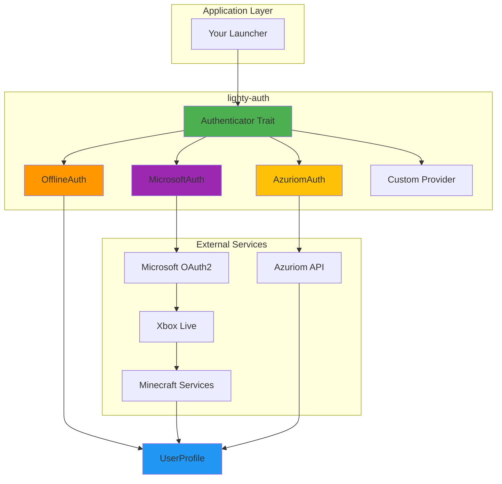
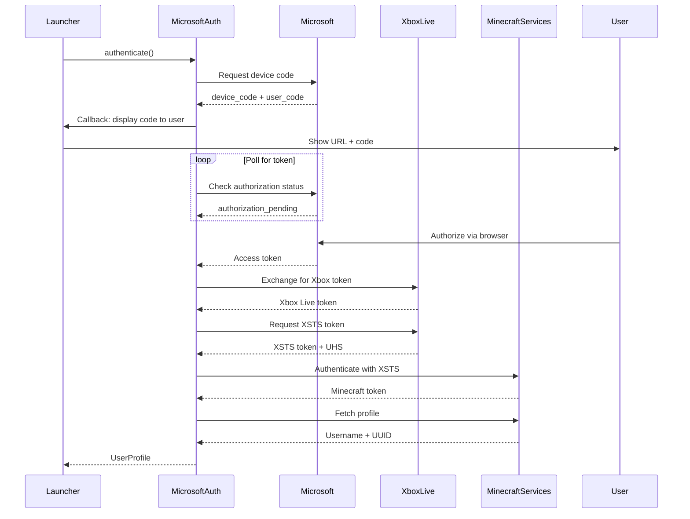

# lighty-auth

Multi-provider authentication system for Minecraft launchers with OAuth2 and CMS integrations.

## Overview

`lighty-auth` provides a unified trait-based authentication system supporting multiple providers:
- **Offline Mode** - Local authentication without network, generates deterministic UUIDs
- **Microsoft Account** - OAuth 2.0 Device Code Flow via Microsoft/Xbox Live/Minecraft Services
- **Azuriom CMS** - Server authentication with 2FA support, roles, and permissions
- **Custom Providers** - Implement the `Authenticator` trait for your own auth system

## Quick Start

```toml
[dependencies]
lighty-auth = "0.8.6"
```

### Offline Authentication

```rust
use lighty_auth::{offline::OfflineAuth, Authenticator};

#[tokio::main]
async fn main() -> Result<(), Box<dyn std::error::Error>> {
    let mut auth = OfflineAuth::new("PlayerName");
    let profile = auth.authenticate().await?;

    println!("Username: {}", profile.username);
    println!("UUID: {}", profile.uuid);

    Ok(())
}
```

### Microsoft Authentication

```rust
use lighty_auth::{microsoft::MicrosoftAuth, Authenticator};

#[tokio::main]
async fn main() -> Result<(), Box<dyn std::error::Error>> {
    let mut auth = MicrosoftAuth::new("your-azure-client-id");

    // Display device code to user
    auth.set_device_code_callback(|code, url| {
        println!("Please visit: {}", url);
        println!("And enter code: {}", code);
    });

    let profile = auth.authenticate().await?;
    println!("Logged in as: {}", profile.username);

    Ok(())
}
```

### Azuriom Authentication

```rust
use lighty_auth::{azuriom::AzuriomAuth, Authenticator, AuthError};

#[tokio::main]
async fn main() -> Result<(), Box<dyn std::error::Error>> {
    let mut auth = AzuriomAuth::new(
        "https://your-server.com",
        "user@example.com",
        "password123"
    );

    match auth.authenticate().await {
        Ok(profile) => {
            println!("Logged in as: {}", profile.username);
            if let Some(role) = profile.role {
                println!("Role: {}", role.name);
            }
        }
        Err(AuthError::TwoFactorRequired) => {
            auth.set_two_factor_code("123456");
            let profile = auth.authenticate().await?;
            println!("Logged in with 2FA: {}", profile.username);
        }
        Err(e) => eprintln!("Authentication failed: {}", e),
    }

    Ok(())
}
```

## Features

| Feature | Description |
|---------|-------------|
| `events` | Enable event system integration for authentication progress tracking |

## Authentication Providers

### Offline Mode

- **Status**: ✅ Stable
- **Network**: Not required
- **Use Cases**: Testing, offline play, development
- **Features**:
  - Deterministic UUID v5 generation via SHA1
  - Username validation (3-16 chars, alphanumeric + underscore)
  - No token or session management

### Microsoft Account

- **Status**: ✅ Stable
- **Network**: Required
- **Use Cases**: Legitimate Minecraft accounts
- **Features**:
  - OAuth 2.0 Device Code Flow
  - Xbox Live integration
  - Minecraft Services authentication
  - Ownership verification
  - Configurable polling and timeout

**Authentication Flow**:
1. Request device code from Microsoft
2. User authorizes via browser (microsoft.com/devicelogin)
3. Poll for access token
4. Exchange for Xbox Live token
5. Exchange for XSTS token
6. Exchange for Minecraft token
7. Fetch Minecraft profile (username, UUID)

### Azuriom CMS

- **Status**: ✅ Stable
- **Network**: Required
- **Use Cases**: Custom server authentication, launcher whitelisting
- **Features**:
  - Email/password authentication
  - Two-factor authentication (2FA/TOTP)
  - Token verification
  - Logout support
  - User roles and permissions
  - Server money/credits integration
  - Account ban detection

## Core Types

### UserProfile

Complete user profile returned after authentication:

```rust
pub struct UserProfile {
    pub id: Option<u64>,              // User ID (server-specific)
    pub username: String,             // Display name
    pub uuid: String,                 // Minecraft UUID with dashes
    pub access_token: Option<String>, // Session token
    pub email: Option<String>,        // User email
    pub email_verified: bool,         // Email verification status
    pub money: Option<f64>,           // Credits/balance (Azuriom)
    pub role: Option<UserRole>,       // User role/rank
    pub banned: bool,                 // Ban status
}
```

### UserRole

Role/rank information (for Azuriom):

```rust
pub struct UserRole {
    pub name: String,           // Role name (e.g., "Admin", "VIP")
    pub color: Option<String>,  // Role color (hex: #RRGGBB)
}
```

### Authenticator Trait

Core trait for implementing custom authentication providers:

```rust
pub trait Authenticator {
    /// Authenticate and return user profile
    async fn authenticate(
        &mut self,
        event_bus: Option<&EventBus>,
    ) -> AuthResult<UserProfile>;

    /// Verify if a token is still valid
    async fn verify(&self, token: &str) -> AuthResult<UserProfile>;

    /// Logout and invalidate token
    async fn logout(&self, token: &str) -> AuthResult<()>;
}
```

## Architecture



## Microsoft OAuth2 Flow



## Error Handling

Comprehensive error types with specific variants:

```rust
use lighty_auth::{AuthError, Authenticator};

match auth.authenticate().await {
    Ok(profile) => println!("Success: {}", profile.username),
    Err(AuthError::InvalidCredentials) => {
        eprintln!("Wrong username or password");
    }
    Err(AuthError::TwoFactorRequired) => {
        // Prompt for 2FA code
        auth.set_two_factor_code("123456");
        auth.authenticate().await?;
    }
    Err(AuthError::Invalid2FACode) => {
        eprintln!("Invalid 2FA code");
    }
    Err(AuthError::EmailNotVerified) => {
        eprintln!("Please verify your email first");
    }
    Err(AuthError::AccountBanned(username)) => {
        eprintln!("Account {} is banned", username);
    }
    Err(AuthError::DeviceCodeExpired) => {
        eprintln!("Device code expired, please try again");
    }
    Err(AuthError::Cancelled) => {
        eprintln!("User cancelled authentication");
    }
    Err(e) => eprintln!("Error: {}", e),
}
```

## Event System Integration

With the `events` feature, track authentication progress:

```rust
use lighty_auth::{offline::OfflineAuth, Authenticator};
use lighty_event::{EventBus, Event, AuthEvent};

let event_bus = EventBus::new(1000);
let mut receiver = event_bus.subscribe();

// Spawn event listener
tokio::spawn(async move {
    while let Ok(event) = receiver.next().await {
        if let Event::Auth(auth_event) = event {
            match auth_event {
                AuthEvent::AuthenticationStarted { provider } => {
                    println!("Authenticating with {}...", provider);
                }
                AuthEvent::AuthenticationInProgress { provider, step } => {
                    println!("[{}] {}", provider, step);
                }
                AuthEvent::AuthenticationSuccess { username, uuid, .. } => {
                    println!("Success! {} ({})", username, uuid);
                }
                AuthEvent::AuthenticationFailed { provider, error } => {
                    eprintln!("[{}] Failed: {}", provider, error);
                }
            }
        }
    }
});

// Authenticate with event bus
let mut auth = OfflineAuth::new("Player");
let profile = auth.authenticate(Some(&event_bus)).await?;
```

## Custom Authentication

Implement your own authentication provider:

```rust
use lighty_auth::{Authenticator, AuthResult, UserProfile, UserRole, AuthError};

pub struct MyCustomAuth {
    api_url: String,
    api_key: String,
}

impl MyCustomAuth {
    pub fn new(api_url: String, api_key: String) -> Self {
        Self { api_url, api_key }
    }
}

impl Authenticator for MyCustomAuth {
    async fn authenticate(
        &mut self,
        #[cfg(feature = "events")] event_bus: Option<&lighty_event::EventBus>,
    ) -> AuthResult<UserProfile> {
        // Your custom authentication logic
        let response = reqwest::get(&format!("{}/auth", self.api_url))
            .await?
            .json::<serde_json::Value>()
            .await?;

        Ok(UserProfile {
            id: Some(response["id"].as_u64().unwrap()),
            username: response["username"].as_str().unwrap().to_string(),
            uuid: response["uuid"].as_str().unwrap().to_string(),
            access_token: Some(response["token"].as_str().unwrap().to_string()),
            email: None,
            email_verified: true,
            money: None,
            role: Some(UserRole {
                name: "User".to_string(),
                color: Some("#FFFFFF".to_string()),
            }),
            banned: false,
        })
    }
}
```

## Utilities

### Generate Offline UUID

Generate deterministic UUIDs for offline mode:

```rust
use lighty_auth::generate_offline_uuid;

let uuid = generate_offline_uuid("PlayerName");
println!("UUID: {}", uuid); // Always the same for this username

// Example output: "f3c8d69b-0000-5000-8000-00000000000a"
```

## Documentation

📚 **Detailed Guides**

- [Architecture Overview](./docs/overview.md) - Authentication system design and patterns
- [Offline Authentication](./docs/offline.md) - Offline mode implementation and UUID generation
- [Microsoft OAuth2](./docs/microsoft.md) - Complete Microsoft authentication flow guide
- [Azuriom Integration](./docs/azuriom.md) - Azuriom CMS authentication with 2FA
- [Examples](./docs/examples.md) - Complete usage examples and patterns

## Thread Safety

- **All providers**: Thread-safe via trait design
- **HTTP Client**: Shared `reqwest::Client` with connection pooling
- **Event Bus**: Lock-free concurrent broadcasting (when `events` feature enabled)

## License

MIT

## Links

- **Main Package**: [lighty-launcher](https://crates.io/crates/lighty-launcher)
- **Repository**: [GitHub](https://github.com/Lighty-Launcher/LightyLauncherLib)
- **Documentation**: [docs.rs/lighty-auth](https://docs.rs/lighty-auth)
