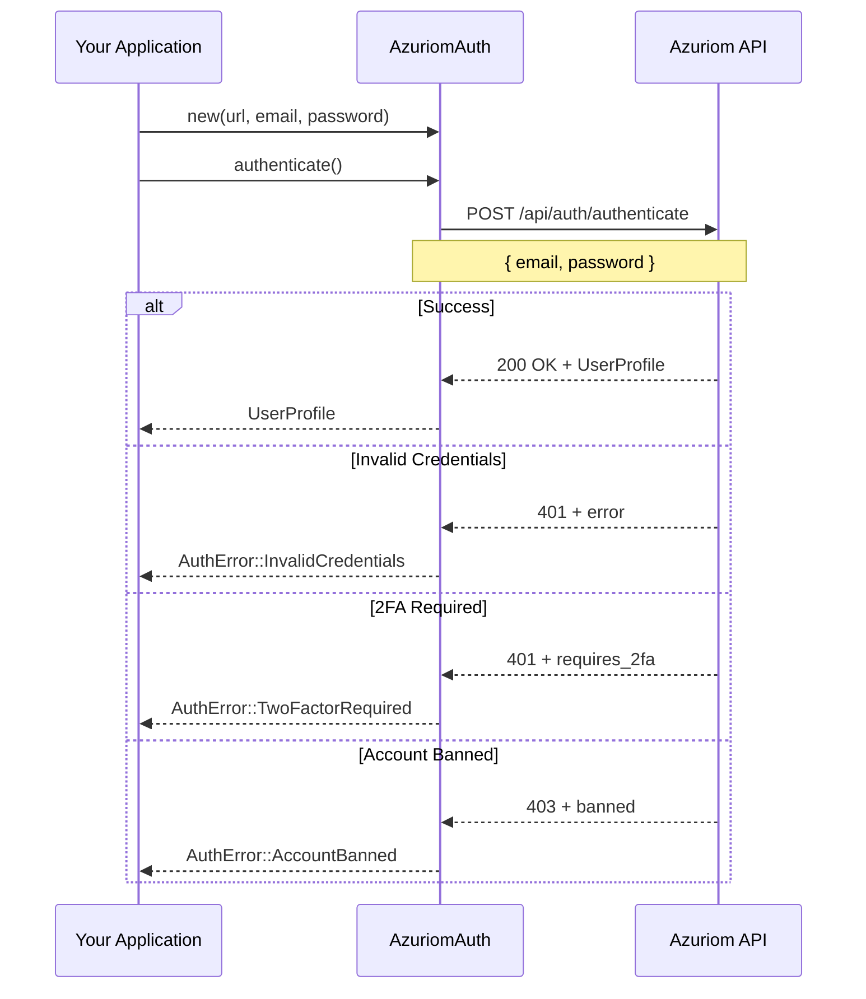
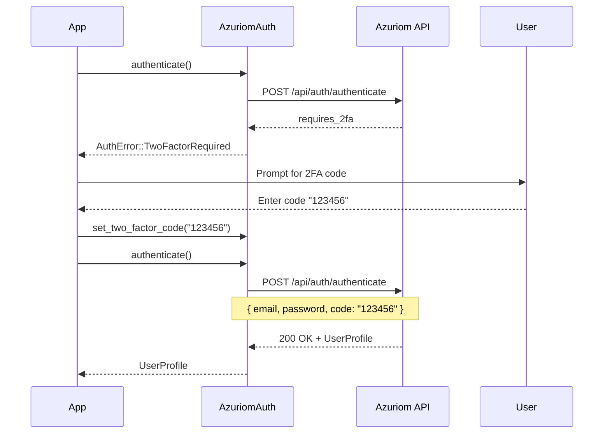

# Azuriom CMS Authentication

## Overview

Azuriom is an open-source CMS designed for Minecraft servers, providing:
- User authentication and management
- Two-factor authentication (2FA/TOTP)
- Role-based permissions
- Server economy integration (credits/money)
- Custom launcher authentication

The `AzuriomAuth` provider integrates with the Azuriom REST API for secure server authentication.

## Prerequisites

### Azuriom Instance

You need:
- A running Azuriom instance (https://azuriom.com)
- Base URL of the instance (e.g., `https://your-server.com`)
- User account created on the Azuriom website

### API Endpoints

The authenticator uses these endpoints:
- `POST /api/auth/authenticate` - Login
- `POST /api/auth/verify` - Token verification
- `POST /api/auth/logout` - Logout

## Quick Start

```rust
use lighty_auth::{azuriom::AzuriomAuth, Authenticator};

#[tokio::main]
async fn main() -> Result<(), Box<dyn std::error::Error>> {
    let mut auth = AzuriomAuth::new(
        "https://your-server.com",
        "user@example.com",
        "password123"
    );

    let profile = auth.authenticate().await?;

    println!("Username: {}", profile.username);
    println!("UUID: {}", profile.uuid);
    println!("Role: {:?}", profile.role);
    println!("Money: {:?}", profile.money);

    Ok(())
}
```

## Authentication Flow

### Basic Authentication



### With Two-Factor Authentication



## Two-Factor Authentication

### Handling 2FA

```rust
use lighty_auth::{azuriom::AzuriomAuth, Authenticator, AuthError};

let mut auth = AzuriomAuth::new(
    "https://your-server.com",
    "user@example.com",
    "password123"
);

match auth.authenticate().await {
    Ok(profile) => {
        println!("Logged in: {}", profile.username);
    }
    Err(AuthError::TwoFactorRequired) => {
        // Prompt user for 2FA code
        let code = prompt_user_for_code();

        auth.set_two_factor_code(code);
        let profile = auth.authenticate().await?;
        println!("Logged in with 2FA: {}", profile.username);
    }
    Err(e) => eprintln!("Error: {}", e),
}
```

### Interactive 2FA Flow

```rust
use std::io::{self, Write};

async fn authenticate_with_2fa(
    url: &str,
    email: &str,
    password: &str,
) -> Result<UserProfile, Box<dyn Error>> {
    let mut auth = AzuriomAuth::new(url, email, password);

    loop {
        match auth.authenticate().await {
            Ok(profile) => return Ok(profile),

            Err(AuthError::TwoFactorRequired) => {
                print!("Enter 2FA code: ");
                io::stdout().flush()?;

                let mut code = String::new();
                io::stdin().read_line(&mut code)?;

                auth.set_two_factor_code(code.trim());
            }

            Err(AuthError::Invalid2FACode) => {
                println!("Invalid 2FA code. Try again.");
                auth.clear_two_factor_code();
            }

            Err(e) => return Err(e.into()),
        }
    }
}
```

## Token Verification

Verify if a token is still valid:

```rust
let mut auth = AzuriomAuth::new(url, email, password);
let profile = auth.authenticate().await?;

// Save token
let token = profile.access_token.clone().unwrap();

// Later: verify token
match auth.verify(&token).await {
    Ok(profile) => {
        println!("Token is valid for: {}", profile.username);
    }
    Err(AuthError::InvalidToken) => {
        println!("Token expired or invalid. Re-authenticating...");
        let profile = auth.authenticate().await?;
    }
    Err(e) => eprintln!("Error: {}", e),
}
```

## Logout

Invalidate an access token:

```rust
let mut auth = AzuriomAuth::new(url, email, password);
let profile = auth.authenticate().await?;

let token = profile.access_token.unwrap();

// Use token for authenticated requests...

// Logout when done
auth.logout(&token).await?;
println!("Successfully logged out");
```

## Error Handling

```rust
use lighty_auth::{azuriom::AzuriomAuth, Authenticator, AuthError};

let mut auth = AzuriomAuth::new(url, email, password);

match auth.authenticate().await {
    Ok(profile) => {
        println!("Success: {}", profile.username);
    }

    Err(AuthError::InvalidCredentials) => {
        eprintln!("Invalid email or password");
    }

    Err(AuthError::TwoFactorRequired) => {
        // Handle 2FA (see above)
    }

    Err(AuthError::Invalid2FACode) => {
        eprintln!("Invalid 2FA code");
    }

    Err(AuthError::EmailNotVerified) => {
        eprintln!("Please verify your email address");
    }

    Err(AuthError::AccountBanned(username)) => {
        eprintln!("Account {} is banned", username);
    }

    Err(AuthError::NetworkError(e)) => {
        eprintln!("Network error: {}", e);
    }

    Err(AuthError::InvalidResponse(msg)) => {
        eprintln!("Invalid response from server: {}", msg);
    }

    Err(e) => {
        eprintln!("Unexpected error: {}", e);
    }
}
```

## UserProfile Output

```rust
pub struct UserProfile {
    pub id: Some(u64),                 // Azuriom user ID
    pub username: String,              // Display name
    pub uuid: String,                  // Minecraft UUID
    pub access_token: Some(String),    // Session token
    pub email: Some(String),           // User email
    pub email_verified: bool,          // Email verification status
    pub money: Option<f64>,            // Server credits/balance
    pub role: Option<UserRole>,        // User role/rank
    pub banned: bool,                  // Ban status
}
```

### Example Output

```rust
UserProfile {
    id: Some(42),
    username: "Steve",
    uuid: "069a79f4-44e9-4726-a5be-fca90e38aaf5",
    access_token: Some("eyJ0eXAiOiJKV1QiLCJhbGc..."),
    email: Some("steve@example.com"),
    email_verified: true,
    money: Some(150.50),
    role: Some(UserRole {
        name: "VIP",
        color: Some("#FFD700")
    }),
    banned: false,
}
```

## Role Management

```rust
let profile = auth.authenticate().await?;

if let Some(role) = &profile.role {
    println!("Role: {}", role.name);

    if let Some(color) = &role.color {
        println!("Color: {}", color);
        // Use color for UI (e.g., player name in chat)
    }

    // Check permissions
    match role.name.as_str() {
        "Admin" | "Moderator" => {
            // Allow access to admin features
        }
        "VIP" => {
            // Enable VIP features
        }
        _ => {
            // Default user
        }
    }
}
```

## Server Economy Integration

```rust
let profile = auth.authenticate().await?;

if let Some(money) = profile.money {
    println!("Balance: ${:.2}", money);

    if money >= 10.0 {
        // Allow purchase
        println!("You can afford this item!");
    } else {
        println!("Insufficient funds. Need ${:.2} more", 10.0 - money);
    }
}
```

## Event System Integration

```rust
use lighty_auth::{azuriom::AzuriomAuth, Authenticator};
use lighty_event::{EventBus, Event, AuthEvent};

let event_bus = EventBus::new(1000);
let mut receiver = event_bus.subscribe();

tokio::spawn(async move {
    while let Ok(event) = receiver.next().await {
        if let Event::Auth(auth_event) = event {
            match auth_event {
                AuthEvent::AuthenticationStarted { provider } => {
                    println!("[{}] Starting...", provider);
                }
                AuthEvent::AuthenticationSuccess { username, .. } => {
                    println!("Welcome, {}!", username);
                }
                AuthEvent::AuthenticationFailed { error, .. } => {
                    eprintln!("Failed: {}", error);
                }
                _ => {}
            }
        }
    }
});

let mut auth = AzuriomAuth::new(url, email, password);
let profile = auth.authenticate(Some(&event_bus)).await?;
```

## API Error Responses

### Success Response

```json
{
    "id": 42,
    "username": "Steve",
    "uuid": "069a79f4-44e9-4726-a5be-fca90e38aaf5",
    "access_token": "eyJ0eXAiOiJKV1QiLCJhbGc...",
    "email_verified": true,
    "money": 150.50,
    "role": {
        "name": "VIP",
        "color": "#FFD700"
    },
    "banned": false
}
```

### Error Response

```json
{
    "status": "error",
    "reason": "invalid_credentials",
    "message": "Invalid email or password"
}
```

**Error Reasons**:
- `invalid_credentials` → `AuthError::InvalidCredentials`
- `requires_2fa` → `AuthError::TwoFactorRequired`
- `invalid_2fa` → `AuthError::Invalid2FACode`
- `email_not_verified` → `AuthError::EmailNotVerified`
- `banned` → `AuthError::AccountBanned`

## Best Practices

### Secure Credential Storage

```rust
// ❌ Bad: Hardcoded credentials
let auth = AzuriomAuth::new(
    "https://server.com",
    "user@example.com",
    "password123"
);

// ✅ Good: Read from environment or secure storage
use std::env;

let url = env::var("AZURIOM_URL")?;
let email = env::var("AZURIOM_EMAIL")?;
let password = env::var("AZURIOM_PASSWORD")?;

let auth = AzuriomAuth::new(url, email, password);
```

### Token Caching

```rust
// ✅ Good: Cache valid tokens
struct TokenCache {
    token: Option<String>,
    expires_at: Option<Instant>,
}

impl TokenCache {
    async fn get_or_authenticate(&mut self, auth: &mut AzuriomAuth) -> Result<String> {
        // Check if cached token is still valid
        if let Some(token) = &self.token {
            if let Some(expires) = self.expires_at {
                if Instant::now() < expires {
                    return Ok(token.clone());
                }
            }
        }

        // Re-authenticate
        let profile = auth.authenticate().await?;
        let token = profile.access_token.unwrap();

        self.token = Some(token.clone());
        self.expires_at = Some(Instant::now() + Duration::from_hours(24));

        Ok(token)
    }
}
```

### Retry Logic

```rust
// ✅ Good: Retry on network errors
async fn authenticate_with_retry(
    auth: &mut AzuriomAuth,
    max_retries: u32,
) -> Result<UserProfile> {
    let mut attempts = 0;

    loop {
        match auth.authenticate().await {
            Ok(profile) => return Ok(profile),

            Err(AuthError::NetworkError(e)) if attempts < max_retries => {
                attempts += 1;
                eprintln!("Network error (attempt {}/{}): {}", attempts, max_retries, e);
                tokio::time::sleep(Duration::from_secs(2)).await;
            }

            Err(e) => return Err(e),
        }
    }
}
```

## Testing

```rust
#[cfg(test)]
mod tests {
    use super::*;

    #[tokio::test]
    async fn test_azuriom_auth() {
        let url = std::env::var("AZURIOM_URL").expect("AZURIOM_URL not set");
        let email = std::env::var("AZURIOM_EMAIL").expect("AZURIOM_EMAIL not set");
        let password = std::env::var("AZURIOM_PASSWORD").expect("AZURIOM_PASSWORD not set");

        let mut auth = AzuriomAuth::new(url, email, password);
        let profile = auth.authenticate().await.unwrap();

        assert!(!profile.username.is_empty());
        assert!(!profile.uuid.is_empty());
        assert!(profile.access_token.is_some());
    }

    #[tokio::test]
    async fn test_invalid_credentials() {
        let url = "https://demo.azuriom.com";
        let mut auth = AzuriomAuth::new(url, "invalid@example.com", "wrong-password");

        let result = auth.authenticate().await;
        assert!(matches!(result, Err(AuthError::InvalidCredentials)));
    }

    #[tokio::test]
    async fn test_token_verify() {
        // ... (same as above to get token)
        let token = profile.access_token.unwrap();

        let verified_profile = auth.verify(&token).await.unwrap();
        assert_eq!(verified_profile.username, profile.username);
    }
}
```

## Troubleshooting

### Issue: Connection refused

**Cause**: Azuriom instance is not reachable

**Solution**:
```rust
// Check if URL is correct and includes protocol
let url = "https://your-server.com";  // ✅ Correct
let url = "your-server.com";          // ❌ Wrong (missing https://)
```

### Issue: Invalid response format

**Cause**: Azuriom API version mismatch

**Solution**: Ensure Azuriom is up-to-date with latest API version

### Issue: 2FA code always invalid

**Cause**: Time synchronization issue

**Solution**: Check system clock is synchronized with NTP server

## Performance

Typical authentication duration: **100-500ms**

**Breakdown**:
- Network roundtrip: 50-200ms
- Server-side validation: 20-100ms
- Database lookup: 10-50ms
- Response parsing: 1-5ms

With 2FA: **200-1000ms** (two requests)

## Security Considerations

- **HTTPS Required**: Always use HTTPS for Azuriom URLs
- **Password Hashing**: Passwords are hashed server-side (bcrypt)
- **2FA Recommended**: Enable 2FA for enhanced security
- **Token Expiration**: Tokens expire after 24 hours (configurable server-side)
- **Rate Limiting**: Azuriom may rate-limit authentication requests
