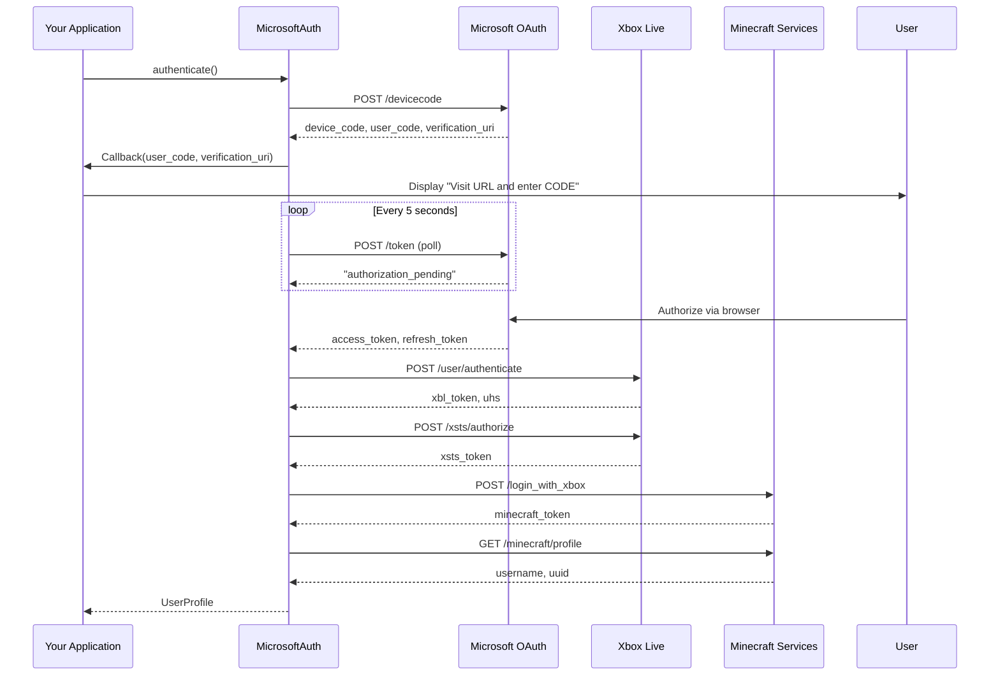

# Microsoft OAuth2 Authentication

## Overview

Microsoft authentication implements the **OAuth 2.0 Device Code Flow** to authenticate Minecraft accounts through:
1. Microsoft Identity Platform
2. Xbox Live
3. Minecraft Services

This is the official authentication method for legitimate Minecraft accounts since Microsoft acquired Mojang.

## Prerequisites

### Azure AD Application

You need to register an application in Azure Active Directory:

1. Go to [Azure Portal](https://portal.azure.com)
2. Navigate to **Azure Active Directory** → **App registrations**
3. Click **New registration**
4. Set **Supported account types** to "Accounts in any organizational directory and personal Microsoft accounts"
5. No redirect URI needed (Device Code Flow)
6. After registration, copy the **Application (client) ID**

### Required Permissions

- `XboxLive.signin` - Access to Xbox Live services
- `offline_access` - Refresh tokens (optional but recommended)

## Quick Start

```rust
use lighty_auth::{microsoft::MicrosoftAuth, Authenticator};

#[tokio::main]
async fn main()  {
    let mut auth = MicrosoftAuth::new("your-azure-client-id");

    // Set callback to display device code
    auth.set_device_code_callback(|code, url| {
        println!("Please visit: {}", url);
        println!("And enter code: {}", code);
    });

    // Authenticate (blocks until user completes authorization)
    let profile = auth.authenticate().await?;

    println!("Logged in as: {}", profile.username);
    println!("UUID: {}", profile.uuid);
    println!("Access Token: {}", profile.access_token.unwrap());

    Ok(())
}
```

## Authentication Flow

### Step-by-Step Process



### 1. Request Device Code

```rust
// Endpoint: https://login.microsoftonline.com/consumers/oauth2/v2.0/devicecode
// Method: POST

{
    "client_id": "your-client-id",
    "scope": "XboxLive.signin offline_access"
}

// Response:
{
    "user_code": "ABCD1234",
    "device_code": "long-device-code-string",
    "verification_uri": "https://microsoft.com/devicelogin",
    "expires_in": 900,
    "interval": 5
}
```

### 2. Display Code to User

The user must:
1. Visit `https://microsoft.com/devicelogin` in a browser
2. Enter the `user_code` (e.g., "ABCD1234")
3. Sign in with their Microsoft account
4. Authorize the application

### 3. Poll for Access Token

```rust
// Poll every 5 seconds until user authorizes
// Endpoint: https://login.microsoftonline.com/consumers/oauth2/v2.0/token

{
    "grant_type": "urn:ietf:params:oauth:grant-type:device_code",
    "client_id": "your-client-id",
    "device_code": "long-device-code-string"
}

// Responses:
// - "authorization_pending" → Continue polling
// - "authorization_declined" → User declined
// - "expired_token" → Code expired (15 minutes)
// - Success → access_token + refresh_token
```

### 4. Exchange for Xbox Live Token

```rust
// Endpoint: https://user.auth.xboxlive.com/user/authenticate

{
    "Properties": {
        "AuthMethod": "RPS",
        "SiteName": "user.auth.xboxlive.com",
        "RpsTicket": "d=<microsoft_access_token>"
    },
    "RelyingParty": "http://auth.xboxlive.com",
    "TokenType": "JWT"
}

// Response:
{
    "Token": "xbox-live-token",
    "DisplayClaims": {
        "xui": [{
            "uhs": "user-hash-string"
        }]
    }
}
```

### 5. Exchange for XSTS Token

```rust
// Endpoint: https://xsts.auth.xboxlive.com/xsts/authorize

{
    "Properties": {
        "SandboxId": "RETAIL",
        "UserTokens": ["xbox-live-token"]
    },
    "RelyingParty": "rp://api.minecraftservices.com/",
    "TokenType": "JWT"
}

// Response:
{
    "Token": "xsts-token",
    "DisplayClaims": { /* same as above */ }
}
```

**Possible Errors**:
- **2148916233**: Account doesn't own Minecraft
- **2148916238**: Xbox Live not available in user's country

### 6. Exchange for Minecraft Token

```rust
// Endpoint: https://api.minecraftservices.com/authentication/login_with_xbox

{
    "identityToken": "XBL3.0 x=<uhs>;<xsts-token>"
}

// Response:
{
    "access_token": "minecraft-access-token",
    "expires_in": 86400
}
```

### 7. Fetch Minecraft Profile

```rust
// Endpoint: https://api.minecraftservices.com/minecraft/profile
// Headers: Authorization: Bearer <minecraft-access-token>

// Response:
{
    "id": "069a79f444e94726a5befca90e38aaf5",  // UUID without dashes
    "name": "Notch"
}
```

## Configuration

### Polling Interval

Control how often to check for authorization:

```rust
let mut auth = MicrosoftAuth::new(client_id);

// Default: 5 seconds
auth.set_poll_interval(Duration::from_secs(3));  // Faster polling

// Respect server's "interval" field from device code response
```

### Timeout

Set maximum time to wait for user authorization:

```rust
let mut auth = MicrosoftAuth::new(client_id);

// Default: 5 minutes (300 seconds)
auth.set_timeout(Duration::from_secs(600));  // 10 minutes

// Match server's "expires_in" field from device code response
```

### Device Code Callback

Display the code to the user:

```rust
// Console application
auth.set_device_code_callback(|code, url| {
    println!("Please visit: {}", url);
    println!("And enter code: {}", code);
});

// GUI application
auth.set_device_code_callback(|code, url| {
    show_dialog(format!("Visit {} and enter: {}", url, code));
    open_browser(url);  // Optional: auto-open browser
});

// Web application
auth.set_device_code_callback(|code, url| {
    send_to_frontend(json!({
        "type": "device_code",
        "code": code,
        "url": url
    }));
});
```

## Error Handling

```rust
use lighty_auth::{microsoft::MicrosoftAuth, Authenticator, AuthError};

let mut auth = MicrosoftAuth::new(client_id);
auth.set_device_code_callback(|code, url| {
    println!("Visit {} and enter: {}", url, code);
});

match auth.authenticate().await {
    Ok(profile) => {
        println!("Success: {}", profile.username);
    }
    Err(AuthError::DeviceCodeExpired) => {
        eprintln!("Device code expired. Please try again.");
        // Retry authentication
    }
    Err(AuthError::Cancelled) => {
        eprintln!("User declined authorization");
    }
    Err(AuthError::Custom(msg)) if msg.contains("doesn't own Minecraft") => {
        eprintln!("This Microsoft account doesn't own Minecraft");
    }
    Err(AuthError::Custom(msg)) if msg.contains("Xbox Live is not available") => {
        eprintln!("Xbox Live is not available in your country");
    }
    Err(AuthError::NetworkError(e)) => {
        eprintln!("Network error: {}", e);
    }
    Err(e) => {
        eprintln!("Authentication failed: {}", e);
    }
}
```

## Event System Integration

Track authentication progress with events:

```rust
use lighty_auth::{microsoft::MicrosoftAuth, Authenticator};
use lighty_event::{EventBus, Event, AuthEvent};

let event_bus = EventBus::new(1000);
let mut receiver = event_bus.subscribe();

tokio::spawn(async move {
    while let Ok(event) = receiver.next().await {
        if let Event::Auth(auth_event) = event {
            match auth_event {
                AuthEvent::AuthenticationStarted { provider } => {
                    println!("[{}] Starting authentication...", provider);
                }
                AuthEvent::AuthenticationInProgress { provider, step } => {
                    println!("[{}] {}", provider, step);
                }
                AuthEvent::AuthenticationSuccess { username, uuid, .. } => {
                    println!("Success! Logged in as {} ({})", username, uuid);
                }
                AuthEvent::AuthenticationFailed { error, .. } => {
                    eprintln!("Authentication failed: {}", error);
                }
            }
        }
    }
});

let mut auth = MicrosoftAuth::new(client_id);
auth.set_device_code_callback(|code, url| {
    println!("Visit {} and enter: {}", url, code);
});

let profile = auth.authenticate(Some(&event_bus)).await?;
```

**Events Emitted**:

1. `AuthenticationStarted { provider: "Microsoft" }`
2. `AuthenticationInProgress { step: "Requesting device code" }`
3. `AuthenticationInProgress { step: "Waiting for user authorization" }`
4. `AuthenticationInProgress { step: "Exchanging for Xbox Live token" }`
5. `AuthenticationInProgress { step: "Exchanging for XSTS token" }`
6. `AuthenticationInProgress { step: "Exchanging for Minecraft token" }`
7. `AuthenticationInProgress { step: "Fetching Minecraft profile" }`
8. `AuthenticationSuccess { username: "...", uuid: "..." }`

## Token Management

### Access Token Storage

```rust
// Save token for future use
let profile = auth.authenticate().await?;
let token = profile.access_token.unwrap();

// Store securely (encrypt at rest)
save_token_to_keychain(&token)?;
```

### Token Refresh

Microsoft tokens include refresh tokens (with `offline_access` scope):

```rust
// Not directly supported by lighty-auth
// You need to implement refresh token logic yourself:

use reqwest::Client;

async fn refresh_token(refresh_token: &str, client_id: &str) -> Result<String, Box<dyn Error>> {
    let client = Client::new();

    let response = client
        .post("https://login.microsoftonline.com/consumers/oauth2/v2.0/token")
        .form(&[
            ("grant_type", "refresh_token"),
            ("client_id", client_id),
            ("refresh_token", refresh_token),
            ("scope", "XboxLive.signin offline_access"),
        ])
        .send()
        .await?;

    let data: serde_json::Value = response.json().await?;
    Ok(data["access_token"].as_str().unwrap().to_string())
}
```

## UserProfile Output

```rust
pub struct UserProfile {
    pub id: None,                          // No server ID
    pub username: String,                  // Minecraft username
    pub uuid: String,                      // Minecraft UUID (with dashes)
    pub access_token: Some(String),        // Minecraft access token
    pub email: None,                       // Not provided
    pub email_verified: true,              // Assumed verified
    pub money: None,                       // Not applicable
    pub role: None,                        // Not applicable
    pub banned: false,                     // Checked by Minecraft Services
}
```

## Best Practices

### Callback Design

```rust
// ✅ Good: Clear instructions
auth.set_device_code_callback(|code, url| {
    println!("┌─────────────────────────────────────────┐");
    println!("│ Microsoft Account Authentication        │");
    println!("├─────────────────────────────────────────┤");
    println!("│ 1. Visit: {}              │", url);
    println!("│ 2. Enter code: {}                  │", code);
    println!("│ 3. Sign in with your Microsoft account │");
    println!("└─────────────────────────────────────────┘");
});

// ❌ Bad: Unclear or missing callback
auth.set_device_code_callback(|code, _| {
    println!("{}", code);  // User doesn't know what to do
});
```

### Retry Logic

```rust
// ✅ Good: Retry on expiration
let profile = loop {
    match auth.authenticate().await {
        Ok(profile) => break profile,
        Err(AuthError::DeviceCodeExpired) => {
            println!("Code expired. Retrying...");
            continue;
        }
        Err(e) => return Err(e),
    }
};
```

### Testing

```rust
#[tokio::test]
#[ignore]  // Requires user interaction
async fn test_microsoft_auth() {
    let client_id = std::env::var("AZURE_CLIENT_ID").unwrap();
    let mut auth = MicrosoftAuth::new(client_id);

    auth.set_device_code_callback(|code, url| {
        println!("Visit {} and enter: {}", url, code);
    });

    let profile = auth.authenticate().await.unwrap();
    assert!(!profile.username.is_empty());
    assert!(!profile.uuid.is_empty());
    assert!(profile.access_token.is_some());
}
```

## Troubleshooting

### Issue: Device code expires before user completes

**Solution**: Increase timeout

```rust
auth.set_timeout(Duration::from_secs(900));  // 15 minutes
```

### Issue: User doesn't see device code

**Solution**: Ensure callback is set before authenticate()

```rust
auth.set_device_code_callback(|code, url| { /* ... */ });
auth.authenticate().await?;  // Callback will be triggered
```

### Issue: "Account doesn't own Minecraft" error

**Solution**: User needs to purchase Minecraft Java Edition

### Issue: "Xbox Live not available" error

**Solution**: User is in a region where Xbox Live is blocked (e.g., certain countries)

## Performance

Typical authentication duration: **30-60 seconds**

**Breakdown**:
- Device code request: ~500ms
- User authorization: 20-50s (varies by user)
- Token exchange (4 requests): ~2-5s
- Profile fetch: ~200ms

## Security Considerations

- **Client ID is public**: Safe to embed in application
- **No client secret needed**: Device Code Flow doesn't require secrets
- **Tokens should be encrypted**: Store access tokens securely
- **HTTPS only**: All requests use HTTPS
- **Token expiration**: Minecraft tokens expire after 24 hours
