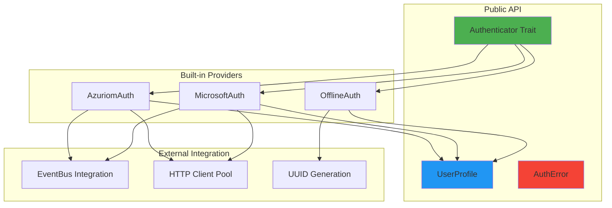
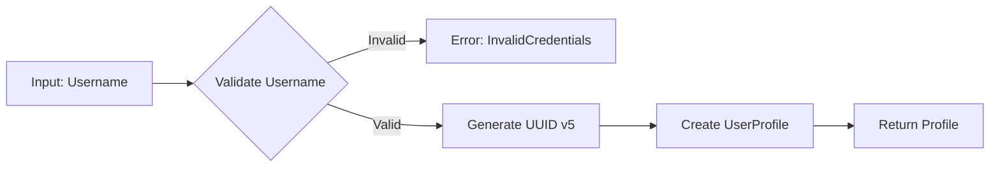
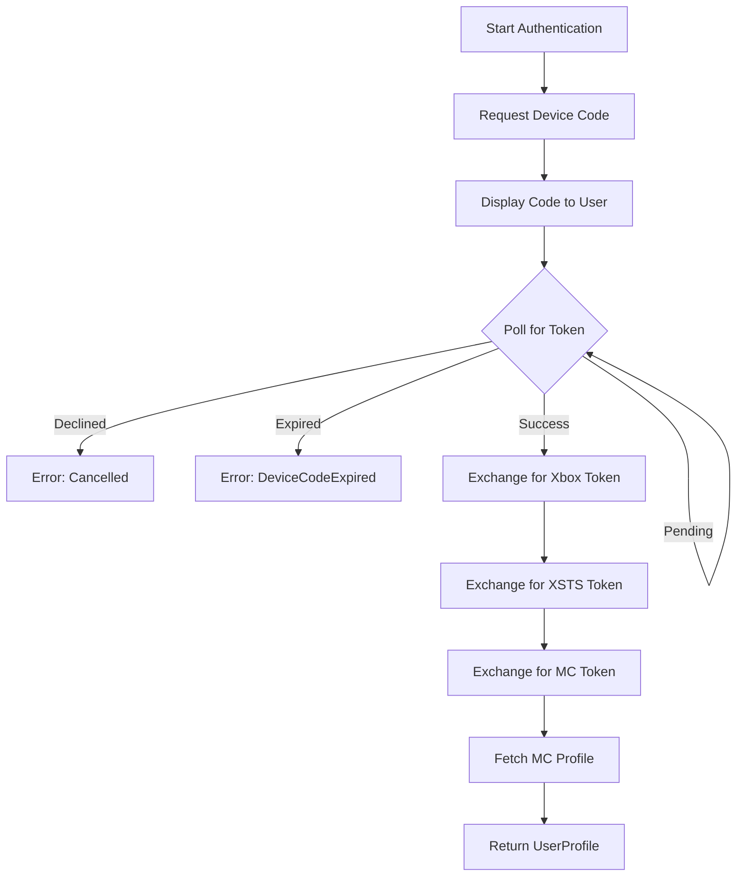
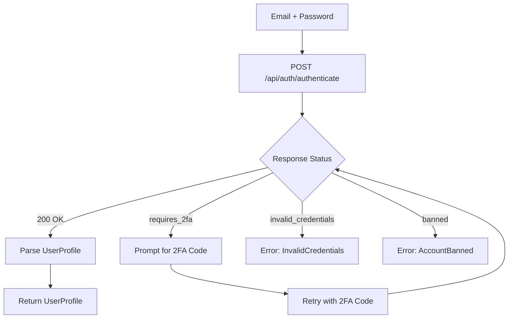

# Architecture Overview

## Design Philosophy

The `lighty-auth` crate follows a trait-based design pattern that enables:
- **Modularity**: Each authentication provider is independent and self-contained
- **Extensibility**: Easy to add custom authentication methods
- **Type Safety**: Compile-time validation of authentication flows
- **Async-First**: Built on tokio for non-blocking I/O operations

## Core Architecture



## Authenticator Trait

The core abstraction that all authentication providers implement:

```rust
pub trait Authenticator {
    /// Primary authentication method
    async fn authenticate(
        &mut self,
        event_bus: Option<&EventBus>,
    ) -> AuthResult<UserProfile>;

    /// Optional: Verify if a token is still valid
    async fn verify(&self, token: &str) -> AuthResult<UserProfile> {
        Err(AuthError::Custom("Verification not supported".into()))
    }

    /// Optional: Invalidate a token
    async fn logout(&self, token: &str) -> AuthResult<()> {
        Ok(())
    }
}
```

**Design Decisions**:
- `&mut self` for `authenticate()` allows providers to cache state (device codes, tokens)
- `event_bus` is optional, enabling use without event system dependency
- Default implementations for `verify()` and `logout()` allow simple providers to skip them

## UserProfile Structure

The unified profile type returned by all authenticators:

```rust
pub struct UserProfile {
    pub id: Option<u64>,              // Server-specific user ID
    pub username: String,             // Display name (required)
    pub uuid: String,                 // Minecraft UUID (required)
    pub access_token: Option<String>, // Session token
    pub email: Option<String>,        // Email address
    pub email_verified: bool,         // Verification status
    pub money: Option<f64>,           // Server credits/balance
    pub role: Option<UserRole>,       // Permissions/rank
    pub banned: bool,                 // Ban status
}
```

**Field Usage by Provider**:

| Field | Offline | Microsoft | Azuriom |
|-------|---------|-----------|---------|
| `id` | ❌ None | ❌ None | ✅ Server ID |
| `username` | ✅ Input | ✅ From profile | ✅ From server |
| `uuid` | ✅ Generated | ✅ From profile | ✅ From server |
| `access_token` | ❌ None | ✅ MC token | ✅ Session token |
| `email` | ❌ None | ❌ None | ✅ User email |
| `email_verified` | `false` | `true` | ✅ From server |
| `money` | ❌ None | ❌ None | ✅ From server |
| `role` | ❌ None | ❌ None | ✅ From server |
| `banned` | `false` | `false` | ✅ From server |

## Error Handling

Comprehensive error types with specific variants:

```rust
pub enum AuthError {
    // Credential errors
    InvalidCredentials,
    InvalidToken,

    // 2FA errors
    TwoFactorRequired,
    Invalid2FACode,

    // Account status errors
    EmailNotVerified,
    AccountBanned(String),

    // Microsoft OAuth errors
    DeviceCodeExpired,
    Cancelled,

    // Network errors
    NetworkError(reqwest::Error),
    InvalidResponse(String),

    // Generic error
    Custom(String),
}
```

## Authentication Flows

### Offline Mode



**Characteristics**:
- Synchronous (no network I/O)
- Deterministic UUID generation
- No token management
- Instant response time

### Microsoft OAuth2



**Characteristics**:
- Asynchronous with polling
- 6-step token exchange chain
- User interaction required (browser)
- Typical duration: 30-60 seconds
- Error handling at each step

### Azuriom CMS



**Characteristics**:
- Single HTTP request (without 2FA)
- Two requests (with 2FA)
- Server-side validation
- Role/permission support
- Fast response time (< 1 second)

## Event System Integration

When the `events` feature is enabled, authentication progress is broadcast:

```rust
pub enum AuthEvent {
    AuthenticationStarted {
        provider: String,
    },
    AuthenticationInProgress {
        provider: String,
        step: String,
    },
    AuthenticationSuccess {
        provider: String,
        username: String,
        uuid: String,
    },
    AuthenticationFailed {
        provider: String,
        error: String,
    },
}
```

**Event Flow Example** (Microsoft):

```
1. AuthenticationStarted { provider: "Microsoft" }
2. AuthenticationInProgress { step: "Requesting device code" }
3. AuthenticationInProgress { step: "Waiting for user authorization" }
4. AuthenticationInProgress { step: "Exchanging for Xbox Live token" }
5. AuthenticationInProgress { step: "Exchanging for XSTS token" }
6. AuthenticationInProgress { step: "Exchanging for Minecraft token" }
7. AuthenticationInProgress { step: "Fetching Minecraft profile" }
8. AuthenticationSuccess { username: "Player", uuid: "..." }
```

## HTTP Client Architecture

All network-based providers share a global HTTP client:

```rust
use lighty_core::hosts::HTTP_CLIENT;

// Configured with:
// - Connection pooling
// - Automatic retry logic
// - Timeout settings
// - User-Agent header
```

**Benefits**:
- Connection reuse across multiple authentications
- Reduced memory footprint
- Consistent network behavior

## Thread Safety

### Shared State

- **HTTP_CLIENT**: Thread-safe via `Arc` + internal locking in `reqwest`
- **EventBus**: Lock-free broadcast channels via `tokio`
- **Authenticator instances**: Not thread-safe (designed for single-threaded use)

### Concurrent Authentication

```rust
// Multiple authentications can run concurrently
let mut auth1 = OfflineAuth::new("Player1");
let mut auth2 = MicrosoftAuth::new(client_id);
let mut auth3 = AzuriomAuth::new(url, email, password);

let (profile1, profile2, profile3) = tokio::try_join!(
    auth1.authenticate(None),
    auth2.authenticate(None),
    auth3.authenticate(None),
)?;
```

## Security Considerations

### Password Handling

- Passwords are never stored persistently
- Transmitted only over HTTPS
- Cleared from memory after use (via Drop trait)

### Token Storage

- **Access tokens** should be encrypted at rest
- **Refresh tokens** (Microsoft) enable re-authentication without credentials
- Tokens should be rotated periodically

### UUID Generation

- Offline UUIDs use SHA1 (sufficient for deterministic generation)
- Microsoft/Azuriom UUIDs are server-provided
- UUID v5 namespace prevents collisions

## Performance Characteristics

| Provider | Network Requests | Typical Latency | Blocking Operations |
|----------|-----------------|-----------------|---------------------|
| Offline | 0 | < 1ms | Username validation only |
| Microsoft | 6-8 | 30-60s | User authorization wait |
| Azuriom | 1-2 | 100-500ms | HTTP roundtrip |

## Extension Points

### Custom Providers

Implement `Authenticator` for custom backends:

```rust
pub struct LDAPAuth { /* ... */ }

impl Authenticator for LDAPAuth {
    async fn authenticate(&mut self, event_bus: Option<&EventBus>) -> AuthResult<UserProfile> {
        // Custom LDAP authentication logic
    }
}
```

### Custom Event Types

Emit custom events during authentication:

```rust
#[cfg(feature = "events")]
if let Some(bus) = event_bus {
    bus.emit(Event::Custom(serde_json::json!({
        "type": "auth_ldap",
        "step": "Connecting to LDAP server"
    })));
}
```

## Best Practices

### Error Handling

```rust
// ✅ Good: Specific error handling
match auth.authenticate().await {
    Ok(profile) => { /* ... */ }
    Err(AuthError::TwoFactorRequired) => { /* Prompt for 2FA */ }
    Err(AuthError::InvalidCredentials) => { /* Show error to user */ }
    Err(e) => { /* Log and show generic error */ }
}

// ❌ Bad: Catch-all error handling
let profile = auth.authenticate().await.unwrap();
```

### Event Bus Usage

```rust
// ✅ Good: Pass event bus for progress tracking
let profile = auth.authenticate(Some(&event_bus)).await?;

// ⚠️ Acceptable: No events if not needed
let profile = auth.authenticate(None).await?;
```

### Token Management

```rust
// ✅ Good: Verify token before use
if let Ok(profile) = auth.verify(&token).await {
    // Token is valid
} else {
    // Re-authenticate
    let profile = auth.authenticate(Some(&event_bus)).await?;
}

// ❌ Bad: Assume token is always valid
let profile = UserProfile { access_token: Some(old_token), /* ... */ };
```
