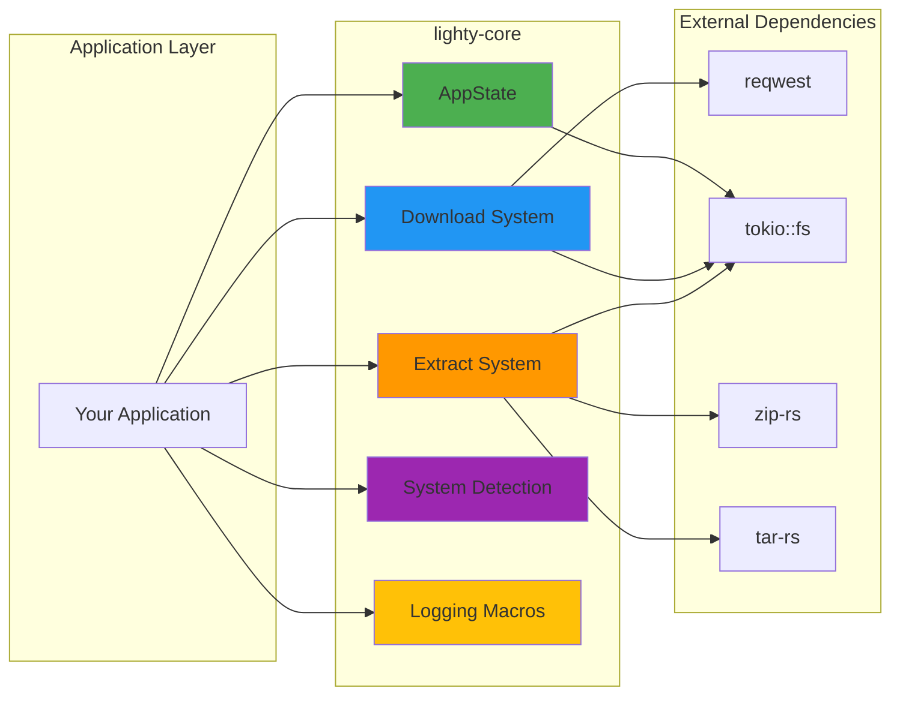

# lighty-core

Core utilities and foundational components for the LightyLauncher ecosystem.

## Overview

`lighty-core` provides essential building blocks used across all LightyLauncher crates:
- **Application State Management** - Global app configuration and directory management
- **File Operations** - Async downloads with retry logic and SHA1 verification
- **Archive Extraction** - ZIP, TAR, and TAR.GZ support
- **System Detection** - Cross-platform OS and architecture detection
- **HTTP Client** - Shared async HTTP client with connection pooling
- **Logging Macros** - Unified tracing macros (trace_info!, trace_error!, etc.)

## Quick Start

```toml
[dependencies]
lighty-core = "0.8.6"
```

```rust
use lighty_core::{AppState, download_file, get_os};

#[tokio::main]
async fn main() -> Result<(), Box<dyn std::error::Error>> {
    // Initialize application state
    let _app = AppState::new("com".into(), "MyCompany".into(), "MyApp".into())?;

    // Detect system
    let os = get_os();
    println!("Running on: {:?}", os);

    // Download a file with SHA1 verification
    download_file(
        "https://example.com/file.zip",
        "/tmp/file.zip",
        Some("expected-sha1-hash")
    ).await?;

    Ok(())
}
```

## Features

| Feature | Description |
|---------|-------------|
| `tracing` | Enable tracing support for logging |

## Core Components

### Application State (`AppState`)

Global configuration management with automatic directory setup.

```rust
// Initialize once at startup
let _app = AppState::new("com".into(), ".MyLauncher".into(), "".into())?;

// Access from anywhere
let dirs = AppState::get_project_dirs();
let name = AppState::get_app_name();      // "MyLauncher"
let version = AppState::get_app_version(); // "0.8.6"
```

**Automatic Paths:**
- Windows: `C:\Users\<User>\AppData\Roaming\<Org>\<App>`
- macOS: `/Users/<User>/Library/Application Support/<Org>.<App>`
- Linux: `/home/<user>/.local/share/<org>/<app>`

### Download System

Async file downloads with retry logic and integrity verification.

```rust
// Download with SHA1 verification
download_file(
    "https://example.com/client.jar",
    "/tmp/client.jar",
    Some("abc123def456...") // SHA1 hash
).await?;

// Download without verification
download_file(url, path, None).await?;
```

**Features:**
- Automatic retry on network errors
- SHA1 hash verification
- Parent directory creation
- Streaming for memory efficiency

### Archive Extraction

Extract ZIP, TAR, and TAR.GZ archives.

```rust
use lighty_core::extract_archive;

extract_archive("file.zip", "/output").await?;
extract_archive("file.tar.gz", "/output").await?;
```

### System Detection

Runtime platform detection for cross-platform support.

```rust
use lighty_core::{get_os, get_architecture, OS, Architecture};

match (get_os(), get_architecture()) {
    (OS::Windows, Architecture::X86_64) => {
        // Windows x64 specific code
    }
    (OS::MacOS, Architecture::Aarch64) => {
        // macOS ARM64 (Apple Silicon)
    }
    (OS::Linux, Architecture::X86_64) => {
        // Linux x64
    }
    _ => {}
}
```

### Logging Macros

Unified tracing macros with conditional compilation.

```rust
use lighty_core::{trace_info, trace_error, trace_debug};

trace_info!("Download started: {}", url);
trace_debug!(file = %path, "Processing file");
trace_error!("Failed to verify: {}", error);
```

## Architecture



## Module Structure

```
lighty-core/
├── app_state.rs    - Global application configuration
├── download.rs     - Async downloads with retry & verification
├── extract.rs      - ZIP, TAR, TAR.GZ extraction
├── system.rs       - OS/Architecture detection
├── hosts.rs        - Shared HTTP client
├── hash.rs         - SHA1/SHA256 verification
├── macros.rs       - Logging macros
└── errors.rs       - Error types
```

## Documentation

📚 **Detailed Guides**

- [Application State Guide](./docs/app_state.md) - AppState initialization and usage
- [Download System Guide](./docs/download.md) - File downloads and verification
- [Archive Extraction Guide](./docs/extract.md) - Working with archives
- [System Detection Guide](./docs/system.md) - Platform detection
- [Logging Macros Guide](./docs/macros.md) - Using trace macros
- [Architecture Overview](./docs/overview.md) - Design and patterns
- [Examples](./docs/examples.md) - Complete code examples

## Error Handling

All operations return `Result` types with descriptive errors:

```rust
use lighty_core::DownloadError;

match download_file(url, path, sha1).await {
    Ok(path) => println!("Downloaded: {:?}", path),
    Err(DownloadError::VerificationFailed { expected, actual }) => {
        eprintln!("Hash mismatch! Expected: {}, Got: {}", expected, actual);
    }
    Err(DownloadError::NetworkError(e)) => {
        eprintln!("Network error: {}", e);
    }
    Err(e) => eprintln!("Error: {:?}", e),
}
```

## Thread Safety

- **AppState**: Thread-safe global access via `OnceCell`
- **HTTP Client**: Shared `reqwest::Client` with connection pooling
- **Download/Extract**: Safe for concurrent operations

## License

MIT

## Links

- **Main Package**: [lighty-launcher](https://crates.io/crates/lighty-launcher)
- **Repository**: [GitHub](https://github.com/Lighty-Launcher/LightyLauncherLib)
- **Documentation**: [docs.rs/lighty-core](https://docs.rs/lighty-core)
