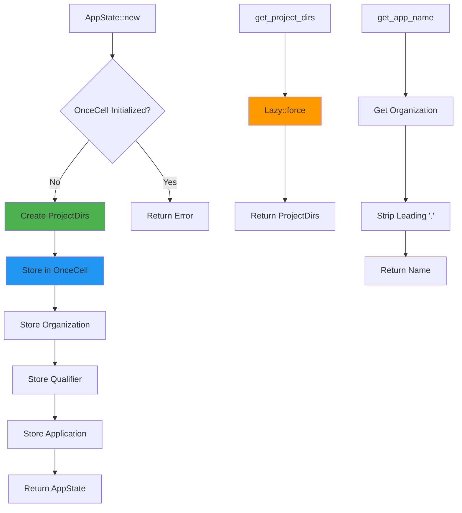

# Application State

## Overview

`AppState` manages global application configuration, including directory paths and metadata. It must be initialized once at application startup before using any LightyLauncher functionality.

## Initialization

```rust
use lighty_core::AppState;

fn main()  {
    // Initialize with your application details
    let _app_state = AppState::new(
        "com".to_string(),        // qualifier (reverse domain)
        ".MyLauncher".to_string(), // organization
        "".to_string(),            // application name (optional)
    )?;

    // Now you can use other LightyLauncher functions
    Ok(())
}
```

## Architecture



## API Reference

### Initialization

#### `AppState::new(qualifier, organization, application)`

Initializes the global application state.

**Parameters:**
- `qualifier`: Reverse domain notation (e.g., `"com"`, `"fr"`)
- `organization`: Organization/launcher name (e.g., `".LightyLauncher"`)
- `application`: Application name (optional, can be empty)

**Returns:** `Result<AppState, AppStateError>`

**Errors:**
- `AppStateError::ProjectDirsCreation` - Failed to create project directories
- `AppStateError::NotInitialized` - AppState already initialized

**Example:**
```rust
let _app = AppState::new(
    "com".into(),
    ".MyLauncher".into(),
    "".into()
)?;
```

### Directory Access

#### `AppState::get_project_dirs()`

Returns the platform-specific project directories.

**Returns:** `&'static Lazy<ProjectDirs>`

**Directories include:**
- `data_dir()` - Application data directory
- `config_dir()` - Configuration directory
- `cache_dir()` - Cache directory

**Example:**
```rust
let dirs = AppState::get_project_dirs();
println!("Data dir: {:?}", dirs.data_dir());
println!("Config dir: {:?}", dirs.config_dir());
```

### Metadata Access

#### `AppState::get_app_name()`

Returns the application name derived from organization.

**Returns:** `String`

**Behavior:**
- Strips leading `.` from organization name
- Falls back to `"LightyLauncher"` if not initialized

**Example:**
```rust
let name = AppState::get_app_name();
// Organization: ".MyLauncher" → Returns: "MyLauncher"
```

#### `AppState::get_app_version()`

Returns the crate version from `Cargo.toml`.

**Returns:** `String`

**Example:**
```rust
let version = AppState::get_app_version();
println!("Version: {}", version); // e.g., "0.8.6"
```

#### `AppState::get_organization()`

Returns the organization name if initialized.

**Returns:** `Option<&'static String>`

#### `AppState::get_qualifier()`

Returns the qualifier if initialized.

**Returns:** `Option<&'static String>`

#### `AppState::get_application()`

Returns the application name if initialized.

**Returns:** `Option<&'static String>`

## Platform-Specific Paths

### Windows
```
C:\Users\<User>\AppData\Roaming\<Organization>\<Application>
C:\Users\<User>\AppData\Local\<Organization>\<Application>\cache
```

### macOS
```
/Users/<User>/Library/Application Support/<Organization>.<Application>
/Users/<User>/Library/Caches/<Organization>.<Application>
```

### Linux
```
/home/<user>/.local/share/<organization>/<application>
/home/<user>/.cache/<organization>/<application>
```

## Thread Safety

`AppState` uses `OnceCell` for thread-safe initialization:

```rust
use std::thread;

fn main()  {
    // Initialize in main thread
    let _app = AppState::new("com".into(), ".MyLauncher".into(), "".into())?;

    // Safe to access from multiple threads
    let handles: Vec<_> = (0..4).map(|_| {
        thread::spawn(|| {
            let dirs = AppState::get_project_dirs();
            println!("{:?}", dirs.data_dir());
        })
    }).collect();

    for handle in handles {
        handle.join().unwrap();
    }

    Ok(())
}
```

## Best Practices

### 1. Initialize Early
```rust
fn main()  {
    // Initialize FIRST, before any other LightyLauncher calls
    let _app = AppState::new("com".into(), ".MyLauncher".into(), "".into())?;

    // Now safe to use other functions
    let version = VersionBuilder::new(/*...*/);
    Ok(())
}
```

### 2. Handle Initialization Errors
```rust
match AppState::new("com".into(), ".MyLauncher".into(), "".into()) {
    Ok(_) => println!("AppState initialized"),
    Err(AppStateError::NotInitialized) => {
        eprintln!("AppState already initialized");
    }
    Err(e) => {
        eprintln!("Failed to initialize AppState: {:?}", e);
    }
}
```

### 3. Organization Naming Convention
```rust
// Leading '.' is stripped for display purposes
let _app = AppState::new(
    "fr".into(),
    ".LightyLauncher".into(),  // → "LightyLauncher" in game
    "".into()
)?;

let name = AppState::get_app_name();
assert_eq!(name, "LightyLauncher");
```

## Integration with Other Crates

### lighty-version
```rust
use lighty_core::AppState;
use lighty_version::VersionBuilder;

let _app = AppState::new(/*...*/)?;
let launcher_dir = AppState::get_project_dirs();

let version = VersionBuilder::new(
    "my-instance",
    Loader::Fabric,
    "0.16.9",
    "1.21",
    launcher_dir
);
```

### lighty-launch
```rust
use lighty_core::AppState;

let _app = AppState::new(/*...*/)?;

// Launch arguments automatically use app name and version
version.launch(&profile, JavaDistribution::Temurin)
    .run()
    .await?;
```

## Error Reference

```rust
pub enum AppStateError {
    /// Project directories could not be created
    ProjectDirsCreation,

    /// AppState has not been initialized or initialization failed
    NotInitialized,
}
```

## See Also

- [Overview](./overview.md) - Architecture overview
- [Examples](./examples.md) - Complete usage examples
