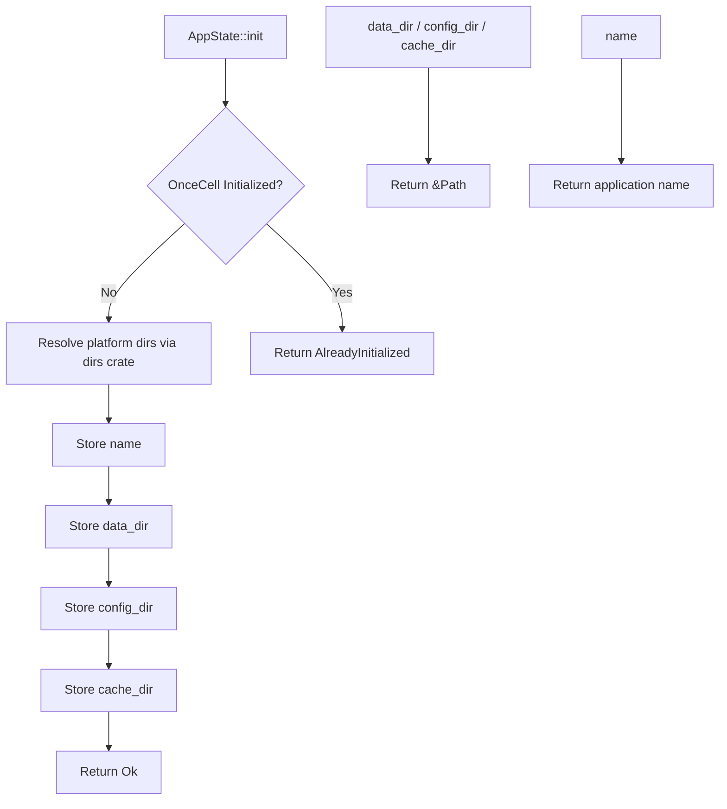

# Application State

## Overview

`AppState` manages global application configuration, including directory paths and metadata. It must be initialized once at application startup before using any LightyLauncher functionality.

## Initialization

```rust
use lighty_core::AppState;

#[tokio::main]
async fn main() -> anyhow::Result<()> {
    // Initialize with your application name
    AppState::init("MyLauncher")?;

    // Now you can use other LightyLauncher functions
    Ok(())
}
```

## Architecture


```mermaid
flowchart TD
    A[AppState::init] --> B{OnceCell Initialized?}
    B -->|No| C[Resolve platform dirs via dirs crate]
    B -->|Yes| D[Return AlreadyInitialized]

    C --> E[Store name]
    E --> F[Store data_dir]
    F --> G[Store config_dir]
    G --> H[Store cache_dir]
    H --> I[Return Ok]

    J[data_dir / config_dir / cache_dir] --> L[Return &Path]

    M[name] --> P[Return application name]
```

## API Reference

### Initialization

#### `AppState::init(name)`

Initializes the global application state.

**Parameters:**
- `name`: Application/launcher name (e.g., `"MyLauncher"`)

**Returns:** `AppStateResult<()>`

**Errors:**
- `AppStateError::AlreadyInitialized` - AppState already initialized
- `AppStateError::MissingDir(&'static str)` - Platform directory unavailable

**Example:**
```rust
AppState::init("MyLauncher")?;
```

### Directory Access

#### `AppState::data_dir() -> &Path`

Returns the platform-specific data directory.

#### `AppState::config_dir() -> &Path`

Returns the platform-specific configuration directory.

#### `AppState::cache_dir() -> &Path`

Returns the platform-specific cache directory.

**Example:**
```rust
println!("Data dir: {:?}", AppState::data_dir());
println!("Config dir: {:?}", AppState::config_dir());
println!("Cache dir: {:?}", AppState::cache_dir());
```

### Metadata Access

#### `AppState::name() -> &str`

Returns the application name passed to `init()`.

**Example:**
```rust
let name = AppState::name();
// AppState::init("MyLauncher") → Returns: "MyLauncher"
```

#### `AppState::app_version() -> &str`

Returns the crate version from `Cargo.toml`.

**Example:**
```rust
let version = AppState::app_version();
println!("Version: {}", version); // e.g., "26.5.1"
```

## Platform-Specific Paths

### Windows
```
%APPDATA%\<name>\
```

### macOS
```
~/Library/Application Support/<name>/
```

### Linux
```
~/.local/share/<name>/
```

## Thread Safety

`AppState` uses `OnceCell` for thread-safe initialization:

```rust
use lighty_core::AppState;
use std::thread;

#[tokio::main]
async fn main() -> anyhow::Result<()> {
    // Initialize in main thread
    AppState::init("MyLauncher")?;

    // Safe to access from multiple threads
    let handles: Vec<_> = (0..4).map(|_| {
        thread::spawn(|| {
            println!("{:?}", AppState::data_dir());
        })
    }).collect();

    for handle in handles {
        handle.join().unwrap();
    }

    Ok(())
}
```

## Best Practices

### 1. Initialize Early
```rust
use lighty_core::AppState;

#[tokio::main]
async fn main() -> anyhow::Result<()> {
    // Initialize FIRST, before any other LightyLauncher calls
    AppState::init("MyLauncher")?;

    // Now safe to use other functions
    let version = VersionBuilder::new(/*...*/);
    Ok(())
}
```

### 2. Handle Initialization Errors
```rust
use lighty_core::{AppState, errors::AppStateError};

match AppState::init("MyLauncher") {
    Ok(()) => println!("AppState initialized"),
    Err(AppStateError::AlreadyInitialized) => {
        eprintln!("AppState already initialized");
    }
    Err(e) => {
        eprintln!("Failed to initialize AppState: {:?}", e);
    }
}
```

### 3. Naming Convention
```rust
use lighty_core::AppState;

// Name is used directly (no leading dot)
AppState::init("LightyLauncher")?;

let name = AppState::name();
assert_eq!(name, "LightyLauncher");
```

## Integration with Other Crates

### lighty-version
```rust
use lighty_core::AppState;
use lighty_version::VersionBuilder;

AppState::init("MyLauncher")?;

let version = VersionBuilder::new(
    "my-instance",
    Loader::Fabric,
    "0.16.9",
    "1.21",
);
```

### lighty-launch
```rust
use lighty_core::AppState;

AppState::init("MyLauncher")?;

// Launch arguments automatically use app name and version
version.launch(&profile, JavaDistribution::Temurin)
    .run()
    .await?;
```

## Error Reference

```rust
pub enum AppStateError {
    /// AppState has not been initialized
    NotInitialized,

    /// AppState was already initialized
    AlreadyInitialized,

    /// Platform directory could not be determined (e.g. no $HOME)
    MissingDir(&'static str),
}
```

## See Also

- [Overview](./overview.md) - Architecture overview
- [Examples](./examples.md) - Complete usage examples
