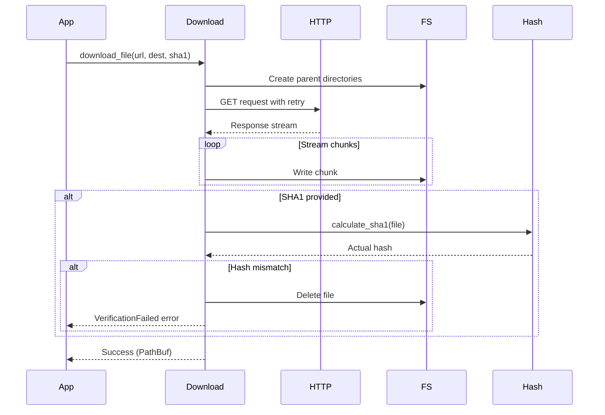

# Download System

## Overview

The download system provides async file downloads with SHA1 verification, retry logic, and proper error handling.

## Quick Example

```rust
use lighty_core::download_file;

#[tokio::main]
async fn main() -> Result<(), Box<dyn std::error::Error>> {
    // Download with SHA1 verification
    let path = download_file(
        "https://example.com/file.zip",
        "/tmp/file.zip",
        Some("expected-sha1-hash")
    ).await?;

    println!("Downloaded to: {:?}", path);
    Ok(())
}
```

## Flow Diagram



## API Reference

### `download_file(url, destination, expected_sha1)`

Downloads a file from a URL to the specified destination.

**Parameters:**
- `url: &str` - URL to download from
- `destination: impl AsRef<Path>` - Local file path
- `expected_sha1: Option<&str>` - Optional SHA1 hash for verification

**Returns:** `Result<PathBuf, DownloadError>`

**Features:**
- Automatic retry on network errors
- Parent directory creation
- SHA1 verification
- Async streaming for memory efficiency

```rust
// Without verification
download_file(
    "https://example.com/file.zip",
    "/tmp/file.zip",
    None
).await?;

// With verification
download_file(
    "https://example.com/file.zip",
    "/tmp/file.zip",
    Some("abc123...")
).await?;
```

## Error Handling

```rust
pub enum DownloadError {
    /// Network error during download
    NetworkError(reqwest::Error),

    /// File system error
    IOError(std::io::Error),

    /// SHA1 verification failed
    VerificationFailed {
        expected: String,
        actual: String,
    },
}
```

**Example:**
```rust
match download_file(url, dest, sha1).await {
    Ok(path) => println!("Downloaded: {:?}", path),
    Err(DownloadError::VerificationFailed { expected, actual }) => {
        eprintln!("Hash mismatch! Expected: {}, Got: {}", expected, actual);
    }
    Err(e) => eprintln!("Download failed: {:?}", e),
}
```

## Best Practices

### 1. Always Verify Critical Files
```rust
// Good: Verify integrity of Minecraft client
download_file(
    client_url,
    client_path,
    Some(&client.sha1)  // Always include SHA1
).await?;
```

### 2. Handle Retries Gracefully
```rust
// Retry is automatic, but handle final failure
match download_file(url, dest, sha1).await {
    Ok(_) => println!("Success"),
    Err(DownloadError::NetworkError(_)) => {
        eprintln!("Network unavailable, try again later");
    }
    Err(e) => eprintln!("Fatal error: {:?}", e),
}
```

### 3. Use Absolute Paths
```rust
use std::path::PathBuf;

let dest = PathBuf::from("/absolute/path/to/file.zip");
download_file(url, &dest, None).await?;
```

## Advanced Usage

### Concurrent Downloads
```rust
use futures::future::join_all;

let downloads = vec![
    download_file(url1, dest1, sha1_1),
    download_file(url2, dest2, sha1_2),
    download_file(url3, dest3, sha1_3),
];

let results = join_all(downloads).await;
```

### Progress Tracking

Currently not directly supported. Use the `indicatif` crate wrapper:

```rust
use indicatif::{ProgressBar, ProgressStyle};

let pb = ProgressBar::new(100);
pb.set_style(ProgressStyle::default_bar()
    .template("{msg} [{bar:40}] {percent}%")?);

// Download (progress not yet integrated)
download_file(url, dest, sha1).await?;
pb.finish_with_message("Downloaded");
```

## See Also

- [Hash Verification](./system.md#hash-verification)
- [Error Handling](./overview.md#error-handling-strategy)
