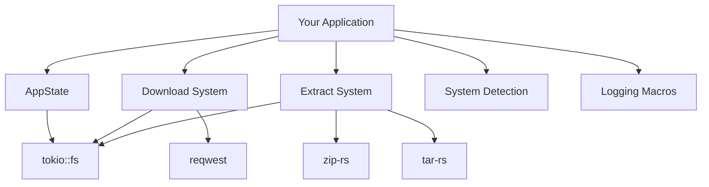
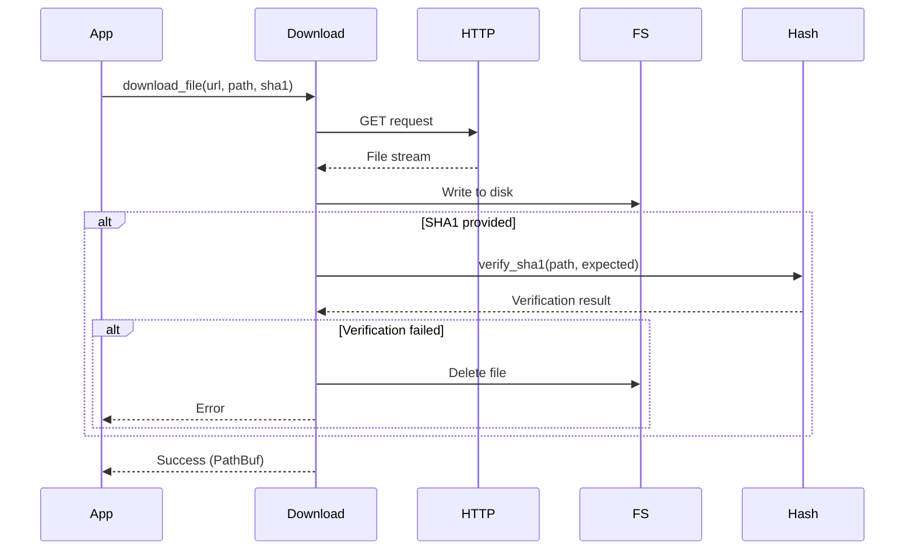
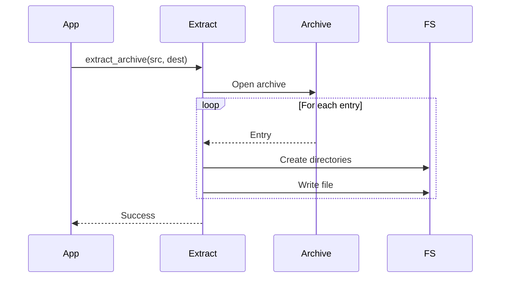

# Architecture Overview

## Introduction

`lighty-core` is the foundational crate that provides core utilities used across the entire LightyLauncher ecosystem. It implements common patterns and utilities to avoid code duplication and ensure consistency.

## Design Philosophy

### 1. **Zero-Cost Abstractions**
- Uses Rust's type system for compile-time guarantees
- Minimal runtime overhead
- Efficient async operations with Tokio

### 2. **Error Handling First**
- Comprehensive error types with `thiserror`
- Clear error messages for debugging
- Proper error propagation with `Result` types

### 3. **Cross-Platform**
- Supports Windows, macOS, and Linux
- Handles platform-specific paths and operations
- Architecture detection (x86_64, aarch64, etc.)

## Core Components



## Module Responsibilities

### AppState
- **Purpose**: Global application configuration
- **Lifecycle**: Initialize once at app startup
- **Dependencies**: `directories` crate for platform paths
- **Thread Safety**: Uses `OnceCell` for thread-safe initialization

### Download System
- **Purpose**: Async file downloads with verification
- **Features**:
  - Concurrent downloads with retry logic
  - SHA1 hash verification
  - Progress tracking support
  - Automatic directory creation

### Extract System
- **Purpose**: Archive extraction
- **Supported Formats**:
  - ZIP (`.zip`)
  - TAR (`.tar`)
  - TAR.GZ (`.tar.gz`)
- **Features**:
  - Streaming extraction for memory efficiency
  - Permission preservation on Unix

### System Detection
- **Purpose**: Runtime platform detection
- **Detects**:
  - Operating System (Windows, macOS, Linux)
  - Architecture (x86_64, x86, aarch64, arm)
- **Use Cases**:
  - Selecting platform-specific downloads
  - Conditional compilation alternatives

### Logging Macros
- **Purpose**: Unified logging interface
- **Macros**:
  - `trace_debug!` - Debug information
  - `trace_info!` - Informational messages
  - `trace_warn!` - Warnings
  - `trace_error!` - Errors
- **Features**:
  - Conditional compilation based on `tracing` feature
  - Fallback to no-op when feature disabled

## Data Flow

### Download Flow



### Extraction Flow



## Error Handling Strategy

All core operations return `Result` types with descriptive errors:

```rust
// Download errors
pub enum DownloadError {
    NetworkError(reqwest::Error),
    IOError(std::io::Error),
    VerificationFailed { expected: String, actual: String },
}

// Extract errors
pub enum ExtractError {
    UnsupportedFormat(String),
    IOError(std::io::Error),
    ArchiveError(String),
}

// AppState errors
pub enum AppStateError {
    NotInitialized,
    ProjectDirsCreation,
}
```

## Thread Safety

### AppState
- Uses `OnceCell` for initialization
- Thread-safe global access
- Initialize once, read many

### HTTP Client
- Shared `reqwest::Client` via `Lazy` static
- Connection pooling for efficiency
- Thread-safe by default

## Performance Considerations

### Download Optimization
- Concurrent downloads using Tokio
- Streaming writes to avoid memory spikes
- Retry logic with exponential backoff

### Extract Optimization
- Streaming extraction
- Parallel extraction for independent files
- Memory-mapped I/O where applicable

## Security Considerations

### Hash Verification
- SHA1 verification for downloaded files
- Optional SHA256 support
- Fail-fast on mismatch

### Path Safety
- Sanitizes archive paths
- Prevents path traversal attacks
- Validates destination directories

## Next Steps

- [Application State Guide](./app_state.md)
- [Download System Guide](./download.md)
- [Examples](./examples.md)
