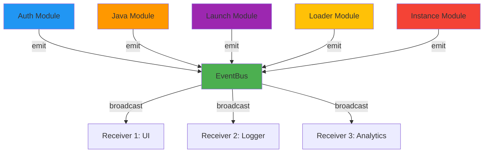
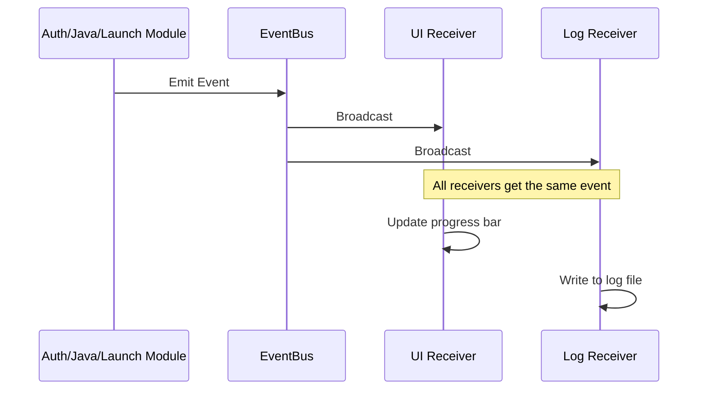

# lighty-event

Real-time event system for monitoring launcher operations and progress tracking.

## Overview

`lighty-event` provides a publish-subscribe event system for:
- **Real-time Progress Tracking** - Download, install, and extraction progress
- **Lifecycle Monitoring** - Authentication, launch, and instance management
- **Console Streaming** - Live game console output (stdout/stderr)
- **Multi-Subscriber Support** - Broadcast to UI, logs, and analytics simultaneously

## Quick Start

```toml
[dependencies]
lighty-event = "0.8.6"
```

```rust
use lighty_event::{EventBus, Event};

#[tokio::main]
async fn main() -> Result<(), Box<dyn std::error::Error>> {
    // Create event bus
    let event_bus = EventBus::new(1000);
    let mut receiver = event_bus.subscribe();

    // Spawn event listener
    tokio::spawn(async move {
        while let Ok(event) = receiver.next().await {
            match event {
                Event::DownloadProgress(e) => {
                    let percent = (e.current * 100) / e.total;
                    println!("Download: {}%", percent);
                }
                Event::InstanceLaunched(e) => {
                    println!("Game launched: {} (PID: {})", e.instance_name, e.pid);
                }
                Event::ConsoleOutput(e) => {
                    print!("[{}] {}", e.stream, e.line);
                }
                _ => {}
            }
        }
    });

    // Use event_bus with launcher operations
    // auth.authenticate(Some(&event_bus)).await?;
    // version.launch(&profile, java).with_event_bus(&event_bus).run().await?;

    Ok(())
}
```

## Event Categories

| Category | Description | Key Events |
|----------|-------------|------------|
| **AuthEvent** | Authentication flow | `AuthenticationStarted`, `AuthenticationSuccess`, `AuthenticationFailed` |
| **JavaEvent** | JRE management | `JavaDownloadProgress`, `JavaExtractionProgress`, `JavaAlreadyInstalled` |
| **LaunchEvent** | Game lifecycle | `InstallStarted`, `InstallProgress`, `Launched`, `ProcessExited` |
| **LoaderEvent** | Mod loaders | `FetchingData`, `DataFetched`, `ManifestCached`, `MergingLoaderData` |
| **CoreEvent** | System operations | `DownloadStarted`, `ExtractionProgress`, `VerificationCompleted` |
| **InstanceEvent** | Instance management | `InstanceLaunched`, `ConsoleOutput`, `InstanceExited`, `InstanceDeleted` |

## Features

- **Async-First Design** - Built on tokio's broadcast channels
- **Zero-Cost Abstraction** - No overhead when events feature disabled
- **Type-Safe Events** - Compile-time validation via Rust's type system
- **Serializable** - All events implement `serde::Serialize` + `Deserialize`
- **Multiple Subscribers** - Broadcast to unlimited listeners
- **Backpressure Handling** - Configurable buffer with lag detection

## Core Features

### Event Bus

Thread-safe event broadcasting with multiple subscribers.

```rust
use lighty_event::EventBus;

// Create with buffer capacity
let event_bus = EventBus::new(1000);

// Subscribe multiple listeners
let ui_receiver = event_bus.subscribe();
let log_receiver = event_bus.subscribe();
let analytics_receiver = event_bus.subscribe();
```

### Console Streaming

Real-time game console output via global `EVENT_BUS`.

```rust
use lighty_event::{Event, ConsoleStream, EVENT_BUS};

let mut receiver = EVENT_BUS.subscribe();

tokio::spawn(async move {
    while let Ok(event) = receiver.next().await {
        if let Event::ConsoleOutput(e) = event {
            match e.stream {
                ConsoleStream::Stdout => print!("[OUT] {}", e.line),
                ConsoleStream::Stderr => eprint!("[ERR] {}", e.line),
            }
        }
    }
});
```

### Progress Tracking

Track download and installation progress.

```rust
use lighty_event::{Event, LaunchEvent};

while let Ok(event) = receiver.next().await {
    match event {
        Event::Launch(LaunchEvent::InstallStarted { total_bytes, .. }) => {
            println!("Installing: {} MB", total_bytes / 1_000_000);
        }
        Event::Launch(LaunchEvent::InstallProgress { bytes }) => {
            // Update progress bar
        }
        Event::Launch(LaunchEvent::InstallCompleted { .. }) => {
            println!("Installation complete!");
        }
        _ => {}
    }
}
```

## Architecture



## Event Flow



## Error Handling

```rust
use lighty_event::{EventReceiveError, EventReceiver};

async fn listen_events(mut receiver: EventReceiver) {
    loop {
        match receiver.next().await {
            Ok(event) => {
                // Handle event
                println!("Event: {:?}", event);
            }
            Err(EventReceiveError::BusDropped) => {
                eprintln!("Event bus closed");
                break;
            }
            Err(EventReceiveError::Lagged { skipped }) => {
                eprintln!("Warning: Missed {} events (slow receiver)", skipped);
                // Continue listening
            }
        }
    }
}
```

## Buffer Size Recommendations

| Application Size | Buffer Size | Use Case |
|-----------------|-------------|----------|
| Small | 100-500 | Simple CLI tools |
| Medium | 500-2000 | Desktop apps with UI |
| Large | 2000-5000 | Complex apps with multiple subscribers |
| Very slow receivers | 5000+ | Heavy processing per event |

```rust
// Small buffer for simple CLI
let event_bus = EventBus::new(500);

// Large buffer for complex desktop app
let event_bus = EventBus::new(5000);
```

## Integration with LightyLauncher

### With Authentication

```rust
use lighty_auth::{OfflineAuth, Authenticator};
use lighty_event::EventBus;

let event_bus = EventBus::new(1000);
let mut auth = OfflineAuth::new("Player");

// Pass event bus to emit auth events
let profile = auth.authenticate(Some(&event_bus)).await?;
```

### With Game Launch

```rust
use lighty_version::VersionBuilder;
use lighty_loaders::types::Loader;
use lighty_java::JavaDistribution;

let mut version = VersionBuilder::new(
    "my-instance",
    Loader::Fabric,
    "0.16.9",
    "1.21",
    launcher_dir
);

// Events are automatically emitted to global EVENT_BUS
version.launch(&profile, JavaDistribution::Temurin)
    .with_event_bus(&event_bus)  // Optional: use custom bus
    .run()
    .await?;
```

## Module Structure

```
lighty-event/
├── lib.rs              - EventBus, EventReceiver, EVENT_BUS
├── errors.rs           - Error types
└── module/
    ├── auth.rs         - AuthEvent
    ├── core.rs         - CoreEvent
    ├── java.rs         - JavaEvent
    ├── launch.rs       - LaunchEvent
    ├── loader.rs       - LoaderEvent
    └── console.rs      - InstanceEvent (console streaming)
```

## Documentation

📚 **Detailed Guides**

- [Architecture](./docs/architecture.md) - Event bus design and data flow
- [Event Reference](./docs/events.md) - Complete event catalog
- [Module System](./docs/modules.md) - Event module organization
- [Examples](./docs/examples.md) - Practical usage patterns

## Serialization

All events support `serde` for easy integration with web APIs, file logging, and network transmission.

```rust
use lighty_event::{Event, LaunchEvent};
use serde_json;

let event = Event::Launch(LaunchEvent::InstallStarted {
    version: "1.21.1".to_string(),
    total_bytes: 1_000_000,
});

// Serialize to JSON
let json = serde_json::to_string(&event)?;

// Deserialize from JSON
let deserialized: Event = serde_json::from_str(&json)?;
```

## Thread Safety

- **EventBus**: Thread-safe via tokio broadcast channels
- **Multiple Subscribers**: Lock-free concurrent access
- **Global EVENT_BUS**: Static instance with lazy initialization

## License

MIT

## Links

- **Main Package**: [lighty-launcher](https://crates.io/crates/lighty-launcher)
- **Repository**: [GitHub](https://github.com/Lighty-Launcher/LightyLauncherLib)
- **Documentation**: [docs.rs/lighty-event](https://docs.rs/lighty-event)
