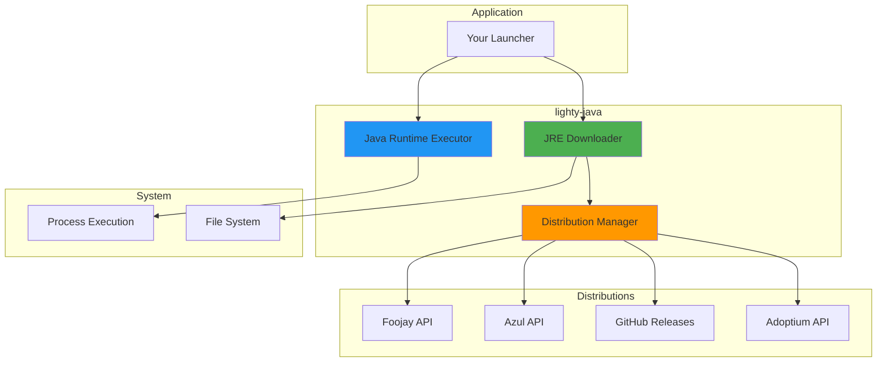
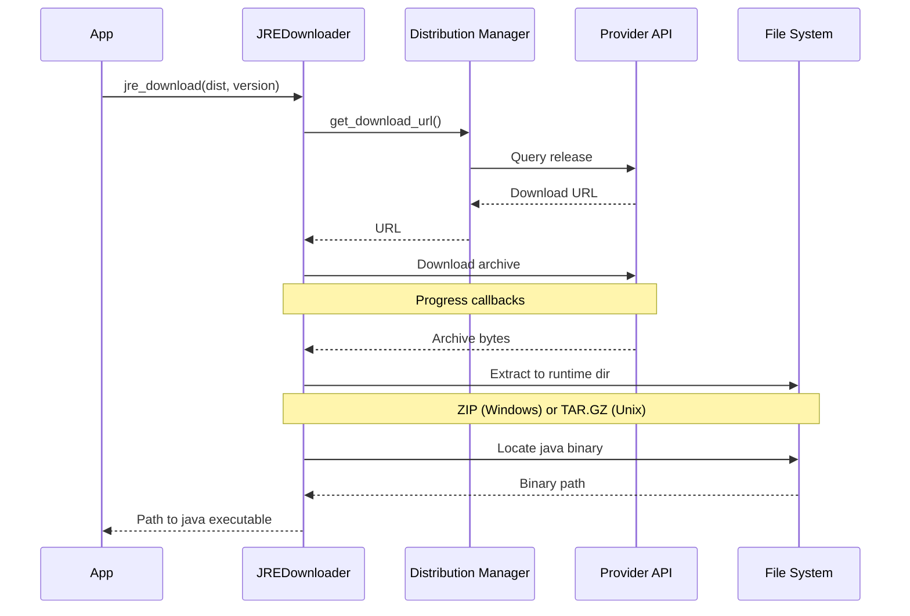

# lighty-java

Automatic Java Runtime Environment (JRE) management for Minecraft launchers with multi-distribution support.

## Overview

`lighty-java` provides automated downloading, installation, and management of Java runtimes for Minecraft:
- **Automatic JRE Download** - Download Java on-demand based on Minecraft version requirements
- **Multi-Distribution Support** - Temurin, GraalVM, Zulu, and Liberica distributions
- **Cross-Platform** - Windows, Linux, and macOS (x64 and ARM64)
- **Version Detection** - Automatically detect required Java version for any Minecraft version
- **Progress Tracking** - Real-time download and extraction progress via event system
- **Caching** - Reuse installed JREs across multiple instances

## Quick Start

```toml
[dependencies]
lighty-java = "0.8.6"
```

### Basic Usage

```rust
use lighty_java::{JavaDistribution, jre_downloader};
use std::path::Path;

#[tokio::main]
async fn main() -> Result<(), Box<dyn std::error::Error>> {
    let runtime_dir = Path::new("./runtimes");

    // Download Java 21 (Temurin distribution)
    let java_path = jre_downloader::jre_download(
        runtime_dir,
        &JavaDistribution::Temurin,
        &21,
        |current, total| {
            let percent = (current * 100) / total;
            println!("Download progress: {}%", percent);
        }
    ).await?;

    println!("Java installed at: {}", java_path.display());

    Ok(())
}
```

### With Event System

```rust
use lighty_java::{JavaDistribution, jre_downloader};
use lighty_event::{EventBus, Event, JavaEvent};

let event_bus = EventBus::new(1000);
let mut receiver = event_bus.subscribe();

// Track events
tokio::spawn(async move {
    while let Ok(event) = receiver.next().await {
        if let Event::Java(java_event) = event {
            match java_event {
                JavaEvent::JavaDownloadStarted { distribution, version, total_bytes } => {
                    println!("Downloading {} {} ({} MB)", distribution, version, total_bytes / 1_000_000);
                }
                JavaEvent::JavaDownloadProgress { bytes } => {
                    print!("\rDownloaded: {} MB", bytes / 1_000_000);
                }
                JavaEvent::JavaExtractionStarted { .. } => {
                    println!("\nExtracting...");
                }
                JavaEvent::JavaExtractionCompleted { binary_path, .. } => {
                    println!("Java ready at: {}", binary_path);
                }
                _ => {}
            }
        }
    }
});

// Download with events
let java_path = jre_downloader::jre_download(
    runtime_dir,
    &JavaDistribution::Temurin,
    &21,
    |_, _| {},  // Progress callback (optional when using events)
    Some(&event_bus)
).await?;
```

## Features

| Feature | Description |
|---------|-------------|
| `events` | Enable event system integration for progress tracking |

## Java Distributions

### Temurin (Recommended)

**Provider**: Eclipse Adoptium
**Type**: OpenJDK builds
**Best For**: General use, maximum compatibility

```rust
let distribution = JavaDistribution::Temurin;
```

**Supported Versions**: 8, 11, 17, 21
**Platforms**: Windows (x64, ARM64), Linux (x64, ARM64), macOS (x64, ARM64)
**Download Source**: Adoptium API

**Characteristics**:
- Most widely tested and stable
- Regular security updates
- Full compatibility with all Minecraft versions
- Smallest download size for older Java versions

### GraalVM

**Provider**: Oracle
**Type**: High-performance JDK with advanced optimizations
**Best For**: Modern Minecraft (1.17+), maximum performance

```rust
let distribution = JavaDistribution::GraalVM;
```

**Supported Versions**: 17, 21
**Platforms**: Windows (x64), Linux (x64, ARM64), macOS (x64, ARM64)
**Download Source**: GitHub Releases

**Characteristics**:
- Advanced JIT compiler for better performance
- Lower memory footprint with G1GC
- Native image support (for future use)
- Only supports Java 17+ (no JDK 8/11)
- Larger download size

### Zulu

**Provider**: Azul Systems
**Type**: Certified OpenJDK builds
**Best For**: Enterprise environments, certified deployments

```rust
let distribution = JavaDistribution::Zulu;
```

**Supported Versions**: 8, 11, 17, 21
**Platforms**: Windows (x64, ARM64), Linux (x64, ARM64), macOS (x64, ARM64)
**Download Source**: Azul API

**Characteristics**:
- TCK-certified OpenJDK builds
- Enterprise support available
- Excellent ARM64 support
- Regular security patches

### Liberica

**Provider**: BellSoft
**Type**: Lightweight OpenJDK distribution
**Best For**: Resource-constrained systems, lightweight deployments

```rust
let distribution = JavaDistribution::Liberica;
```

**Supported Versions**: 8, 11, 17, 21
**Platforms**: Windows (x64, ARM64), Linux (x64, ARM64), macOS (x64, ARM64)
**Download Source**: Foojay API

**Characteristics**:
- Smaller memory footprint
- Optimized for embedded systems
- JavaFX bundled (optional)
- Good for older hardware

## Version Detection

Automatically detect required Java version for Minecraft:

```rust
use lighty_java::runtime::get_jre_version;

// Minecraft 1.20.4 requires Java 17
let required_version = get_jre_version("1.20.4");
println!("Minecraft 1.20.4 requires Java {}", required_version);  // 17

// Minecraft 1.16.5 requires Java 8
let required_version = get_jre_version("1.16.5");
println!("Minecraft 1.16.5 requires Java {}", required_version);  // 8
```

**Version Mapping**:
- **Minecraft 1.18+**: Java 17+
- **Minecraft 1.17 - 1.17.1**: Java 16+
- **Minecraft 1.12 - 1.16.5**: Java 8+
- **Minecraft < 1.12**: Java 8

## Core Components

### JRE Downloader

Download and install Java runtimes:

```rust
use lighty_java::{JavaDistribution, jre_downloader};

// Download Java
let java_path = jre_downloader::jre_download(
    runtime_dir,
    &JavaDistribution::Temurin,
    &21,
    |current, total| {
        println!("Progress: {}/{}", current, total);
    }
).await?;

// Find existing installation
let java_path = jre_downloader::find_java_binary(
    runtime_dir,
    &JavaDistribution::Temurin,
    &21
).await?;
```

### Runtime Execution

Execute Java processes with I/O streaming:

```rust
use lighty_java::runtime::JavaRuntime;

let mut runtime = JavaRuntime::new(&java_path);

// Set arguments
runtime
    .add_arg("-Xmx2G")
    .add_arg("-Xms512M")
    .add_arg("-jar")
    .add_arg("server.jar");

// Execute with output streaming
runtime.run(
    |line| println!("[STDOUT] {}", line),
    |line| eprintln!("[STDERR] {}", line),
).await?;
```

## Architecture



## Download Flow



## Error Handling

Comprehensive error types for all operations:

```rust
use lighty_java::{jre_downloader, JavaDistribution, JreError};

match jre_downloader::jre_download(runtime_dir, &JavaDistribution::Temurin, &21, |_, _| {}).await {
    Ok(java_path) => {
        println!("Java installed: {}", java_path.display());
    }
    Err(JreError::Download(msg)) => {
        eprintln!("Download failed: {}", msg);
    }
    Err(JreError::Extraction(msg)) => {
        eprintln!("Extraction failed: {}", msg);
    }
    Err(JreError::NotFound { path }) => {
        eprintln!("Java binary not found at: {}", path.display());
    }
    Err(JreError::UnsupportedOS) => {
        eprintln!("Unsupported operating system");
    }
    Err(JreError::UnsupportedVersion { version, distribution }) => {
        eprintln!("{} doesn't support Java {}", distribution, version);
    }
    Err(e) => {
        eprintln!("Error: {}", e);
    }
}
```

## Platform Support

| Platform | Architecture | Temurin | GraalVM | Zulu | Liberica |
|----------|-------------|---------|---------|------|----------|
| Windows | x64 | ✅ | ✅ | ✅ | ✅ |
| Windows | ARM64 | ✅ | ❌ | ✅ | ✅ |
| Linux | x64 | ✅ | ✅ | ✅ | ✅ |
| Linux | ARM64 | ✅ | ✅ | ✅ | ✅ |
| macOS | x64 | ✅ | ✅ | ✅ | ✅ |
| macOS | ARM64 (M1/M2) | ✅ | ✅ | ✅ | ✅ |

## Complete Example

```rust
use lighty_java::{JavaDistribution, jre_downloader, runtime};
use std::path::Path;

#[tokio::main]
async fn main() -> Result<(), Box<dyn std::error::Error>> {
    let runtime_dir = Path::new("./runtimes");
    let minecraft_version = "1.20.4";

    // 1. Detect required Java version
    let java_version = runtime::get_jre_version(minecraft_version);
    println!("Minecraft {} requires Java {}", minecraft_version, java_version);

    // 2. Check if Java is already installed
    let java_path = match jre_downloader::find_java_binary(
        runtime_dir,
        &JavaDistribution::Temurin,
        &java_version
    ).await {
        Ok(path) => {
            println!("Using existing Java at: {}", path.display());
            path
        }
        Err(_) => {
            // 3. Download and install Java
            println!("Downloading Java {}...", java_version);
            jre_downloader::jre_download(
                runtime_dir,
                &JavaDistribution::Temurin,
                &java_version,
                |current, total| {
                    let percent = (current * 100) / total;
                    print!("\rProgress: {}%", percent);
                }
            ).await?
        }
    };

    // 4. Run Java process
    let mut java_runtime = runtime::JavaRuntime::new(&java_path);
    java_runtime
        .add_arg("-version");

    java_runtime.run(
        |line| println!("[OUT] {}", line),
        |line| eprintln!("[ERR] {}", line),
    ).await?;

    Ok(())
}
```

## Documentation

📚 **Detailed Guides**

- [Architecture Overview](./docs/overview.md) - Design and implementation details
- [Distributions Guide](./docs/distributions.md) - Deep dive into each Java distribution
- [Installation Guide](./docs/installation.md) - Download and installation process
- [Runtime Execution](./docs/runtime.md) - Java process execution and I/O handling
- [Examples](./docs/examples.md) - Complete usage examples and patterns

## Performance

### Download Sizes

| Distribution | Java 8 | Java 11 | Java 17 | Java 21 |
|--------------|--------|---------|---------|---------|
| Temurin | ~45 MB | ~100 MB | ~110 MB | ~120 MB |
| GraalVM | N/A | N/A | ~180 MB | ~190 MB |
| Zulu | ~50 MB | ~105 MB | ~115 MB | ~125 MB |
| Liberica | ~40 MB | ~95 MB | ~105 MB | ~115 MB |

### Installation Time

**Typical Installation** (on modern system):
- Download: 10-60 seconds (depends on network)
- Extraction: 5-15 seconds
- **Total**: 15-75 seconds

**Caching Benefits**:
- First launch: 15-75 seconds (download + install)
- Subsequent launches: < 1 second (binary lookup)

## Thread Safety

- **JRE Downloader**: Safe for concurrent downloads of different versions
- **Runtime Executor**: Not thread-safe (one runtime per process)
- **HTTP Client**: Shared pool with connection reuse

## Security

- **HTTPS Only**: All downloads use secure connections
- **Archive Verification**: File size validation
- **No Code Execution**: Downloads are passive until explicitly run
- **Sandboxed Extraction**: JREs extracted to isolated directories

## License

MIT

## Links

- **Main Package**: [lighty-launcher](https://crates.io/crates/lighty-launcher)
- **Repository**: [GitHub](https://github.com/Lighty-Launcher/LightyLauncherLib)
- **Documentation**: [docs.rs/lighty-java](https://docs.rs/lighty-java)
