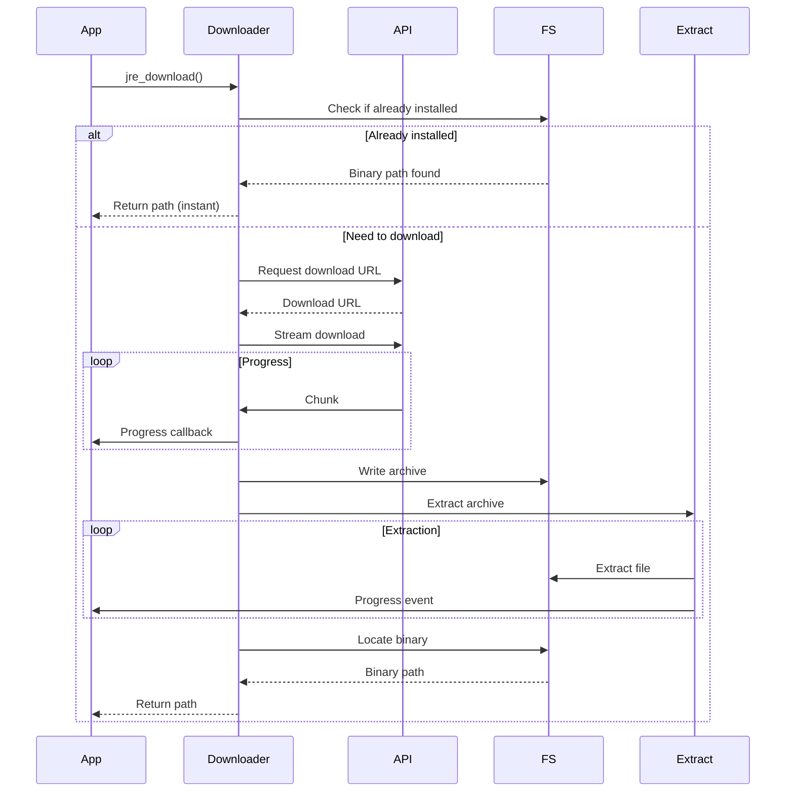

# Installation Guide

## Download Process

### Basic Download

```rust
use lighty_java::{JavaDistribution, jre_downloader};
use std::path::Path;

#[tokio::main]
async fn main() {
    let runtime_dir = Path::new("./runtimes");

    let java_path = jre_downloader::jre_download(
        runtime_dir,
        &JavaDistribution::Temurin,
        &21,
        |current, total| {
            let percent = (current * 100) / total;
            println!("Download: {}%", percent);
        }
    ).await.unwrap();

    println!("Java installed at: {}", java_path.display());
}
```

### With Progress Tracking

```rust
use lighty_java::{JavaDistribution, jre_downloader};

let java_path = jre_downloader::jre_download(
    runtime_dir,
    &JavaDistribution::Temurin,
    &17,
    |current, total| {
        let percent = (current * 100) / total;
        let current_mb = current / 1_000_000;
        let total_mb = total / 1_000_000;
        print!("\rDownloading: {} / {} MB ({}%)", current_mb, total_mb, percent);
    }
).await?;

println!("\nInstalled: {}", java_path.display());
```

### With Event System

```rust
use lighty_java::{JavaDistribution, jre_downloader};
use lighty_event::{EventBus, Event, JavaEvent};

let event_bus = EventBus::new(1000);
let mut receiver = event_bus.subscribe();

// Spawn event listener
tokio::spawn(async move {
    while let Ok(event) = receiver.next().await {
        if let Event::Java(java_event) = event {
            match java_event {
                JavaEvent::JavaDownloadStarted { distribution, version, total_bytes } => {
                    println!("Downloading {} {} ({} MB)", distribution, version, total_bytes / 1_000_000);
                }
                JavaEvent::JavaDownloadProgress { bytes } => {
                    print!("\r{} MB", bytes / 1_000_000);
                }
                JavaEvent::JavaDownloadCompleted { .. } => {
                    println!("\nDownload complete");
                }
                JavaEvent::JavaExtractionStarted { .. } => {
                    println!("Extracting...");
                }
                JavaEvent::JavaExtractionCompleted { binary_path, .. } => {
                    println!("Ready: {}", binary_path);
                }
                _ => {}
            }
        }
    }
});

let java_path = jre_downloader::jre_download(
    runtime_dir,
    &JavaDistribution::Temurin,
    &21,
    |_, _| {},
    Some(&event_bus)
).await?;
```

## Installation Flow



## Directory Structure

### Before Installation

```
runtimes/
└── (empty)
```

### After Installation

```
runtimes/
└── temurin_21/
    └── jdk-21.0.1+12/
        ├── bin/
        │   ├── java         (or java.exe on Windows)
        │   ├── javac
        │   └── ...
        ├── lib/
        │   ├── modules
        │   └── ...
        └── conf/
            └── ...
```

## Finding Existing Installation

Check if Java is already installed before downloading:

```rust
use lighty_java::{JavaDistribution, jre_downloader};

let java_path = match jre_downloader::find_java_binary(
    runtime_dir,
    &JavaDistribution::Temurin,
    &21
).await {
    Ok(path) => {
        println!("Using existing installation: {}", path.display());
        path
    }
    Err(_) => {
        println!("Downloading Java 21...");
        jre_downloader::jre_download(
            runtime_dir,
            &JavaDistribution::Temurin,
            &21,
            |current, total| {
                print!("\r{}%", (current * 100) / total);
            }
        ).await?
    }
};
```

## Installation Naming

Runtime directories follow this pattern:

```
{distribution}_{version}/
```

Examples:
- `temurin_8/` - Temurin Java 8
- `graalvm_21/` - GraalVM Java 21
- `zulu_17/` - Zulu Java 17
- `liberica_11/` - Liberica Java 11

## Archive Extraction

### Windows (ZIP)

```rust
// Extracts to: runtimes/temurin_21/
zip_extract(archive, destination).await?;
```

### Linux/macOS (TAR.GZ)

```rust
// Extracts to: runtimes/temurin_21/
tar_gz_extract(archive, destination).await?;
```

## Binary Location

After extraction, the Java binary is located at:

**Windows**:
```
runtimes/temurin_21/jdk-21.0.1+12/bin/java.exe
```

**macOS**:
```
runtimes/temurin_21/jdk-21.0.1+12/Contents/Home/bin/java
```

**Linux**:
```
runtimes/temurin_21/jdk-21.0.1+12/bin/java
```

## Permissions (Unix)

On Linux and macOS, the binary needs execution permissions:

```rust
// Automatically handled by find_java_binary()
#[cfg(unix)]
{
    use std::os::unix::fs::PermissionsExt;

    let metadata = fs::metadata(&java_path).await?;
    let mut permissions = metadata.permissions();
    permissions.set_mode(0o755);  // rwxr-xr-x
    fs::set_permissions(&java_path, permissions).await?;
}
```

## Error Handling

### Download Errors

```rust
use lighty_java::JreError;

match jre_downloader::jre_download(dir, &dist, &version, |_,_| {}).await {
    Ok(path) => println!("Success: {}", path.display()),

    Err(JreError::Download(msg)) => {
        eprintln!("Download failed: {}", msg);
        // Possible causes:
        // - Network connectivity issues
        // - Invalid distribution/version combination
        // - API rate limiting
    }

    Err(JreError::Extraction(msg)) => {
        eprintln!("Extraction failed: {}", msg);
        // Possible causes:
        // - Corrupted archive
        // - Insufficient disk space
        // - Permission issues
    }

    Err(JreError::NotFound { path }) => {
        eprintln!("Binary not found: {}", path.display());
        // Possible causes:
        // - Unexpected archive structure
        // - Platform detection error
    }

    Err(JreError::UnsupportedOS) => {
        eprintln!("Your operating system is not supported");
    }

    Err(JreError::UnsupportedVersion { version, distribution }) => {
        eprintln!("{} doesn't support Java {}", distribution, version);
        // GraalVM only supports Java 17+
    }

    Err(e) => {
        eprintln!("Unexpected error: {}", e);
    }
}
```

### Network Retry

The download system automatically retries on network errors:

```rust
// Automatic retry with exponential backoff
// - Retry 1: Wait 1 second
// - Retry 2: Wait 2 seconds
// - Retry 3: Wait 4 seconds
// Max retries: 3
```

## Disk Space Requirements

Ensure sufficient disk space before downloading:

| Distribution | Java 8 | Java 11 | Java 17 | Java 21 |
|--------------|--------|---------|---------|---------|
| Temurin | ~120 MB | ~250 MB | ~275 MB | ~300 MB |
| GraalVM | N/A | N/A | ~450 MB | ~475 MB |
| Zulu | ~125 MB | ~260 MB | ~290 MB | ~315 MB |
| Liberica | ~100 MB | ~240 MB | ~265 MB | ~290 MB |

Space includes:
- Downloaded archive
- Extracted files
- 10% buffer for safety

## Cleanup

Remove old Java installations:

```rust
use tokio::fs;

// Remove specific version
fs::remove_dir_all("runtimes/temurin_8").await?;

// Remove all runtimes
fs::remove_dir_all("runtimes").await?;
```

## Concurrent Downloads

Multiple Java versions can be downloaded concurrently:

```rust
use tokio::try_join;

let (java8, java17, java21) = try_join!(
    jre_downloader::jre_download(dir, &JavaDistribution::Temurin, &8, |_,_| {}),
    jre_downloader::jre_download(dir, &JavaDistribution::Temurin, &17, |_,_| {}),
    jre_downloader::jre_download(dir, &JavaDistribution::Temurin, &21, |_,_| {})
)?;

println!("Java 8: {}", java8.display());
println!("Java 17: {}", java17.display());
println!("Java 21: {}", java21.display());
```

## See Also

- [Overview](./overview.md) - Architecture overview
- [Distributions](./distributions.md) - Distribution comparison
- [Runtime](./runtime.md) - Executing Java processes
- [Examples](./examples.md) - Complete examples
