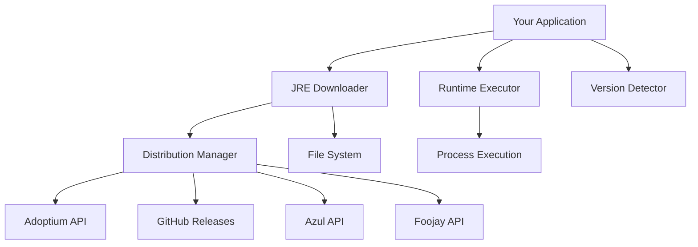
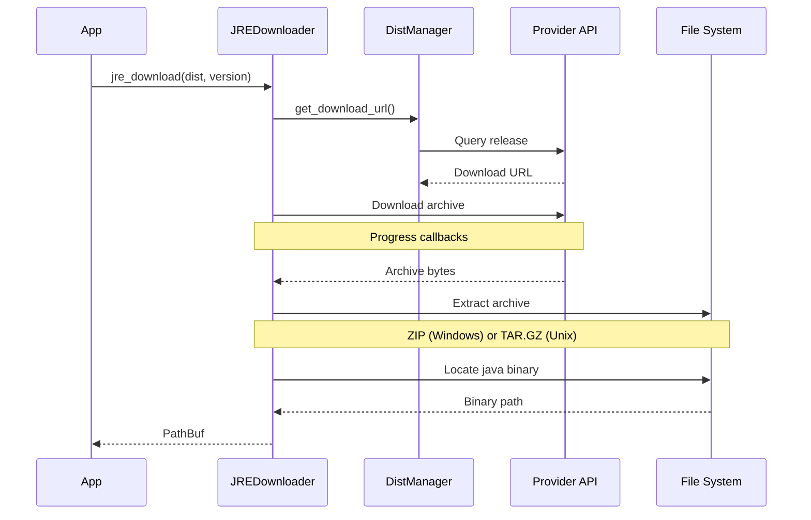
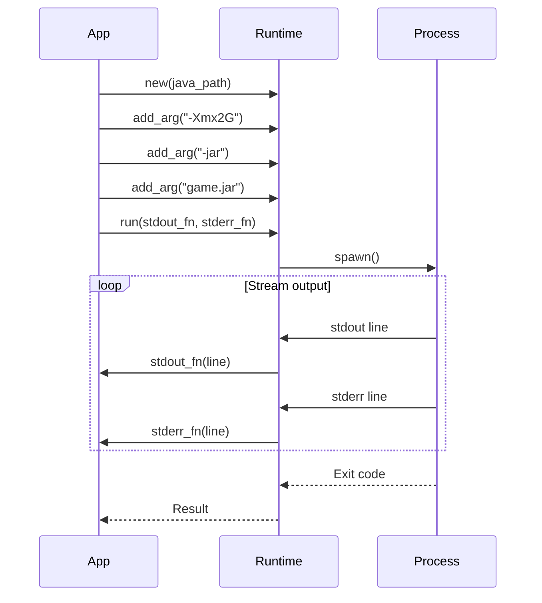
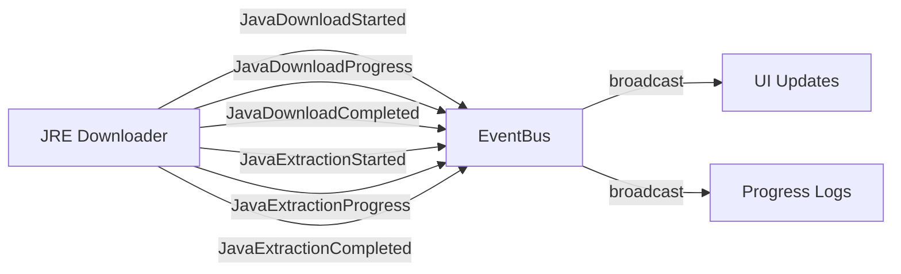

# Architecture Overview

## Design Philosophy

`lighty-java` follows a provider-based architecture where each Java distribution (Temurin, GraalVM, Zulu, Liberica) is abstracted behind a common interface.

### Key Principles

1. **Provider Abstraction** - Common API for all distributions
2. **On-Demand Downloads** - Only download when needed
3. **Version Detection** - Automatically determine required Java version
4. **Platform Support** - Cross-platform with native archive handling

## Core Components



## Module Responsibilities

### JRE Downloader (`jre_downloader.rs`)

Handles downloading and installing Java runtimes:
- Query distribution APIs for download URLs
- Stream downloads with progress callbacks
- Extract archives (ZIP for Windows, TAR.GZ for Unix)
- Locate java binary in extracted directory
- Set execution permissions (Unix only)

### Distribution Manager (`distribution/mod.rs`)

Manages Java distribution providers:
- **Temurin**: Queries Adoptium API for OpenJDK releases
- **GraalVM**: Fetches from GitHub releases
- **Zulu**: Queries Azul API for certified builds
- **Liberica**: Uses Foojay API for lightweight builds

### Runtime Executor (`runtime.rs`)

Executes Java processes with I/O streaming:
- Build command-line arguments
- Spawn Java process
- Stream stdout/stderr in real-time
- Handle process lifecycle

### Version Detector (`runtime.rs`)

Determines required Java version for Minecraft:
- Maps Minecraft version to Java version
- Returns minimum required Java version
- Supports all Minecraft versions from 1.7+ to latest

## Data Flow

### Download Flow



### Execution Flow



## Distribution Architecture

Each distribution implements URL building differently:

### Temurin (Adoptium)
- **API**: `https://api.adoptium.net/v3/assets/`
- **Query**: Feature version, image type (JRE), OS, architecture
- **Response**: JSON with binary download URL
- **Support**: All Java versions (8, 11, 17, 21+)

### GraalVM (Oracle)
- **Source**: GitHub Releases
- **Format**: Direct download URLs from release assets
- **Pattern**: `graalvm-jdk-{version}_{os}_{arch}.{ext}`
- **Support**: Java 17+ only

### Zulu (Azul)
- **API**: `https://api.azul.com/metadata/v1/zulu/packages/`
- **Query**: Java version, OS, architecture, bundle type (JRE)
- **Response**: JSON with download URL
- **Support**: All Java versions with excellent ARM support

### Liberica (Foojay)
- **API**: `https://api.foojay.io/disco/v3.0/packages`
- **Query**: Java version, distribution, OS, architecture
- **Response**: JSON with package details
- **Support**: All Java versions, optimized for embedded systems

## Platform Detection

### Operating System

```rust
match OS {
    OperatingSystem::WINDOWS => "windows",
    OperatingSystem::LINUX => "linux",
    OperatingSystem::OSX => "mac",
    OperatingSystem::UNKNOWN => return Err(UnsupportedOS),
}
```

### Architecture

```rust
match ARCH {
    Architecture::X64 => "x64",
    Architecture::AARCH64 => "aarch64",
    _ => return Err(UnsupportedArchitecture),
}
```

### Archive Format

- **Windows**: ZIP archives
- **Linux/macOS**: TAR.GZ archives

## Binary Location

Java binary location varies by platform:

**Windows**:
```
jre_root/bin/java.exe
```

**macOS**:
```
jre_root/Contents/Home/bin/java
```

**Linux**:
```
jre_root/bin/java
```

## Error Handling

### Error Types

```rust
pub enum JreError {
    Download(String),      // Network or API errors
    Extraction(String),    // Archive extraction failures
    NotFound { path },     // Binary not found after extraction
    UnsupportedOS,         // Platform not supported
    UnsupportedVersion,    // Distribution doesn't support this Java version
    IO(std::io::Error),    // File system errors
}
```

### Error Propagation

All errors use `thiserror` for clear error messages:
- Network failures include URL and status code
- Extraction errors include archive type and path
- Not found errors include expected binary path

## Performance Considerations

### Download Optimization

- **Streaming**: Downloads stream directly to disk
- **No buffering**: Minimal memory usage for large files
- **Progress callbacks**: Real-time progress without overhead

### Extraction Optimization

- **Lazy extraction**: Only extract when needed
- **Memory-mapped I/O**: Efficient for large archives
- **Async operations**: Non-blocking file I/O

### Caching Strategy

- **Binary lookup**: O(1) directory check
- **No re-downloads**: Check for existing installation first
- **Persistent cache**: Installations persist across runs

## Thread Safety

- **HTTP Client**: Shared global client with connection pooling
- **File Operations**: Async tokio::fs for concurrent safety
- **No global state**: Each download is independent

## Event System Integration

When `events` feature is enabled:



Events emitted during download:
1. `JavaDownloadStarted` - Total bytes, distribution, version
2. `JavaDownloadProgress` - Current bytes downloaded
3. `JavaDownloadCompleted` - Distribution, version
4. `JavaExtractionStarted` - Distribution, version
5. `JavaExtractionProgress` - Files extracted, total files
6. `JavaExtractionCompleted` - Binary path, distribution, version

## See Also

- [Distributions Guide](./distributions.md) - Deep dive into each distribution
- [Installation Guide](./installation.md) - Download and installation process
- [Runtime Execution](./runtime.md) - Java process execution
- [Examples](./examples.md) - Complete usage examples
