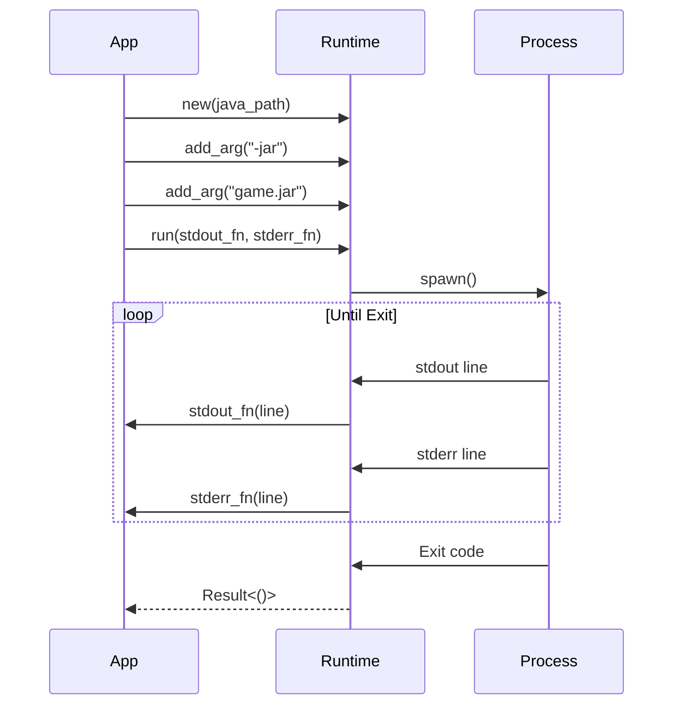

# Runtime Execution

## Overview

The `JavaRuntime` struct provides execution of Java processes with real-time I/O streaming.

## Basic Execution

```rust
use lighty_java::runtime::JavaRuntime;

#[tokio::main]
async fn main() {
    let java_path = "/path/to/java";

    let mut runtime = JavaRuntime::new(java_path);
    runtime.add_arg("-version");

    runtime.run(
        |line| println!("[STDOUT] {}", line),
        |line| eprintln!("[STDERR] {}", line),
    ).await.unwrap();
}
```

## Building Arguments

### Chaining Method

```rust
let mut runtime = JavaRuntime::new(&java_path);

runtime
    .add_arg("-Xmx2G")
    .add_arg("-Xms512M")
    .add_arg("-XX:+UseG1GC")
    .add_arg("-jar")
    .add_arg("minecraft.jar");
```

### From Vec

```rust
let args = vec![
    "-Xmx2G",
    "-Xms512M",
    "-jar",
    "minecraft.jar"
];

let mut runtime = JavaRuntime::new(&java_path);
for arg in args {
    runtime.add_arg(arg);
}
```

## Memory Configuration

### Basic Memory Settings

```rust
runtime
    .add_arg("-Xmx4G")      // Maximum heap: 4GB
    .add_arg("-Xms1G");     // Initial heap: 1GB
```

### Recommended Settings

```rust
runtime
    .add_arg("-Xmx4G")
    .add_arg("-Xms1G")
    .add_arg("-XX:+UseG1GC")
    .add_arg("-XX:+UnlockExperimentalVMOptions")
    .add_arg("-XX:G1NewSizePercent=20")
    .add_arg("-XX:G1ReservePercent=20")
    .add_arg("-XX:MaxGCPauseMillis=50")
    .add_arg("-XX:G1HeapRegionSize=32M");
```

## Output Streaming

### Real-time Console Output

```rust
runtime.run(
    |line| {
        // Handle stdout
        println!("{}", line);
    },
    |line| {
        // Handle stderr
        eprintln!("ERROR: {}", line);
    },
).await?;
```

### Filtering Output

```rust
runtime.run(
    |line| {
        if line.contains("[INFO]") {
            println!("{}", line);
        }
    },
    |line| {
        if line.contains("Exception") || line.contains("Error") {
            eprintln!("CRITICAL: {}", line);
        }
    },
).await?;
```

### Logging to File

```rust
use std::fs::OpenOptions;
use std::io::Write;

let mut log_file = OpenOptions::new()
    .create(true)
    .append(true)
    .open("game.log")?;

runtime.run(
    |line| {
        writeln!(log_file, "[OUT] {}", line).ok();
    },
    |line| {
        writeln!(log_file, "[ERR] {}", line).ok();
    },
).await?;
```

## Process Management

### Execution Flow



### Exit Code Handling

```rust
match runtime.run(|line| println!("{}", line), |line| eprintln!("{}", line)).await {
    Ok(()) => {
        println!("Process exited successfully");
    }
    Err(e) => {
        eprintln!("Process failed: {}", e);
    }
}
```

## Common Use Cases

### Running Minecraft Client

```rust
use lighty_java::runtime::JavaRuntime;

let mut runtime = JavaRuntime::new(&java_path);

runtime
    .add_arg("-Xmx4G")
    .add_arg("-Xms1G")
    .add_arg("-Djava.library.path=natives")
    .add_arg("-cp")
    .add_arg("libraries/*:minecraft.jar")
    .add_arg("net.minecraft.client.main.Main")
    .add_arg("--username")
    .add_arg("Player")
    .add_arg("--version")
    .add_arg("1.20.4");

runtime.run(
    |line| println!("[GAME] {}", line),
    |line| eprintln!("[ERROR] {}", line),
).await?;
```

### Version Check

```rust
let mut runtime = JavaRuntime::new(&java_path);
runtime.add_arg("-version");

let mut version_info = String::new();

runtime.run(
    |_| {},  // Version info goes to stderr
    |line| {
        version_info.push_str(line);
        version_info.push('\n');
    },
).await?;

println!("Java version:\n{}", version_info);
```

## Performance Optimization

### GraalVM Arguments

```rust
// For GraalVM distributions
runtime
    .add_arg("-XX:+UseG1GC")
    .add_arg("-XX:+UnlockExperimentalVMOptions")
    .add_arg("-XX:G1NewSizePercent=20")
    .add_arg("-XX:G1ReservePercent=20")
    .add_arg("-XX:MaxGCPauseMillis=50")
    .add_arg("-XX:G1HeapRegionSize=32M");
```

### ZGC (Java 17+)

```rust
// For low-latency applications
runtime
    .add_arg("-XX:+UseZGC")
    .add_arg("-Xmx16G")
    .add_arg("-Xms16G");
```

### Shenandoah GC

```rust
// For predictable pause times
runtime
    .add_arg("-XX:+UseShenandoahGC")
    .add_arg("-Xmx8G")
    .add_arg("-Xms8G");
```

## Error Handling

### Runtime Errors

```rust
use lighty_java::JavaRuntimeError;

match runtime.run(stdout, stderr).await {
    Ok(()) => println!("Success"),

    Err(JavaRuntimeError::SpawnFailed(e)) => {
        eprintln!("Failed to start Java process: {}", e);
        // Possible causes:
        // - Invalid java path
        // - Insufficient permissions
        // - Missing dependencies
    }

    Err(JavaRuntimeError::ExecutionFailed(code)) => {
        eprintln!("Java process exited with code: {}", code);
        // Non-zero exit code indicates error
    }

    Err(e) => {
        eprintln!("Unexpected error: {}", e);
    }
}
```

## Advanced Features

### Environment Variables

```rust
use std::process::Command;

// For custom environment
let output = Command::new(&java_path)
    .env("JAVA_HOME", "/path/to/java")
    .env("PATH", "/custom/path")
    .args(&["-version"])
    .output()
    .await?;
```

### Working Directory

```rust
use std::process::Command;

let output = Command::new(&java_path)
    .current_dir("/path/to/game")
    .args(&["-jar", "server.jar"])
    .output()
    .await?;
```

### Input Streaming

For interactive Java programs:

```rust
use tokio::process::Command;
use tokio::io::AsyncWriteExt;

let mut child = Command::new(&java_path)
    .args(&["-jar", "interactive.jar"])
    .stdin(std::process::Stdio::piped())
    .spawn()?;

if let Some(mut stdin) = child.stdin.take() {
    stdin.write_all(b"input command\n").await?;
}

child.wait().await?;
```

## See Also

- [Overview](./overview.md) - Architecture overview
- [Installation](./installation.md) - Downloading and installing Java
- [Distributions](./distributions.md) - Java distribution comparison
- [Examples](./examples.md) - Complete examples
