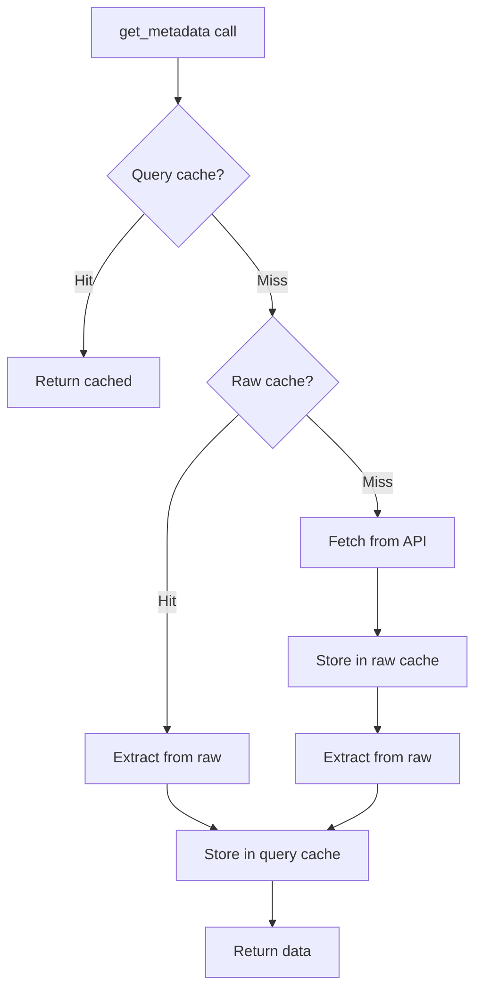

# Cache System

## Overview

The cache system uses a dual-layer architecture to minimize network requests and improve performance.

**Exports**:
- `lighty_loaders::utils::cache::Cache`
- `lighty_loaders::utils::cache::CachedData`

## Two-Layer Architecture

### Layer 1: Raw Version Cache

Stores complete, unparsed data from external APIs.

**Purpose**: Avoid redundant API calls
**Key**: Version identifier (String)
**Value**: Raw data (e.g., JSON struct)
**TTL**: 1 hour (configurable via `Query::cache_ttl()`)

**Example keys**:
- `"vanilla-1.21.1"`
- `"fabric-1.21.1-0.16.9"`
- `"quilt-1.21.1-0.27.1"`

### Layer 2: Query Cache

Stores extracted, processed metadata for specific queries.

**Purpose**: Avoid re-parsing/re-processing raw data
**Key**: `QueryKey<Q>` (version + query type)
**Value**: `Arc<VersionMetaData>`
**TTL**: 1 hour (configurable via `Query::cache_ttl_for_query()`)

**Example keys**:
```rust
QueryKey {
    version: "vanilla-1.21.1",
    query: VanillaQuery::Libraries
}
QueryKey {
    version: "fabric-1.21.1-0.16.9",
    query: FabricQuery::FabricBuilder
}
```

## Data Flow



## Cache Implementation

### CachedData Structure

```rust
use std::time::{Duration, Instant};

pub struct CachedData<T> {
    pub data: T,
    pub timestamp: Instant,
    pub ttl: Duration,
}

impl<T> CachedData<T> {
    pub fn is_expired(&self) -> bool {
        self.timestamp.elapsed() >= self.ttl
    }
}
```

### Cache Type

```rust
use std::collections::HashMap;
use std::sync::{Arc, RwLock};

pub struct Cache<K, V> {
    data: Arc<RwLock<HashMap<K, CachedData<V>>>>,
}

impl<K, V> Cache<K, V>
where
    K: Eq + std::hash::Hash + Clone,
    V: Clone,
{
    pub fn new() -> Self {
        Self {
            data: Arc::new(RwLock::new(HashMap::new())),
        }
    }

    pub fn get(&self, key: &K) -> Option<V> {
        let cache = self.data.read().unwrap();

        if let Some(cached) = cache.get(key) {
            if !cached.is_expired() {
                return Some(cached.data.clone());
            }
        }

        None
    }

    pub fn insert(&self, key: K, value: V, ttl: Duration) {
        let mut cache = self.data.write().unwrap();
        cache.insert(key, CachedData {
            data: value,
            timestamp: Instant::now(),
            ttl,
        });
    }
}
```

## TTL Configuration

### Default TTL

```rust
impl Query for MyLoaderQuery {
    // Default: 1 hour for all queries
    fn cache_ttl() -> Duration {
        Duration::from_secs(3600)
    }
}
```

### Per-Query TTL

```rust
impl Query for VanillaQuery {
    fn cache_ttl_for_query(query: &Self::Query) -> Duration {
        match query {
            VanillaQuery::VanillaBuilder => Duration::from_secs(7200),  // 2 hours
            VanillaQuery::Libraries => Duration::from_secs(3600),       // 1 hour
            VanillaQuery::Assets => Duration::from_secs(1800),          // 30 min
            _ => Self::cache_ttl(),                                      // Default
        }
    }
}
```

## Cache Behavior

### First Request (Cold Cache)

```rust
let instance = VersionBuilder::new("vanilla-1.21", Loader::Vanilla, "", "1.21.1", launcher_dir);

// First call: fetches from API (~500ms)
let metadata1 = instance.get_metadata().await?;
```

**What happens**:
1. Check query cache → Miss
2. Check raw cache → Miss
3. Fetch from Mojang API → `https://piston-meta.mojang.com/...`
4. Parse JSON → `VanillaMetaData`
5. Store in raw cache (key: `"vanilla-1.21.1"`)
6. Extract metadata → `Version`
7. Store in query cache (key: `QueryKey { version: "vanilla-1.21.1", query: VanillaBuilder }`)
8. Return `Arc<VersionMetaData>`

### Second Request (Warm Cache)

```rust
// Second call: uses query cache (~1ms)
let metadata2 = instance.get_metadata().await?;
```

**What happens**:
1. Check query cache → Hit!
2. Return cached `Arc<VersionMetaData>`

### Different Query (Partial Cache)

```rust
// Get libraries only
let libraries = instance.get_libraries().await?;
```

**What happens**:
1. Check query cache (key: `QueryKey { version: "vanilla-1.21.1", query: Libraries }`) → Miss
2. Check raw cache (key: `"vanilla-1.21.1"`) → Hit!
3. Extract libraries from cached raw data
4. Store in query cache
5. Return `Arc<VersionMetaData>`

### After TTL Expiry

```rust
// After 1 hour, cache expired
let metadata3 = instance.get_metadata().await?;
```

**What happens**:
1. Check query cache → Expired (TTL exceeded)
2. Check raw cache → Expired (TTL exceeded)
3. Fetch from API again
4. Store both caches
5. Return data

## Event Integration

Cache hits/misses emit events:

```rust
#[cfg(feature = "events")]
use lighty_event::{Event, LoaderEvent};

// Cache hit
EVENT_BUS.emit(Event::Loader(LoaderEvent::ManifestCached {
    loader: "Vanilla".to_string(),
}));

// Cache miss
EVENT_BUS.emit(Event::Loader(LoaderEvent::FetchingData {
    loader: "Vanilla".to_string(),
    minecraft_version: "1.21.1".to_string(),
    loader_version: "".to_string(),
}));
```

## Performance Metrics

### Typical Latencies

| Operation | Cold Cache | Warm Cache | Improvement |
|-----------|------------|------------|-------------|
| Vanilla metadata | ~500ms | ~1ms | 500x |
| Fabric metadata | ~800ms | ~1ms | 800x |
| Libraries only | ~300ms | ~1ms | 300x |
| Multiple queries | ~500ms first, ~1ms rest | ~1ms all | Massive |

### Cache Hit Rates

In typical usage:
- **First launch**: 0% hit rate (cold cache)
- **Subsequent launches**: 95%+ hit rate
- **After 1 hour**: Gradual decrease as caches expire

## Thread Safety

All cache operations are thread-safe:
- Uses `Arc<RwLock<HashMap>>`
- Read locks for queries (multiple concurrent reads allowed)
- Write locks for insertions (exclusive access)
- No deadlocks (short-lived locks)

## Memory Management

### Cache Size

Caches grow with unique versions:
- Each version has 1 raw cache entry
- Each version/query combination has 1 query cache entry

**Example**:
- 5 versions × 1 query each = 5 raw + 5 query entries
- 1 version × 6 queries = 1 raw + 6 query entries

### Cleanup

Expired entries are not automatically removed. They're replaced on next access or remain until process ends.

For long-running processes, consider periodic cleanup (not currently implemented).

## Cache Keys

### Raw Cache Keys

Format: `"{loader}-{minecraft_version}[-{loader_version}]"`

Examples:
- `"vanilla-1.21.1"`
- `"fabric-1.21.1-0.16.9"`
- `"quilt-1.21.1-0.27.1"`
- `"neoforge-1.21.1-21.1.80"`

### Query Cache Keys

```rust
#[derive(Debug, Clone, PartialEq, Eq, Hash)]
pub struct QueryKey<Q> {
    pub version: String,  // Same as raw cache key
    pub query: Q,          // Query enum variant
}
```

Examples:
```rust
QueryKey {
    version: "vanilla-1.21.1",
    query: VanillaQuery::Libraries
}
QueryKey {
    version: "fabric-1.21.1-0.16.9",
    query: FabricQuery::FabricBuilder
}
```

## Debugging Cache

### Enable Tracing

```rust
#[tokio::main]
async fn main() -> anyhow::Result<()> {
    #[cfg(feature = "tracing")]
    tracing_subscriber::fmt()
        .with_max_level(tracing::Level::DEBUG)
        .init();

    // Cache operations will be logged
    let metadata = instance.get_metadata().await?;

    Ok(())
}
```

**Logs**:
```
DEBUG vanilla: Fetching manifest from https://piston-meta.mojang.com/...
DEBUG vanilla: Manifest fetched successfully
DEBUG vanilla: Extracting VanillaBuilder query
DEBUG vanilla: Metadata cached
```

### Monitor Events

```rust
let mut receiver = EVENT_BUS.subscribe();

tokio::spawn(async move {
    while let Ok(event) = receiver.next().await {
        if let Event::Loader(LoaderEvent::ManifestCached { loader }) => {
            println!("Cache hit: {}", loader);
        }
        if let Event::Loader(LoaderEvent::FetchingData { loader, .. }) => {
            println!("Cache miss: {}", loader);
        }
    }
});
```

## Best Practices

### 1. Reuse VersionBuilder

Don't create new instances for same version:

**Bad**:
```rust
for _ in 0..10 {
    let instance = VersionBuilder::new("vanilla", Loader::Vanilla, "", "1.21.1", launcher_dir);
    instance.get_metadata().await?;  // Cache still works!
}
```

**Good** (but cache works anyway):
```rust
let instance = VersionBuilder::new("vanilla", Loader::Vanilla, "", "1.21.1", launcher_dir);

for _ in 0..10 {
    instance.get_metadata().await?;  // Cached after first call
}
```

### 2. Use Specific Queries When Possible

If you only need libraries, use `get_libraries()`:

```rust
// Faster (smaller data)
let libraries = instance.get_libraries().await?;

// Slower (more data, but cached separately)
let metadata = instance.get_metadata().await?;
let libraries = &metadata.libraries;
```

### 3. TTL Configuration

Adjust TTL based on data stability:
- Stable releases: Longer TTL (24 hours)
- Snapshots: Shorter TTL (30 minutes)
- Development: Very short TTL (5 minutes)

## Related Documentation

- [Overview](./overview.md) - Architecture overview
- [Query System](./query.md) - Implementing queries
- [Traits](./traits.md) - VersionInfo and LoaderExtensions
- [Events](./events.md) - LoaderEvent types
