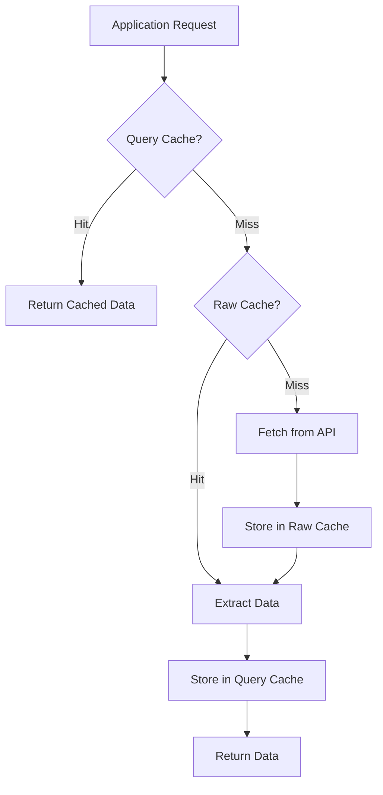
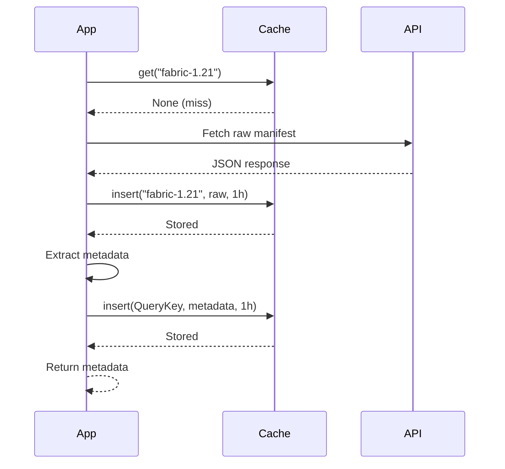
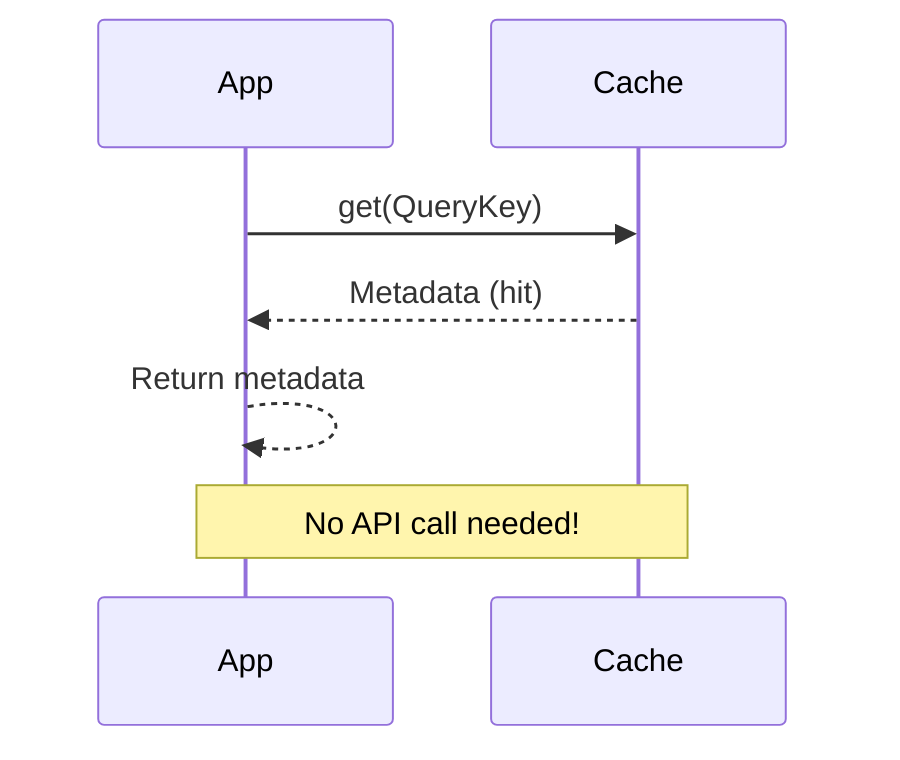
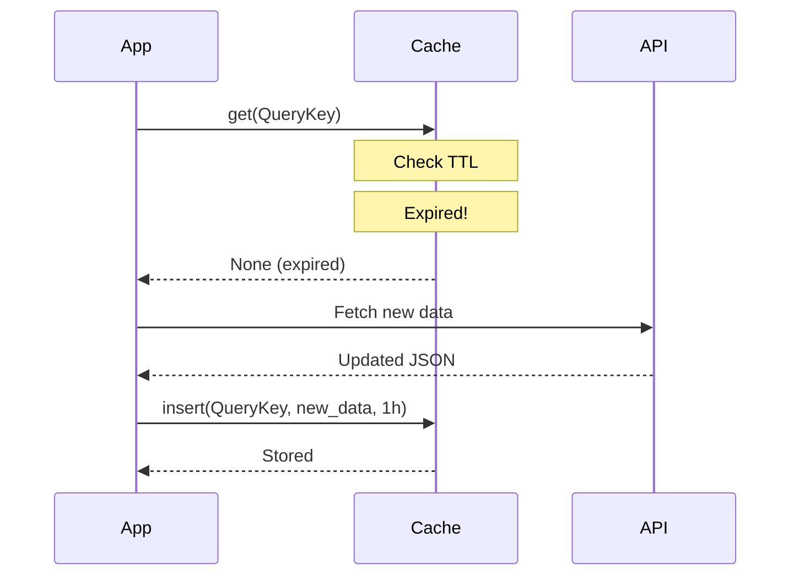

# Caching System

## Overview

`lighty-loaders` implements a dual-layer caching system to minimize network requests and improve performance. The system consists of two caches:

1. **Raw Version Cache**: Stores complete JSON manifests from APIs
2. **Query Cache**: Stores extracted, processed data

Both caches are thread-safe, support TTL-based expiration, and operate independently.

## Architecture



## Cache Types

### Raw Version Cache

Stores complete, unparsed data from external APIs.

**Key Format**:
```rust
String // Version identifier: "{loader}-{minecraft_version}"
```

**Value Format**:
```rust
CachedData<Raw> {
    data: Raw,           // Raw JSON or parsed struct
    timestamp: Instant,  // When cached
    ttl: Duration,       // Time to live
}
```

**Purpose**:
- Avoid redundant API calls
- Store complete version manifests
- Enable multiple queries on same data

**Example**:
```
Key: "vanilla-1.21"
Value: Complete version_manifest_v2.json response
TTL: 1 hour
```

### Query Cache

Stores extracted, processed metadata for specific queries.

**Key Format**:
```rust
QueryKey<Q> {
    version: String,  // Version identifier
    query: Q,         // Specific query parameters
}
```

**Value Format**:
```rust
CachedData<Data> {
    data: Data,          // Extracted metadata
    timestamp: Instant,
    ttl: Duration,
}
```

**Purpose**:
- Avoid re-processing raw data
- Fast retrieval of specific information
- Support multiple query types per version

**Example**:
```
Key: QueryKey { version: "fabric-1.21", query: MetadataQuery }
Value: Processed VersionMetaData struct
TTL: 1 hour
```

## Cache Implementation

### Structure

```rust
use std::collections::HashMap;
use std::sync::{Arc, RwLock};
use std::time::{Duration, Instant};

pub struct CachedData<T> {
    pub data: T,
    pub timestamp: Instant,
    pub ttl: Duration,
}

pub struct Cache<K, V> {
    data: Arc<RwLock<HashMap<K, CachedData<V>>>>,
}

impl<K, V> Cache<K, V>
where
    K: Eq + std::hash::Hash + Clone,
    V: Clone,
{
    pub fn new() -> Self {
        Self {
            data: Arc::new(RwLock::new(HashMap::new())),
        }
    }

    pub fn get(&self, key: &K) -> Option<V> {
        let cache = self.data.read().unwrap();

        if let Some(cached) = cache.get(key) {
            if cached.timestamp.elapsed() < cached.ttl {
                return Some(cached.data.clone());
            }
        }

        None
    }

    pub fn insert(&self, key: K, value: V, ttl: Duration) {
        let mut cache = self.data.write().unwrap();
        cache.insert(key, CachedData {
            data: value,
            timestamp: Instant::now(),
            ttl,
        });
    }

    pub fn clear_expired(&self) {
        let mut cache = self.data.write().unwrap();
        cache.retain(|_, v| v.timestamp.elapsed() < v.ttl);
    }
}
```

### Thread Safety

All cache operations are thread-safe:

- `Arc<RwLock<HashMap>>` enables shared ownership
- Read lock for queries (multiple concurrent reads)
- Write lock for insertions (exclusive access)
- No deadlocks due to short-lived locks

## TTL Configuration

### Default TTL

```rust
impl Query for VanillaQuery {
    fn cache_ttl() -> Duration {
        Duration::from_secs(3600)  // 1 hour
    }
}
```

### Per-Query TTL

```rust
impl Query for CustomQuery {
    fn cache_ttl_for_query(query: &Self::Query) -> Duration {
        match query {
            CustomQuery::Stable => Duration::from_secs(7200),   // 2 hours
            CustomQuery::Snapshot => Duration::from_secs(1800), // 30 minutes
        }
    }
}
```

### Recommended TTL Values

| Data Type | TTL | Reason |
|-----------|-----|--------|
| Stable versions | 24 hours | Rarely change |
| Latest versions | 1 hour | Frequent updates |
| Snapshots | 30 minutes | Very frequent |
| Release manifests | 6 hours | Moderate changes |
| Loader versions | 2 hours | Regular updates |

## Cache Workflow

### First Request (Cold Cache)



### Subsequent Request (Warm Cache)



### Expired Cache Entry



## Cache Management

### Manual Cache Clearing

```rust
use lighty_loaders::utils::cache::Cache;

// Clear all caches for a specific loader
pub fn clear_loader_cache(loader: &str) {
    // Implementation depends on your cache access pattern
    // Typically handled internally by the library
}
```

### Automatic Cleanup

The cache automatically removes expired entries during:
- Regular cleanup intervals
- Cache size threshold checks
- Explicit cleanup calls

### Memory Management

**Best Practices**:
- Set appropriate TTL values
- Clear cache when switching profiles
- Monitor cache size in production
- Consider disk-based cache for large datasets

## Performance Metrics

### Cache Hit Rates

Typical cache hit rates in production:

| Scenario | Raw Cache | Query Cache | Network Savings |
|----------|-----------|-------------|-----------------|
| Single version, multiple queries | 0% | 90%+ | 90%+ |
| Multiple versions, same loader | 50% | 80% | 85% |
| Frequent relaunches | 95% | 95% | 95% |
| Version switching | 20% | 40% | 30% |

### Latency Comparison

| Operation | Cold Cache | Warm Cache | Improvement |
|-----------|------------|------------|-------------|
| Vanilla metadata | ~500ms | ~1ms | 500x |
| Fabric metadata | ~800ms | ~1ms | 800x |
| Forge metadata | ~2000ms | ~1ms | 2000x |
| Version list | ~300ms | ~1ms | 300x |

## Advanced Usage

### Custom Cache TTL

Implement custom TTL logic:

```rust
use lighty_loaders::utils::query::Query;
use std::time::Duration;

pub struct MyQuery;

#[async_trait]
impl Query for MyQuery {
    type Query = MyQueryType;
    type Data = MyData;
    type Raw = serde_json::Value;

    fn cache_ttl_for_query(query: &Self::Query) -> Duration {
        if query.is_production {
            Duration::from_secs(86400)  // 24 hours for production
        } else {
            Duration::from_secs(300)    // 5 minutes for dev
        }
    }

    // ... other trait methods
}
```

### Pre-warming Cache

```rust
use lighty_loaders::{Loader, Version};
use lighty_loaders::types::LoaderExtensions;

#[tokio::main]
async fn main() {
    let versions = vec![
        ("fabric-1.21", Loader::Fabric, "0.16.9", "1.21"),
        ("fabric-1.20.4", Loader::Fabric, "0.15.11", "1.20.4"),
        ("vanilla-1.21", Loader::Vanilla, "", "1.21"),
    ];

    // Pre-warm cache for common versions
    for (name, loader, loader_ver, mc_ver) in versions {
        let version = Version::new(name, loader, loader_ver, mc_ver, &dirs);

        // This will populate both caches
        version.get_metadata().await.ok();
    }

    println!("Cache pre-warmed!");
}
```

### Cache Statistics

Implement cache hit tracking:

```rust
use std::sync::atomic::{AtomicU64, Ordering};

pub struct CacheStats {
    hits: AtomicU64,
    misses: AtomicU64,
}

impl CacheStats {
    pub fn hit_rate(&self) -> f64 {
        let hits = self.hits.load(Ordering::Relaxed) as f64;
        let misses = self.misses.load(Ordering::Relaxed) as f64;

        if hits + misses == 0.0 {
            0.0
        } else {
            hits / (hits + misses)
        }
    }
}
```

## Troubleshooting

### Cache Not Working

**Symptoms**:
- Every request hits the network
- Slow response times

**Solutions**:
1. Check TTL is not 0
2. Verify cache key is consistent
3. Ensure no errors during cache insert
4. Check memory constraints

### Stale Data

**Symptoms**:
- Old version information returned
- Changes not reflected

**Solutions**:
1. Reduce TTL for changing data
2. Clear cache manually when needed
3. Implement cache invalidation on updates
4. Use conditional requests

### Memory Usage

**Symptoms**:
- High memory consumption
- OOM errors

**Solutions**:
1. Reduce TTL values
2. Implement cache size limits
3. Clear expired entries regularly
4. Consider disk-based cache

## Best Practices

1. **Set Appropriate TTLs**
   - Stable data: Long TTL (hours/days)
   - Dynamic data: Short TTL (minutes)
   - Critical data: Medium TTL with invalidation

2. **Cache Invalidation**
   - Clear on version changes
   - Invalidate on errors
   - Manual clear for troubleshooting

3. **Monitoring**
   - Track hit/miss rates
   - Monitor memory usage
   - Log cache operations (debug mode)

4. **Testing**
   - Test with cold cache
   - Test with warm cache
   - Test expiration behavior

## See Also

- [Overview](./overview.md) - Architecture overview
- [Loaders Guide](./loaders.md) - Detailed guide for each loader
- [Examples](./examples.md) - Complete usage examples
