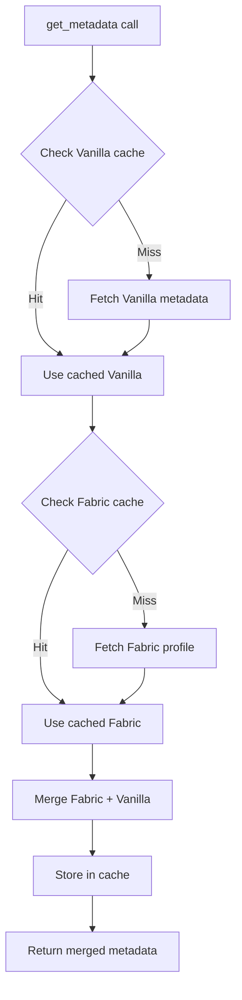

# Fabric Loader

Lightweight, modular mod loader with excellent performance and large mod ecosystem.

## Overview

**Status**: Stable
**MC Versions**: 1.14+ (official), 1.8+ (community builds)
**Feature Flag**: `fabric`
**API**: FabricMC official API

## Usage

```rust
use lighty_launcher::prelude::*;

#[tokio::main]
async fn main() -> anyhow::Result<()> {
    const QUALIFIER: &str = "com";
const ORGANIZATION: &str = "MyLauncher";
const APPLICATION: &str = "";

let _app = AppState::new(
    QUALIFIER.to_string(),
    ORGANIZATION.to_string(),
    APPLICATION.to_string(),
)?;
    let launcher_dir = AppState::get_project_dirs();

    let instance = VersionBuilder::new(
        "fabric-1.21",       // Instance name
        Loader::Fabric,      // Loader type
        "0.16.9",            // Fabric loader version
        "1.21.1",            // Minecraft version
        launcher_dir
    );

    let metadata = instance.get_metadata().await?;

    println!("Version: {}", metadata.id);
    println!("Main class: {}", metadata.main_class);
    println!("Libraries: {}", metadata.libraries.len());
    // Fabric libraries + Vanilla libraries

    Ok(())
}
```

## Exports

**In lighty_loaders**:
```rust
use lighty_loaders::loaders::fabric;
```

**In lighty_launcher**:
```rust
use lighty_launcher::loaders::fabric;
```

## API Endpoints

### Loader Versions List

```
GET https://meta.fabricmc.net/v2/versions/loader
```

**Response**:
```json
[
  {
    "separator": ".",
    "build": 9,
    "maven": "net.fabricmc:fabric-loader:0.16.9",
    "version": "0.16.9",
    "stable": true
  }
]
```

### Game Versions List

```
GET https://meta.fabricmc.net/v2/versions/game
```

**Response**:
```json
[
  {
    "version": "1.21.1",
    "stable": true
  }
]
```

### Loader Profile

```
GET https://meta.fabricmc.net/v2/versions/loader/{minecraft}/{loader}/profile/json
```

Example: `https://meta.fabricmc.net/v2/versions/loader/1.21.1/0.16.9/profile/json`

**Response**: Fabric-specific metadata including:
- Fabric libraries
- Main class override (if any)
- Additional JVM arguments
- Loader-specific configuration

## Query Types

### FabricQuery Enum

```rust
pub enum FabricQuery {
    FabricBuilder,  // Full metadata (Fabric + Vanilla merged)
    Libraries,      // Only libraries
}
```

### FabricBuilder

Returns complete metadata with Fabric and Vanilla merged.

```rust
use lighty_launcher::loaders::LoaderExtensions;

let metadata = instance.get_metadata().await?;
```

**Merging process**:
1. Fetch Vanilla metadata for MC version
2. Fetch Fabric loader profile
3. Merge libraries (Fabric + Vanilla)
4. Override main class if specified
5. Merge JVM/game arguments
6. Return combined metadata

**Contains**:
- All Vanilla libraries
- All Fabric libraries (`net.fabricmc:*`)
- Merged arguments
- Vanilla assets
- Fabric-specific configuration

### Libraries

Returns merged libraries from both Fabric and Vanilla.

```rust
let libraries = instance.get_libraries().await?;

for lib in &libraries.libraries {
    if lib.name.starts_with("net.fabricmc:") {
        println!("Fabric library: {}", lib.name);
    } else {
        println!("Vanilla library: {}", lib.name);
    }
}
```

**Example Fabric libraries**:
- `net.fabricmc:fabric-loader:0.16.9`
- `net.fabricmc:tiny-mappings-parser:0.3.0+build.17`
- `net.fabricmc:sponge-mixin:0.15.4+mixin.0.8.7`
- `net.fabricmc:tiny-remapper:0.10.3`

## Data Flow



## Events

### Vanilla Fetch

```rust
Event::Loader(LoaderEvent::FetchingData {
    loader: "Vanilla",
    minecraft_version: "1.21.1",
    loader_version: "",
})
Event::Loader(LoaderEvent::DataFetched {
    loader: "Vanilla",
    minecraft_version: "1.21.1",
    loader_version: "",
})
```

### Fabric Fetch

```rust
Event::Loader(LoaderEvent::FetchingData {
    loader: "Fabric",
    minecraft_version: "1.21.1",
    loader_version: "0.16.9",
})
Event::Loader(LoaderEvent::DataFetched {
    loader: "Fabric",
    minecraft_version: "1.21.1",
    loader_version: "0.16.9",
})
```

### Merging

```rust
Event::Loader(LoaderEvent::MergingLoaderData {
    base_loader: "Vanilla",
    overlay_loader: "Fabric",
})
Event::Loader(LoaderEvent::DataMerged {
    base_loader: "Vanilla",
    overlay_loader: "Fabric",
})
```

### Cached

```rust
Event::Loader(LoaderEvent::ManifestCached {
    loader: "Vanilla",  // or "Fabric"
})
```

## Caching

### Cache Keys

- **Vanilla raw cache**: `"vanilla-1.21.1"`
- **Fabric raw cache**: `"fabric-1.21.1-0.16.9"`
- **Query cache**: `QueryKey { version: "fabric-1.21.1-0.16.9", query: FabricQuery::* }`

### TTL

- Default: 1 hour (3600 seconds)
- Both Vanilla and Fabric cached separately
- Merged result also cached

### Example

```rust
// First call: fetches Vanilla + Fabric (slow)
let metadata1 = instance.get_metadata().await?;  // ~800ms

// Second call: uses both caches (fast)
let metadata2 = instance.get_metadata().await?;  // ~1ms

// After 1 hour: Fabric cache expired, refetches
let metadata3 = instance.get_metadata().await?;  // ~300ms (only Fabric)

// Vanilla cache might still be valid
```

## Version Selection

### Latest Stable Loader

To get the latest stable Fabric version, query the API:

```rust
use reqwest;

let client = reqwest::Client::new();
let response = client
    .get("https://meta.fabricmc.net/v2/versions/loader")
    .send()
    .await?;

let loaders: Vec<serde_json::Value> = response.json().await?;

// Find latest stable
for loader in loaders {
    if loader["stable"].as_bool().unwrap_or(false) {
        let version = loader["version"].as_str().unwrap();
        println!("Latest stable: {}", version);
        break;
    }
}
```

### Specific Version

Use a known version directly:

```rust
let instance = VersionBuilder::new(
    "fabric",
    Loader::Fabric,
    "0.16.9",  // Specific version
    "1.21.1",
    launcher_dir
);
```

## Mod Support

### Mod Directory Structure

```
instances/
└── {instance-name}/
    └── mods/
        ├── fabric-api-0.100.0.jar
        ├── sodium-0.5.8.jar
        └── lithium-0.12.0.jar
```

### Installing Mods

Mods are placed in the `mods` directory and loaded automatically by Fabric.

```rust
use lighty_launcher::macros::*;
use std::path::Path;

#[tokio::main]
async fn main() -> anyhow::Result<()> {
    const QUALIFIER: &str = "com";
const ORGANIZATION: &str = "MyLauncher";
const APPLICATION: &str = "";

let _app = AppState::new(
    QUALIFIER.to_string(),
    ORGANIZATION.to_string(),
    APPLICATION.to_string(),
)?;
    let launcher_dir = AppState::get_project_dirs();

    let instance_name = "fabric-1.21";
    let mods_dir = launcher_dir.data_dir()
        .join("instances")
        .join(instance_name)
        .join("mods");

    // Create mods directory
    mkdir!(&mods_dir);

    // Download mod to mods directory
    // (using lighty-core download utilities)

    Ok(())
}
```

### Fabric API Dependency

Many Fabric mods require Fabric API. Install it as a mod:

```
https://modrinth.com/mod/fabric-api
or
https://www.curseforge.com/minecraft/mc-mods/fabric-api
```

## Complete Example

```rust
use lighty_launcher::prelude::*;

#[tokio::main]
async fn main() -> anyhow::Result<()> {
    // Initialize
    const QUALIFIER: &str = "com";
const ORGANIZATION: &str = "MyLauncher";
const APPLICATION: &str = "";

let _app = AppState::new(
    QUALIFIER.to_string(),
    ORGANIZATION.to_string(),
    APPLICATION.to_string(),
)?;
    let launcher_dir = AppState::get_project_dirs();

    // Setup events
    let event_bus = EventBus::new(1000);
    let mut receiver = event_bus.subscribe();

    tokio::spawn(async move {
        while let Ok(event) = receiver.next().await {
            if let Event::Loader(loader_event) = event {
                match loader_event {
                    LoaderEvent::FetchingData { loader, .. } => {
                        trace_info!("Fetching {}...", loader);
                    }
                    LoaderEvent::DataFetched { loader, .. } => {
                        trace_info!("{} data fetched", loader);
                    }
                    LoaderEvent::MergingLoaderData { base_loader, overlay_loader } => {
                        trace_info!("Merging {} + {}", overlay_loader, base_loader);
                    }
                    _ => {}
                }
            }
        }
    });

    // Create Fabric instance
    let instance = VersionBuilder::new(
        "fabric-1.21",
        Loader::Fabric,
        "0.16.9",
        "1.21.1",
        launcher_dir
    );

    // Fetch metadata (emits events)
    trace_info!("Fetching Fabric metadata...");
    let metadata = instance.get_metadata().await?;

    // Display info
    trace_info!("=== Fabric {} ===", metadata.id);
    trace_info!("Main class: {}", metadata.main_class);
    trace_info!("Total libraries: {}", metadata.libraries.len());

    // Count Fabric-specific libraries
    let fabric_libs = metadata.libraries.iter()
        .filter(|lib| lib.name.starts_with("net.fabricmc:"))
        .count();
    trace_info!("Fabric libraries: {}", fabric_libs);
    trace_info!("Vanilla libraries: {}", metadata.libraries.len() - fabric_libs);

    // Authenticate
    let mut auth = OfflineAuth::new("Player");
    let profile = auth.authenticate(None).await?;

    // Launch
    let mut instance_mut = instance;
    instance_mut.launch(&profile, JavaDistribution::Temurin)
        .with_jvm_options()
            .set("Xmx", "4G")
            .set("Xms", "2G")
            .done()
        .run()
        .await?;

    Ok(())
}
```

## Comparison with Quilt

Fabric and Quilt are very similar. Main differences:

| Feature | Fabric | Quilt |
|---------|--------|-------|
| API | FabricMC | QuiltMC |
| Mod compatibility | Fabric mods | Fabric + Quilt mods |
| Development | Community-driven | Fork with improvements |
| Stability | Stable | Stable |
| Adoption | Very high | Growing |

See [Quilt](./quilt.md) for Quilt-specific documentation.

## Common Issues

### Version Not Found

```rust
Event::Loader(LoaderEvent::ManifestNotFound {
    loader: "Fabric",
    minecraft_version: "1.21.1",
    loader_version: "0.99.99",  // Doesn't exist
    error: "Loader version not found",
})
```

**Solution**: Check available versions at https://fabricmc.net/develop

### MC Version Not Supported

Some MC versions don't have official Fabric support. Use community builds or wait for official support.

## Related Documentation

- [How to Use](../how-to-use.md) - General usage guide
- [Traits](../traits.md) - VersionInfo and LoaderExtensions
- [Query System](../query.md) - How queries work
- [Cache System](../cache.md) - Caching details
- [Events](../events.md) - LoaderEvent types

## Related Loaders

- [Vanilla](./vanilla.md) - Base Minecraft (merged with Fabric)
- [Quilt](./quilt.md) - Fabric fork with improvements
- [NeoForge](./neoforge.md) - Alternative mod loader
