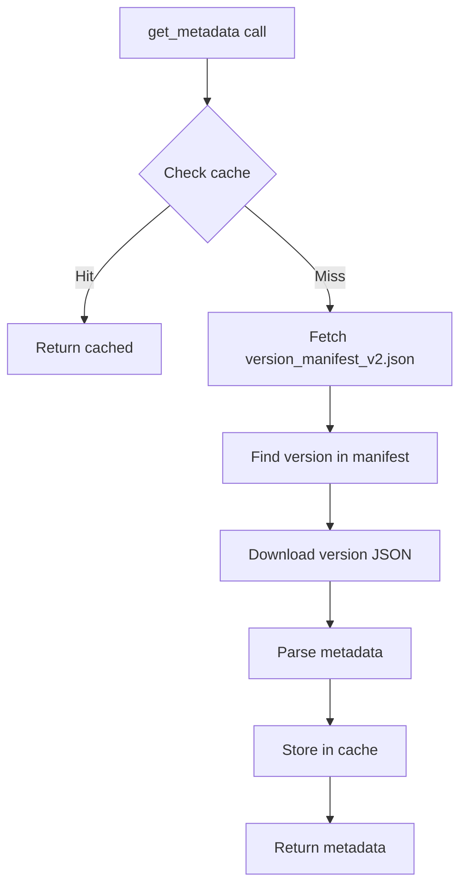

# Vanilla Loader

Pure Minecraft without any modifications or mod support.

## Overview

**Status**: Stable
**MC Versions**: All
**Feature Flag**: `vanilla`
**API**: Mojang official API

## Usage

```rust
use lighty_launcher::prelude::*;

#[tokio::main]
async fn main() -> anyhow::Result<()> {
    let _app = AppState::new("com".into(), "MyLauncher".into(), "".into())?;
    let launcher_dir = AppState::get_project_dirs();

    let instance = VersionBuilder::new(
        "vanilla-1.21",      // Instance name
        Loader::Vanilla,      // Loader type
        "",                   // No loader version for Vanilla
        "1.21.1",            // Minecraft version
        launcher_dir
    );

    let metadata = instance.get_metadata().await?;

    println!("Version: {}", metadata.id);
    println!("Main class: {}", metadata.main_class);
    println!("Libraries: {}", metadata.libraries.len());

    Ok(())
}
```

## Exports

**In lighty_loaders**:
```rust
use lighty_loaders::loaders::vanilla;
```

**In lighty_launcher**:
```rust
use lighty_launcher::loaders::vanilla;
```

## API Endpoints

### Version Manifest

```
GET https://piston-meta.mojang.com/mc/game/version_manifest_v2.json
```

**Response**:
```json
{
  "latest": {
    "release": "1.21.1",
    "snapshot": "24w33a"
  },
  "versions": [
    {
      "id": "1.21.1",
      "type": "release",
      "url": "https://piston-meta.mojang.com/v1/packages/{sha1}/1.21.1.json",
      "time": "2024-08-08T11:25:39+00:00",
      "releaseTime": "2024-08-08T11:18:46+00:00",
      "sha1": "..."
    }
  ]
}
```

### Version JSON

```
GET https://piston-meta.mojang.com/v1/packages/{sha1}/{version}.json
```

**Response**: Complete version metadata including:
- Main class
- Libraries
- Assets
- JVM arguments
- Game arguments
- Native libraries
- Java version requirement

## Query Types

### VanillaQuery Enum

```rust
pub enum VanillaQuery {
    VanillaBuilder,  // Full metadata
    Libraries,       // Only libraries
    MainClass,       // Only main class
    Natives,         // Only native libraries
    JavaVersion,     // Only Java version requirement
    Assets,          // Only assets
}
```

### VanillaBuilder

Returns complete version metadata.

```rust
use lighty_launcher::loaders::LoaderExtensions;

let metadata = instance.get_metadata().await?;
```

**Contains**:
- `id`: Minecraft version
- `type`: "release" or "snapshot"
- `main_class`: Main class to launch
- `libraries`: All libraries
- `arguments`: JVM and game arguments
- `asset_index`: Asset information
- `downloads`: Client/server JAR info
- `java_version`: Java requirement

### Libraries

Returns only library dependencies.

```rust
let libraries = instance.get_libraries().await?;

for lib in &libraries.libraries {
    println!("{}", lib.name);
}
```

**Example libraries**:
- `com.mojang:authlib:6.0.54`
- `com.mojang:brigadier:1.2.9`
- `com.mojang:datafixerupper:8.0.16`
- `org.lwjgl:lwjgl:3.3.3`

### MainClass

Returns the entry point class name.

```rust
let main_class_data = instance.get_main_class().await?;
println!("Main class: {}", main_class_data.main_class);
```

**Example**: `net.minecraft.client.main.Main`

### Natives

Returns native libraries for platform-specific code.

```rust
let natives = instance.get_natives().await?;

for lib in &natives.libraries {
    if let Some(natives_map) = &lib.natives {
        println!("Native library: {} ({:?})", lib.name, natives_map);
    }
}
```

**Example natives**:
- LWJGL (OpenGL)
- GLFW (window management)
- OpenAL (audio)

### JavaVersion

Returns Java version requirement.

```rust
let java_info = instance.get_java_version().await?;
println!("Required Java: {}", java_info.java_version.major_version);
```

**Version mapping**:
- MC 1.21+ → Java 21
- MC 1.18-1.20.x → Java 17
- MC 1.17.x → Java 16
- MC 1.12-1.16.x → Java 8
- MC < 1.12 → Java 7-8

### Assets

Returns asset index information.

```rust
let assets = instance.get_assets().await?;

if let Some(asset_index) = &assets.asset_index {
    println!("Asset ID: {}", asset_index.id);
    println!("Total size: {} MB", asset_index.total_size / 1_000_000);
    println!("URL: {}", asset_index.url);
}
```

## Data Flow



## Events

### FetchingData

Emitted before fetching from Mojang API.

```rust
Event::Loader(LoaderEvent::FetchingData {
    loader: "Vanilla",
    minecraft_version: "1.21.1",
    loader_version: "",
})
```

### DataFetched

Emitted after successful fetch.

```rust
Event::Loader(LoaderEvent::DataFetched {
    loader: "Vanilla",
    minecraft_version: "1.21.1",
    loader_version: "",
})
```

### ManifestCached

Emitted when using cached data.

```rust
Event::Loader(LoaderEvent::ManifestCached {
    loader: "Vanilla",
})
```

### ManifestNotFound

Emitted when version doesn't exist.

```rust
Event::Loader(LoaderEvent::ManifestNotFound {
    loader: "Vanilla",
    minecraft_version: "1.99.99",
    loader_version: "",
    error: "Version not found in manifest",
})
```

## Caching

### Cache Keys

- **Raw cache**: `"vanilla-{minecraft_version}"`
- **Query cache**: `QueryKey { version: "vanilla-{minecraft_version}", query: VanillaQuery::* }`

### TTL

- Default: 1 hour (3600 seconds)
- Configurable via `Query::cache_ttl()`

### Example

```rust
// First call: fetches from API (slow)
let metadata1 = instance.get_metadata().await?;  // ~500ms

// Second call: uses cache (fast)
let metadata2 = instance.get_metadata().await?;  // ~1ms

// After 1 hour: cache expired, fetches again
```

## Version Types

### Release

Stable versions (e.g., 1.21.1, 1.20.4).

```rust
let instance = VersionBuilder::new("vanilla", Loader::Vanilla, "", "1.21.1", launcher_dir);
```

### Snapshot

Development versions (e.g., 24w33a).

```rust
let instance = VersionBuilder::new("snapshot", Loader::Vanilla, "", "24w33a", launcher_dir);
```

### Old Versions

Legacy versions still supported (e.g., 1.7.10, 1.12.2).

```rust
let instance = VersionBuilder::new("legacy", Loader::Vanilla, "", "1.7.10", launcher_dir);
```

## Complete Example

```rust
use lighty_launcher::prelude::*;

#[tokio::main]
async fn main() -> anyhow::Result<()> {
    // Initialize
    let _app = AppState::new("com".into(), "MyLauncher".into(), "".into())?;
    let launcher_dir = AppState::get_project_dirs();

    // Create instance
    let instance = VersionBuilder::new("vanilla-1.21", Loader::Vanilla, "", "1.21.1", launcher_dir);

    // Fetch metadata
    trace_info!("Fetching Vanilla metadata...");
    let metadata = instance.get_metadata().await?;

    // Display info
    trace_info!("=== Vanilla {} ===", metadata.id);
    trace_info!("Main class: {}", metadata.main_class);
    trace_info!("Libraries: {}", metadata.libraries.len());

    if let Some(asset_index) = &metadata.asset_index {
        trace_info!("Assets: {} ({} MB)",
            asset_index.id,
            asset_index.total_size / 1_000_000
        );
    }

    if let Some(java) = &metadata.java_version {
        trace_info!("Required Java: {}", java.major_version);
    }

    // Query specific data
    trace_info!("\nQuerying specific data...");

    let libraries = instance.get_libraries().await?;
    trace_info!("Libraries query: {}", libraries.libraries.len());

    let assets = instance.get_assets().await?;
    if let Some(idx) = &assets.asset_index {
        trace_info!("Assets query: {}", idx.id);
    }

    Ok(())
}
```

## Related Documentation

- [How to Use](../how-to-use.md) - General usage guide
- [Traits](../traits.md) - VersionInfo and LoaderExtensions
- [Query System](../query.md) - How queries work
- [Cache System](../cache.md) - Caching details
- [Events](../events.md) - LoaderEvent types

## Related Loaders

- [Fabric](./fabric.md) - Merges with Vanilla
- [Quilt](./quilt.md) - Merges with Vanilla
- [NeoForge](./neoforge.md) - Based on Vanilla (indirectly)
