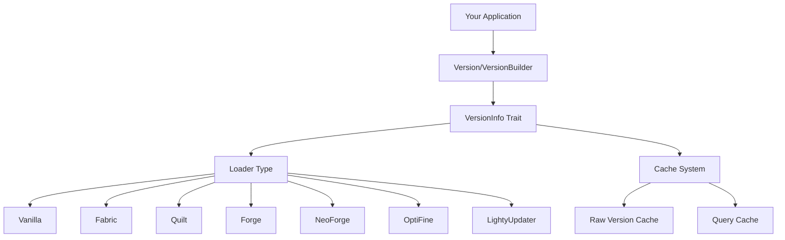
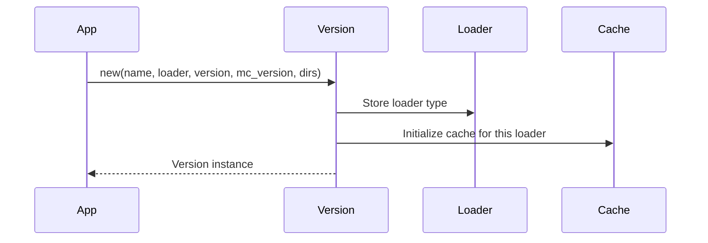
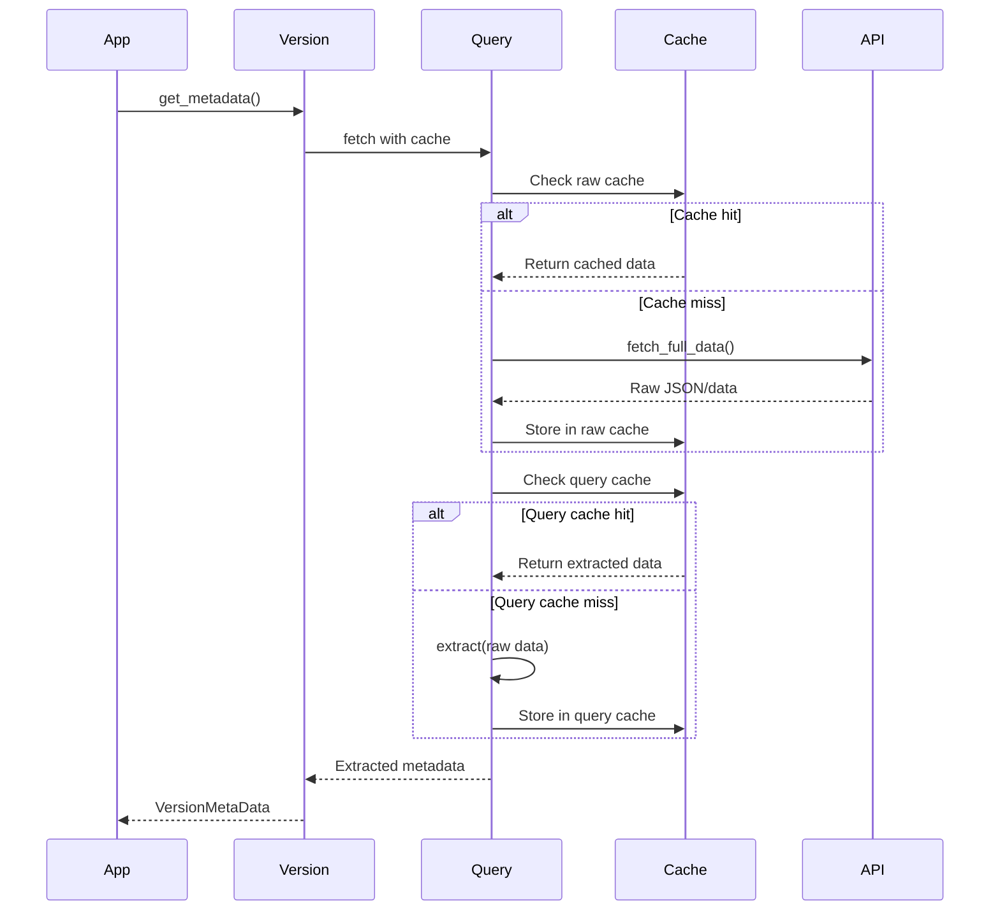
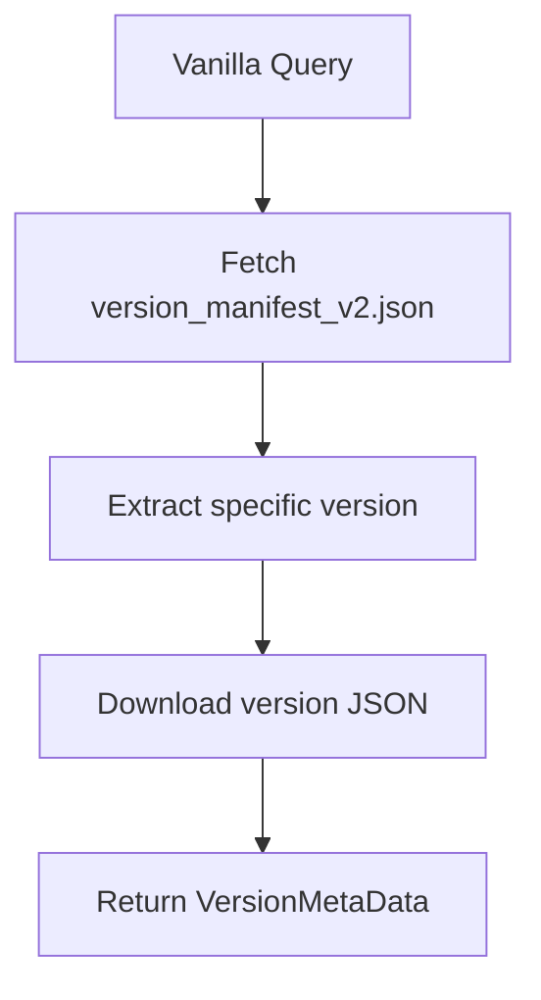
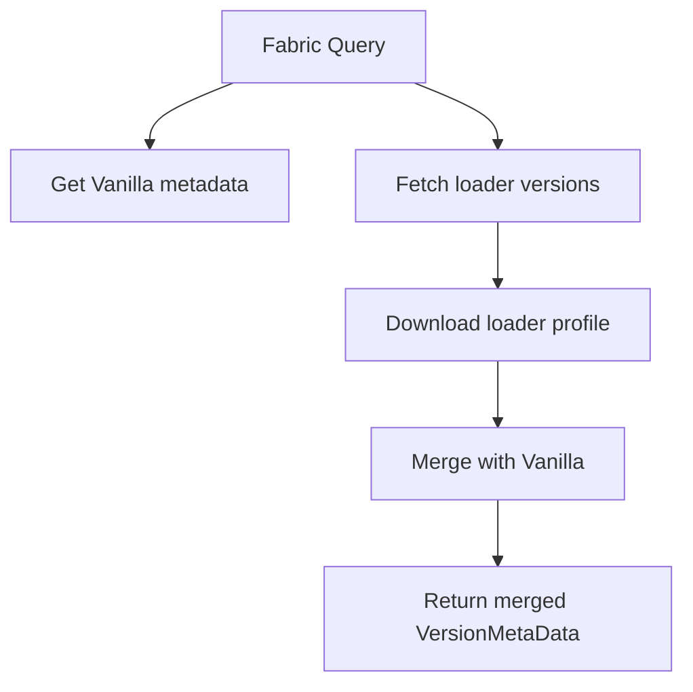

# Architecture Overview

## Design Philosophy

`lighty-loaders` provides a unified, trait-based system for managing different Minecraft mod loaders. The design prioritizes:

- **Extensibility**: Easy to add new loaders without modifying existing code
- **Performance**: Smart caching to minimize network requests
- **Type Safety**: Strongly typed version information and queries
- **Flexibility**: Feature flags to compile only needed loaders

## Core Architecture



## Key Components

### 1. Loader Enum

The `Loader` enum defines all supported mod loaders:

```rust
pub enum Loader {
    Vanilla,      // Pure Minecraft
    Fabric,       // Lightweight mod loader
    Quilt,        // Fabric fork
    Forge,        // Traditional mod loader
    NeoForge,     // Modern Forge fork
    Optifine,     // Graphics optimization
    LightyUpdater // Custom updater system
}
```

### 2. VersionInfo Trait

The core trait that all version types must implement:

```rust
pub trait VersionInfo: Clone + Send + Sync {
    type LoaderType: Clone + Send + Sync + std::fmt::Debug;

    fn name(&self) -> &str;
    fn loader_version(&self) -> &str;
    fn minecraft_version(&self) -> &str;
    fn game_dirs(&self) -> &Path;
    fn java_dirs(&self) -> &Path;
    fn loader(&self) -> &Self::LoaderType;
}
```

**Provides**:
- Version identification (name, versions)
- Directory management (game, java)
- Loader type information

**Implementations**:
- `Version` (from `lighty-version`)
- `VersionBuilder` (from `lighty-version`)

### 3. Query System

The `Query` trait enables flexible metadata retrieval with caching:

```rust
#[async_trait]
pub trait Query: Send + Sync {
    type Query: Eq + Hash + Clone + Send + Sync + 'static;
    type Data: Clone + Send + Sync + 'static;
    type Raw: Send + Sync + 'static;

    fn name() -> &'static str;
    async fn fetch_full_data<V: VersionInfo>(version: &V) -> Result<Self::Raw>;
    async fn extract<V: VersionInfo>(version: &V, query: &Self::Query, raw: &Self::Raw) -> Result<Self::Data>;
    fn cache_ttl() -> Duration;
}
```

**Features**:
- Generic over query type, data type, and raw type
- Automatic caching with configurable TTL
- Type-safe data extraction

### 4. LoaderExtensions Trait

Provides loader-specific functionality:

```rust
#[async_trait]
pub trait LoaderExtensions<V: VersionInfo> {
    async fn get_metadata(&self) -> Result<Version>;
    async fn get_loader_metadata(&self) -> Result<VersionMetaData>;
}
```

**Purpose**:
- Fetch complete version metadata
- Retrieve loader-specific configuration
- Merge multiple loader data

## Data Flow

### Version Creation



### Metadata Retrieval



## Loader Implementations

Each loader implements the `Query` trait with specific logic:

### Vanilla



**API**: `https://piston-meta.mojang.com/mc/game/version_manifest_v2.json`

### Fabric



**API**: `https://meta.fabricmc.net/v2/versions/loader`

### Forge/NeoForge

Similar flow with loader-specific manifests and installation profiles.

## Feature Flags

Control compilation with Cargo features:

```toml
[dependencies]
lighty-loaders = { version = "0.6.3", features = ["vanilla", "fabric"] }
```

**Available Features**:
- `vanilla` - Vanilla Minecraft
- `fabric` - Fabric loader
- `quilt` - Quilt loader
- `forge` - Forge loader (1.13+)
- `forge_legacy` - Legacy Forge (1.7-1.12)
- `neoforge` - NeoForge loader
- `lighty_updater` - Custom updater
- `all-loaders` - Enable all loaders

**Benefits**:
- Smaller binary size
- Faster compilation
- Only include what you need

## Directory Structure

```
game_dirs/
├── assets/                    # Game assets
│   ├── indexes/
│   └── objects/
├── libraries/                 # Java libraries
│   ├── com/
│   ├── net/
│   └── org/
├── versions/                  # Version metadata
│   └── {version-name}/
│       ├── {version-name}.json
│       ├── {version-name}.jar
│       └── natives/
└── instances/                 # Instance directories
    └── {instance-name}/
        └── mods/

java_dirs/
└── runtimes/                  # Java installations
    ├── java-8/
    ├── java-17/
    └── java-21/
```

## Error Handling

All operations return `Result<T, QueryError>`:

```rust
pub enum QueryError {
    NetworkError(String),
    ParseError(String),
    NotFound(String),
    InvalidVersion(String),
    CacheError(String),
}
```

**Usage**:

```rust
use lighty_loaders::types::VersionInfo;

match version.get_metadata().await {
    Ok(metadata) => println!("Got metadata for {}", metadata.id),
    Err(QueryError::NetworkError(e)) => eprintln!("Network error: {}", e),
    Err(QueryError::NotFound(v)) => eprintln!("Version not found: {}", v),
    Err(e) => eprintln!("Error: {:?}", e),
}
```

## Thread Safety

All components are thread-safe:

- `VersionInfo` trait requires `Send + Sync`
- Cache uses `Arc<RwLock<HashMap>>`
- Query results are `Clone`
- Async operations use `tokio`

## Performance Considerations

### Caching Strategy

1. **Raw Version Cache**: Stores complete JSON manifests
   - TTL: 1 hour (configurable)
   - Key: Version identifier
   - Reduces API calls

2. **Query Cache**: Stores extracted metadata
   - TTL: 1 hour (configurable)
   - Key: `QueryKey<Q>` (version + query)
   - Faster than re-parsing

### Network Optimization

- Parallel downloads when possible
- Connection pooling via `reqwest`
- Compressed responses
- Minimal data transfer

### Memory Management

- Lazy loading of metadata
- Cache cleanup on TTL expiry
- Shared data via `Arc`
- Clone-on-write where applicable

## Extension Points

To add a new loader:

1. Create module in `src/loaders/`
2. Implement `Query` trait
3. Define query and data types
4. Add to `Loader` enum
5. Add feature flag
6. Update exports

Example skeleton:

```rust
pub struct CustomQuery {
    // Query parameters
}

pub struct CustomData {
    // Extracted data
}

#[async_trait]
impl Query for CustomQuery {
    type Query = CustomQuery;
    type Data = CustomData;
    type Raw = serde_json::Value;

    fn name() -> &'static str {
        "custom"
    }

    async fn fetch_full_data<V: VersionInfo>(version: &V) -> Result<Self::Raw> {
        // Fetch from API
    }

    async fn extract<V: VersionInfo>(version: &V, query: &Self::Query, raw: &Self::Raw) -> Result<Self::Data> {
        // Extract data
    }
}
```

## See Also

- [Loaders Guide](./loaders.md) - Detailed guide for each loader
- [Caching System](./caching.md) - Cache architecture
- [Examples](./examples.md) - Complete usage examples
