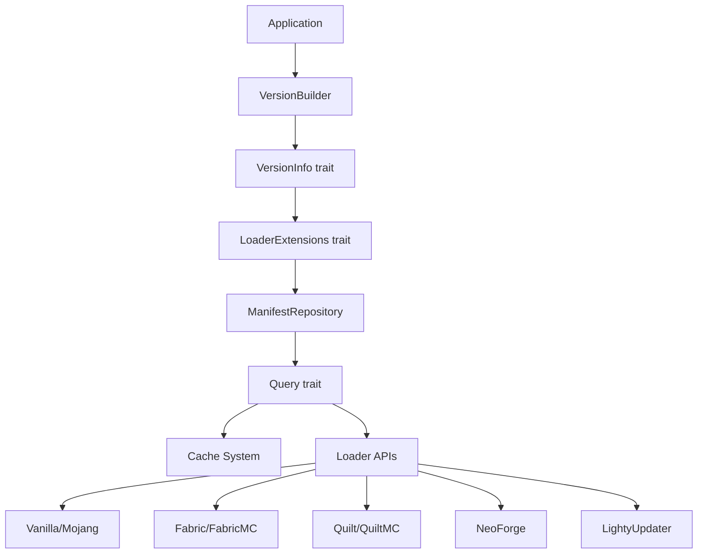
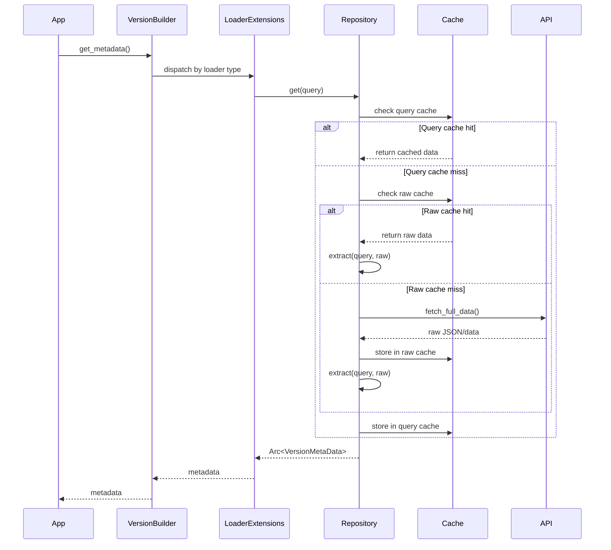
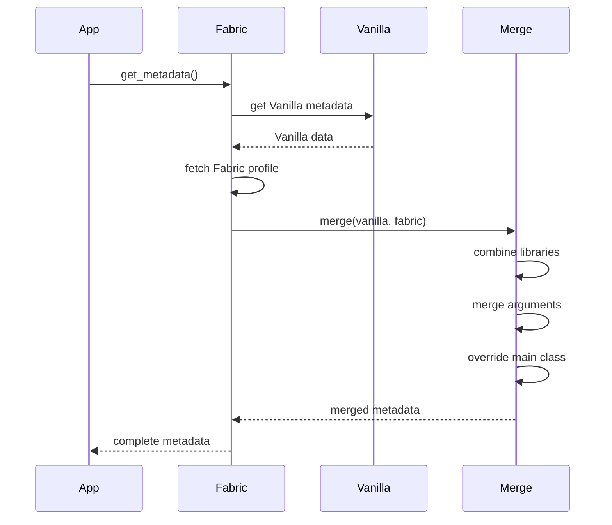

# Architecture Overview

## Design Philosophy

`lighty-loaders` provides a unified trait-based system for managing different Minecraft mod loaders with these principles:

- **Trait-based extensibility**: Easy to add new loaders
- **Smart caching**: Minimize network requests
- **Type safety**: Strongly typed queries and metadata
- **Feature flags**: Compile only what you need

## Core Architecture



## Key Components

### 1. VersionInfo Trait

Generic interface for version information, implemented by `VersionBuilder` and `LightyVersionBuilder`.

**Exports**:
- `lighty_loaders::types::VersionInfo`
- `lighty_launcher::loaders::VersionInfo`

**Purpose**: Provides version identity and directory information

```rust
pub trait VersionInfo: Clone + Send + Sync {
    type LoaderType: Clone + Send + Sync + std::fmt::Debug;

    fn name(&self) -> &str;
    fn loader_version(&self) -> &str;
    fn minecraft_version(&self) -> &str;
    fn game_dirs(&self) -> &Path;
    fn java_dirs(&self) -> &Path;
    fn loader(&self) -> &Self::LoaderType;
}
```

### 2. LoaderExtensions Trait

Extension methods for fetching metadata, automatically implemented for any type implementing `VersionInfo<LoaderType = Loader>`.

**Exports**:
- `lighty_loaders::types::LoaderExtensions`
- `lighty_launcher::loaders::LoaderExtensions`

**Purpose**: Provides metadata fetching methods

```rust
#[async_trait]
pub trait LoaderExtensions {
    async fn get_metadata(&self) -> Result<Arc<VersionMetaData>>;
    async fn get_libraries(&self) -> Result<Arc<VersionMetaData>>;
    async fn get_main_class(&self) -> Result<Arc<VersionMetaData>>;
    async fn get_natives(&self) -> Result<Arc<VersionMetaData>>;
    async fn get_java_version(&self) -> Result<Arc<VersionMetaData>>;
    async fn get_assets(&self) -> Result<Arc<VersionMetaData>>;
}
```

### 3. Query Trait

Defines how to fetch and extract loader data.

**Exports**:
- `lighty_loaders::utils::query::Query`

**Purpose**: Core trait for implementing new loaders

```rust
#[async_trait]
pub trait Query: Send + Sync {
    type Query: Eq + Hash + Clone + Send + Sync + 'static;
    type Data: Clone + Send + Sync + 'static;
    type Raw: Send + Sync + 'static;

    fn name() -> &'static str;
    async fn fetch_full_data<V: VersionInfo>(version: &V) -> Result<Self::Raw>;
    async fn extract<V: VersionInfo>(version: &V, query: &Self::Query, raw: &Self::Raw) -> Result<Self::Data>;
    fn cache_ttl() -> Duration;
    fn cache_ttl_for_query(_query: &Self::Query) -> Duration;
    async fn version_builder<V: VersionInfo>(version: &V, full_data: &Self::Raw) -> Result<Version>;
}
```

### 4. ManifestRepository

Generic repository for querying loader manifests with caching.

**Exports**:
- `lighty_loaders::utils::manifest::ManifestRepository`

**Purpose**: Manages cache and dispatches queries

```rust
pub struct ManifestRepository<Q: Query> {
    raw_cache: Cache<String, Q::Raw>,
    query_cache: Cache<QueryKey<Q::Query>, Arc<Q::Data>>,
}
```

### 5. Loader Enum

Defines all supported loaders.

**Exports**:
- `lighty_loaders::types::Loader`
- `lighty_launcher::loaders::Loader`
- `lighty_launcher::Loader` (root)

```rust
#[derive(Debug, Clone)]
pub enum Loader {
    Vanilla,
    Fabric,
    Quilt,
    NeoForge,
    Forge,
    LightyUpdater,
    Optifine,
}
```

## Data Flow

### Metadata Fetching



### Fabric Merging Example



## Cache System

### Two-Layer Architecture

**Layer 1: Raw Version Cache**
- Stores complete JSON/data from APIs
- Key: Version identifier (e.g., `"vanilla-1.21.1"`)
- TTL: 1 hour (configurable)

**Layer 2: Query Cache**
- Stores extracted, processed data
- Key: `QueryKey<Q>` (version + query type)
- TTL: 1 hour (configurable)

### Benefits

- **Avoid API calls**: Raw cache prevents redundant network requests
- **Avoid re-parsing**: Query cache prevents redundant extraction
- **Multiple queries**: Different queries can share raw cache

See [Cache System](./cache.md) for details.

## Loader Implementations

### Vanilla

**Query types**: VanillaBuilder, Libraries, MainClass, Natives, JavaVersion, Assets
**API**: Mojang official
**Caching**: Single manifest for all queries

### Fabric

**Query types**: FabricBuilder, Libraries
**API**: FabricMC
**Merging**: Combines with Vanilla metadata
**Caching**: Separate caches for Vanilla and Fabric

### Quilt

**Query types**: QuiltBuilder, Libraries
**API**: QuiltMC
**Merging**: Combines with Vanilla metadata (similar to Fabric)
**Caching**: Separate caches for Vanilla and Quilt

### NeoForge

**Query types**: NeoForgeBuilder
**API**: NeoForged Maven
**Status**: In progress
**Caching**: Installer-based

### Forge

**Query types**: ForgeBuilder
**API**: MinecraftForge
**Status**: In progress
**Caching**: Installer-based

### LightyUpdater

**Query types**: LightyBuilder
**API**: Custom server (user-defined)
**Merging**: Can merge with Vanilla
**Caching**: Custom server manifest

See individual loader docs in [loaders/](./loaders/) for details.

## Directory Structure

```
game_dirs/
├── versions/                  # Version metadata
│   └── {instance-name}/
│       ├── {instance}.json
│       └── {instance}.jar
├── libraries/                 # Java libraries
│   ├── com/
│   ├── net/
│   └── org/
├── assets/                    # Game assets
│   ├── indexes/
│   └── objects/
└── instances/                 # Instance data
    └── {instance-name}/
        ├── mods/
        ├── config/
        └── saves/

java_dirs/
└── runtimes/                  # Java installations
    ├── java-8/
    ├── java-17/
    └── java-21/
```

## Error Handling

All operations return `Result<T, QueryError>`:

**Exports**:
- `lighty_loaders::utils::error::QueryError`

```rust
pub enum QueryError {
    NetworkError(String),
    ParseError(String),
    NotFound(String),
    InvalidVersion(String),
    CacheError(String),
    UnsupportedLoader(String),
}
```

## Thread Safety

All components are thread-safe:
- `VersionInfo` requires `Send + Sync`
- Cache uses `Arc<RwLock<HashMap>>`
- Query results are `Arc<Data>`
- Async operations use `tokio`

## Feature Flags

```toml
[dependencies]
lighty-loaders = { version = "0.8.6", features = ["vanilla", "fabric"] }
```

**Available**:
- `vanilla` - Vanilla Minecraft
- `fabric` - Fabric loader
- `quilt` - Quilt loader
- `neoforge` - NeoForge loader
- `forge` - Forge loader (in progress)
- `forge_legacy` - Legacy Forge (in progress)
- `lighty_updater` - Custom updater
- `all-loaders` - All of the above

## Extension Points

### Adding a New Loader

1. Create module in `src/loaders/your_loader/`
2. Implement `Query` trait
3. Define query enum and data types
4. Add to `Loader` enum
5. Add feature flag
6. Implement `LoaderExtensions` dispatch

See [Query System](./query.md) for implementation guide.

## Related Documentation

- [How to Use](./how-to-use.md) - Practical examples
- [Traits](./traits.md) - VersionInfo and LoaderExtensions
- [Query System](./query.md) - Implementing queries
- [Cache System](./cache.md) - Caching details
- [Events](./events.md) - LoaderEvent types
