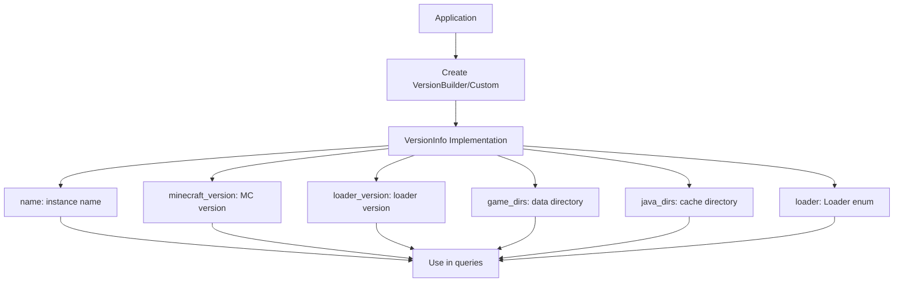
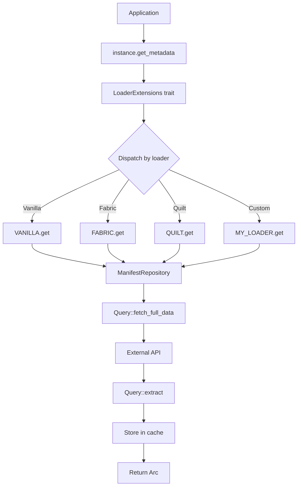

# Query System

The Query trait is the core mechanism for implementing new loaders. It defines how to fetch, extract, and cache loader data.

## Query Trait Definition

**Export**: `lighty_loaders::utils::query::Query`

```rust
use async_trait::async_trait;
use std::hash::Hash;
use std::time::Duration;

#[async_trait]
pub trait Query: Send + Sync {
    /// Type of query (enum defining what to fetch)
    type Query: Eq + Hash + Clone + Send + Sync + 'static;

    /// Type of extracted data (usually VersionMetaData)
    type Data: Clone + Send + Sync + 'static;

    /// Type of raw data from API (JSON or typed struct)
    type Raw: Send + Sync + 'static;

    /// Loader name (e.g., "vanilla", "fabric")
    fn name() -> &'static str;

    /// Fetch raw manifest from external source
    async fn fetch_full_data<V: VersionInfo>(version: &V) -> Result<Self::Raw>;

    /// Extract specific data from raw manifest
    async fn extract<V: VersionInfo>(
        version: &V,
        query: &Self::Query,
        raw: &Self::Raw
    ) -> Result<Self::Data>;

    /// Global TTL for cache (default: 1 hour)
    fn cache_ttl() -> Duration {
        Duration::from_secs(3600)
    }

    /// Per-query TTL (optional override)
    fn cache_ttl_for_query(_query: &Self::Query) -> Duration {
        Self::cache_ttl()
    }

    /// Build complete Version metadata
    async fn version_builder<V: VersionInfo>(
        version: &V,
        full_data: &Self::Raw
    ) -> Result<Version>;
}
```

## Implementing a Custom Query

### Example: Custom Mod Loader

Let's implement a complete custom loader called "MyModLoader".

#### Step 1: Define Module Structure

Create `src/loaders/my_loader/` with:
- `mod.rs` - Module exports
- `my_loader.rs` - Query implementation
- `my_loader_metadata.rs` - Data structures

#### Step 2: Define Metadata Types

```rust
// my_loader_metadata.rs
use serde::{Deserialize, Serialize};

/// Raw API response from MyModLoader
#[derive(Debug, Clone, Deserialize, Serialize)]
pub struct MyLoaderRaw {
    pub version: String,
    pub minecraft_version: String,
    pub libraries: Vec<MyLoaderLibrary>,
    pub main_class: Option<String>,
}

#[derive(Debug, Clone, Deserialize, Serialize)]
pub struct MyLoaderLibrary {
    pub name: String,
    pub url: String,
    pub sha1: String,
}
```

#### Step 3: Implement Query

```rust
// my_loader.rs
use async_trait::async_trait;
use once_cell::sync::Lazy;
use std::sync::Arc;

use lighty_loaders::utils::{
    query::Query,
    manifest::ManifestRepository,
    error::QueryError,
};
use lighty_loaders::types::{
    VersionInfo,
    version_metadata::{Version, VersionMetaData, Library},
};
use lighty_core::hosts::HTTP_CLIENT;

use super::my_loader_metadata::MyLoaderRaw;

// Singleton repository
pub static MY_LOADER: Lazy<ManifestRepository<MyLoaderQuery>> =
    Lazy::new(|| ManifestRepository::new());

// Query enum - defines what can be queried
#[derive(Debug, Clone, PartialEq, Eq, Hash)]
pub enum MyLoaderQuery {
    FullMetadata,  // Complete metadata
    Libraries,     // Only libraries
}

#[async_trait]
impl Query for MyLoaderQuery {
    type Query = MyLoaderQuery;
    type Data = VersionMetaData;
    type Raw = MyLoaderRaw;

    fn name() -> &'static str {
        "my_loader"
    }

    // Optional: Custom TTL
    fn cache_ttl() -> Duration {
        Duration::from_secs(7200)  // 2 hours
    }

    fn cache_ttl_for_query(query: &Self::Query) -> Duration {
        match query {
            MyLoaderQuery::FullMetadata => Duration::from_secs(7200),
            MyLoaderQuery::Libraries => Duration::from_secs(3600),
        }
    }

    // Fetch raw data from API
    async fn fetch_full_data<V: VersionInfo>(version: &V) -> Result<Self::Raw, QueryError> {
        let url = format!(
            "https://my-loader-api.com/versions/{}/{}",
            version.minecraft_version(),
            version.loader_version()
        );

        lighty_core::trace_info!("Fetching MyLoader from {}", url);

        let response = HTTP_CLIENT
            .get(&url)
            .send()
            .await
            .map_err(|e| QueryError::NetworkError(e.to_string()))?;

        if !response.status().is_success() {
            return Err(QueryError::NotFound(format!(
                "MyLoader version {}/{} not found",
                version.minecraft_version(),
                version.loader_version()
            )));
        }

        let raw: MyLoaderRaw = response
            .json()
            .await
            .map_err(|e| QueryError::ParseError(e.to_string()))?;

        Ok(raw)
    }

    // Extract data based on query type
    async fn extract<V: VersionInfo>(
        version: &V,
        query: &Self::Query,
        raw: &Self::Raw
    ) -> Result<Self::Data, QueryError> {
        match query {
            MyLoaderQuery::FullMetadata => {
                let version = Self::version_builder(version, raw).await?;
                Ok(VersionMetaData::Version(version))
            }
            MyLoaderQuery::Libraries => {
                let libraries = extract_libraries(raw);
                Ok(VersionMetaData::Libraries(libraries))
            }
        }
    }

    // Build complete Version
    async fn version_builder<V: VersionInfo>(
        version: &V,
        raw: &Self::Raw
    ) -> Result<Version, QueryError> {
        // You can merge with Vanilla here if needed
        // For this example, we use only MyLoader data

        Ok(Version {
            main_class: raw.main_class
                .clone()
                .unwrap_or_else(|| "net.minecraft.client.main.Main".to_string())
                .into(),
            java_version: JavaVersion {
                major_version: 21,  // Hardcoded or from API
            },
            arguments: Arguments::default(),  // Or build from raw
            libraries: extract_libraries(raw),
            mods: None,
            natives: None,
            client: None,
            assets_index: None,
            assets: None,
        })
    }
}

// Helper function to extract libraries
fn extract_libraries(raw: &MyLoaderRaw) -> Vec<Library> {
    raw.libraries
        .iter()
        .map(|lib| Library {
            name: lib.name.clone(),
            url: Some(lib.url.clone()),
            path: None,  // Or compute from name
            sha1: Some(lib.sha1.clone()),
            size: None,
        })
        .collect()
}
```

#### Step 4: Add to Loader Enum

In `src/types/loader.rs`, add your loader:

```rust
#[derive(Debug, Clone)]
pub enum Loader {
    Vanilla,
    Fabric,
    Quilt,
    NeoForge,
    Forge,
    LightyUpdater,
    Optifine,
    MyLoader,  // Add your loader
}
```

#### Step 5: Implement LoaderExtensions Dispatch

In `src/types/loader_extensions.rs`, add dispatch:

```rust
#[cfg(feature = "my_loader")]
use crate::loaders::my_loader::my_loader::{MyLoaderQuery, MY_LOADER};

async fn get_metadata(&self) -> Result<Arc<VersionMetaData>> {
    match self.loader() {
        // ... existing loaders

        #[cfg(feature = "my_loader")]
        Loader::MyLoader => {
            MY_LOADER.get(self, MyLoaderQuery::FullMetadata).await
        }

        _ => Err(QueryError::UnsupportedLoader(
            format!("Loader {:?} not supported", self.loader())
        ))
    }
}
```

#### Step 6: Add Feature Flag

In `Cargo.toml`:

```toml
[features]
my_loader = []
all-loaders = ["vanilla", "fabric", "quilt", "neoforge", "my_loader"]
```

#### Step 7: Module Exports

```rust
// src/loaders/my_loader/mod.rs
pub mod my_loader;
pub mod my_loader_metadata;

pub use my_loader::{MyLoaderQuery, MY_LOADER};
pub use my_loader_metadata::MyLoaderRaw;
```

```rust
// src/loaders/mod.rs
#[cfg(feature = "my_loader")]
pub mod my_loader;
```

### Usage

```rust
use lighty_launcher::prelude::*;

const QUALIFIER: &str = "com";
const ORGANIZATION: &str = "MyLauncher";
const APPLICATION: &str = "";

#[tokio::main]
async fn main() -> anyhow::Result<()> {
    let _app = AppState::new(
        QUALIFIER.to_string(),
        ORGANIZATION.to_string(),
        APPLICATION.to_string(),
    )?;

    let launcher_dir = AppState::get_project_dirs();

    let instance = VersionBuilder::new(
        "my-instance",
        Loader::MyLoader,
        "1.0.0",        // MyLoader version
        "1.21.1",       // Minecraft version
        launcher_dir
    );

    let metadata = instance.get_metadata().await?;

    println!("MyLoader libraries: {}", metadata.libraries.len());

    Ok(())
}
```

## Merging with Vanilla

If your loader extends Vanilla (like Fabric/Quilt), merge metadata:

```rust
use lighty_loaders::loaders::vanilla::{VanillaQuery, VANILLA};

async fn version_builder<V: VersionInfo>(
    version: &V,
    raw: &Self::Raw
) -> Result<Version, QueryError> {
    // 1. Get Vanilla metadata
    let vanilla_meta = VANILLA
        .get(version, VanillaQuery::VanillaBuilder)
        .await?;

    let mut vanilla_version = match vanilla_meta.as_ref() {
        VersionMetaData::Version(v) => v.clone(),
        _ => return Err(QueryError::ParseError("Expected Version".into())),
    };

    // 2. Add your loader's libraries
    let my_libraries = extract_libraries(raw);
    vanilla_version.libraries.extend(my_libraries);

    // 3. Override main class if needed
    if let Some(main_class) = &raw.main_class {
        vanilla_version.main_class = main_class.clone().into();
    }

    // 4. Merge arguments if needed
    // vanilla_version.arguments.jvm.extend(my_jvm_args);

    Ok(vanilla_version)
}
```

## Data Flow Diagrams

### VersionInfo Data Flow



### LoaderExtensions Data Flow



## Implementing Custom VersionInfo

You can also implement `VersionInfo` for your own types:

```rust
use lighty_loaders::types::{VersionInfo, Loader};
use std::path::{Path, PathBuf};
use lighty_core::app_state::AppState;

#[derive(Clone)]
pub struct MyCustomVersion {
    name: String,
    mc_version: String,
    loader_version: String,
}

impl MyCustomVersion {
    pub fn new(name: &str, mc_version: &str, loader_version: &str) -> Self {
        Self {
            name: name.to_string(),
            mc_version: mc_version.to_string(),
            loader_version: loader_version.to_string(),
        }
    }
}

impl VersionInfo for MyCustomVersion {
    type LoaderType = Loader;

    fn name(&self) -> &str {
        &self.name
    }

    fn loader_version(&self) -> &str {
        &self.loader_version
    }

    fn minecraft_version(&self) -> &str {
        &self.mc_version
    }

    fn game_dirs(&self) -> &Path {
        AppState::get_project_dirs().data_dir()
    }

    fn java_dirs(&self) -> &Path {
        AppState::get_project_dirs().cache_dir()
    }

    fn loader(&self) -> &Loader {
        &Loader::MyLoader
    }
}

// Now you can use LoaderExtensions automatically!
```

Usage:

```rust
use lighty_loaders::types::LoaderExtensions;

let custom = MyCustomVersion::new("my-custom", "1.21.1", "1.0.0");
let metadata = custom.get_metadata().await?;  // Works!
```

## Event Integration

Emit events during fetching (optional):

```rust
#[cfg(feature = "events")]
use lighty_event::{EVENT_BUS, Event, LoaderEvent};

async fn fetch_full_data<V: VersionInfo>(version: &V) -> Result<Self::Raw, QueryError> {
    // Emit FetchingData event
    #[cfg(feature = "events")]
    EVENT_BUS.emit(Event::Loader(LoaderEvent::FetchingData {
        loader: "MyLoader".to_string(),
        minecraft_version: version.minecraft_version().to_string(),
        loader_version: version.loader_version().to_string(),
    }));

    // Fetch data...
    let raw = /* ... */;

    // Emit DataFetched event
    #[cfg(feature = "events")]
    EVENT_BUS.emit(Event::Loader(LoaderEvent::DataFetched {
        loader: "MyLoader".to_string(),
        minecraft_version: version.minecraft_version().to_string(),
        loader_version: version.loader_version().to_string(),
    }));

    Ok(raw)
}
```

## Testing Your Query

```rust
#[cfg(test)]
mod tests {
    use super::*;
    use lighty_loaders::types::VersionInfo;
    use lighty_version::VersionBuilder;

    #[tokio::test]
    async fn test_my_loader_query() {
        let version = VersionBuilder::new(
            "test",
            Loader::MyLoader,
            "1.0.0",
            "1.21.1",
            AppState::get_project_dirs()
        );

        let metadata = MY_LOADER
            .get(&version, MyLoaderQuery::FullMetadata)
            .await
            .unwrap();

        assert!(metadata.libraries.len() > 0);
    }
}
```

## Related Documentation

- [Overview](./overview.md) - Architecture overview
- [Traits](./traits.md) - VersionInfo and LoaderExtensions
- [Cache System](./cache.md) - How caching works
- [How to Use](./how-to-use.md) - Usage examples
