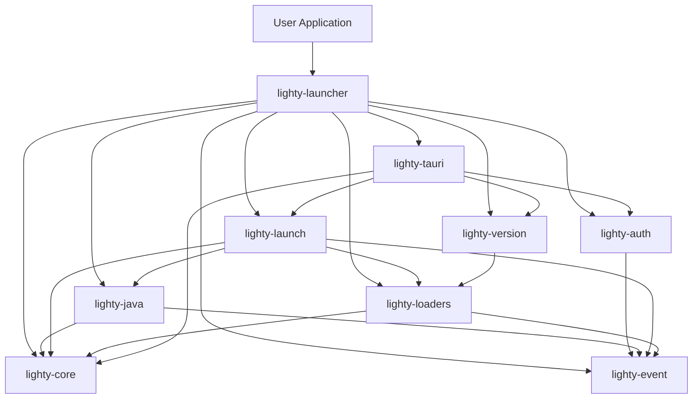

# Architecture

## System Overview

```
┌─────────────────────────────────────────────────────────────────┐
│                         User Application                         │
└──────────────────────────────────┬──────────────────────────────┘
                                   │
                    ┌──────────────┴──────────────┐
                    │  lighty-launcher (Facade)   │
                    │    - Prelude                │
                    │    - Re-exports             │
                    └──────────────┬──────────────┘
                                   │
        ┌──────────────────────────┼──────────────────────────┐
        │                          │                          │
        ▼                          ▼                          ▼
┌───────────────┐          ┌───────────────┐         ┌───────────────┐
│  lighty-core  │          │ lighty-launch │         │ lighty-loaders│
│  - AppState   │          │  - Launch     │         │  - Vanilla    │
│  - Extract    │          │  - Installer  │         │  - Fabric     │
│  - Hash       │          │  - Arguments  │         │  - Quilt      │
│  - Download   │          │  - Instance   │         │  - Forge      │
└───────┬───────┘          └───────┬───────┘         └───────┬───────┘
        │                          │                         │
        │                          │                         │
┌───────▼───────┐          ┌───────▼───────┐         ┌───────▼────────┐
│  lighty-auth  │          │  lighty-java  │         │ lighty-version │
│  - Offline    │          │  - Temurin    │         │  - Builder     │
│  - Microsoft  │          │  - GraalVM    │         │  - Lighty      │
│  - Azuriom    │          │  - Zulu       │         │                │
└───────────────┘          └───────────────┘         └────────────────┘
        │                                                    │
        └────────────────────┬───────────────────────────────┘
                             │
                      ┌──────▼──────┐
                      │ lighty-event│
                      │  - EventBus │
                      │  - Events   │
                      └─────────────┘
```

## Module Dependencies



## Core Modules

### lighty-core

**Purpose**: Foundation layer providing low-level utilities

**Responsibilities**:
- Application state management (`AppState`)
- File system operations
- HTTP client management
- Archive extraction (ZIP, TAR.GZ)
- SHA1 hashing and verification
- System detection (OS, architecture)
- Cross-platform compatibility

**Key Exports**:
- `AppState::new()` - Initialize project directories
- `extract::zip_extract()` - Extract ZIP archives
- `hash::verify_file_sha1()` - Verify file integrity
- `download::download_file()` - HTTP downloads

**Dependencies**: None (foundation)

**Documentation**: [lighty-core](../crates/core/README.md)

---

### lighty-auth

**Purpose**: User authentication and profile management

**Responsibilities**:
- Offline authentication (UUID v5 generation)
- Microsoft OAuth 2.0 flow
- Azuriom CMS integration
- Custom authentication providers (trait-based)
- User profile management

**Key Exports**:
- `Authenticator` trait - Authentication interface
- `OfflineAuth` - No network required
- `MicrosoftAuth` - OAuth 2.0
- `AzuriomAuth` - CMS integration
- `UserProfile` - User data

**Dependencies**:
- `lighty-event` (optional, for events)

**Documentation**: [lighty-auth](../crates/auth/README.md)

---

### lighty-event

**Purpose**: Real-time progress tracking and event system

**Responsibilities**:
- Event bus (multi-producer, multi-consumer)
- Event types for all operations
- Global event bus singleton
- Progress tracking
- Console output streaming

**Key Exports**:
- `EventBus` - Main event bus
- `Event` - Event enum
- Specific events: `AuthEvent`, `JavaEvent`, `LaunchEvent`, etc.
- `EVENT_BUS` - Global singleton

**Dependencies**: None

**Documentation**: [lighty-event](../crates/event/README.md)

---

### lighty-java

**Purpose**: Java runtime management and distribution

**Responsibilities**:
- Automatic JRE downloads
- Multiple distribution support (Temurin, GraalVM, Zulu, Liberica)
- Version detection and selection
- Java process execution
- Platform-specific handling

**Key Exports**:
- `JavaDistribution` - Distribution enum
- `JavaRuntime` - Process executor
- `jre_downloader` - Download functions

**Dependencies**:
- `lighty-core` - Download and extraction
- `lighty-event` (optional)

**Documentation**: [lighty-java](../crates/java/README.md)

---

### lighty-loaders

**Purpose**: Mod loader implementations and version metadata

**Responsibilities**:
- Loader implementations (Vanilla, Fabric, Quilt, Forge, NeoForge, LightyUpdater, OptiFine)
- Version metadata fetching and caching
- Metadata merging (vanilla + loader)
- Version querying
- Manifest caching

**Key Exports**:
- `Loader` - Loader enum
- `VersionInfo` trait - Version information
- `LoaderExtensions` trait - Loader operations
- Version metadata types

**Dependencies**:
- `lighty-core` - HTTP and caching
- `lighty-event` (optional)

**Documentation**: [lighty-loaders](../crates/loaders/README.md)

---

### lighty-version

**Purpose**: Version builders for game instances

**Responsibilities**:
- Standard version builder (VersionBuilder)
- Custom server builder (LightyVersionBuilder)
- Version information implementation
- Directory management

**Key Exports**:
- `VersionBuilder` - Standard builder
- `LightyVersionBuilder` - Custom server builder

**Dependencies**:
- `lighty-loaders` - VersionInfo implementation

**Documentation**: [lighty-version](../crates/version/README.md)

---

### lighty-launch

**Purpose**: Game launching and installation orchestration

**Responsibilities**:
- Complete launch process coordination
- Parallel file downloads and installation
- Argument building and substitution
- Process spawning and management
- Instance lifecycle tracking
- Console output streaming

**Key Exports**:
- `Launch` trait - Launch builder
- `LaunchBuilder` - Fluent API
- `Installer` trait - Installation
- `InstanceControl` trait - Process management
- Argument constants

**Dependencies**:
- `lighty-core` - Downloads, extraction
- `lighty-java` - Java management
- `lighty-loaders` - Metadata
- `lighty-event` (optional)

**Documentation**: [lighty-launch](../crates/launch/README.md)

---

### lighty-tauri

**Purpose**: Tauri desktop integration

**Requires**: `tauri-commands` feature

**Responsibilities**:
- Tauri command wrappers
- State management for Tauri
- Frontend-backend communication
- Pre-built commands for common operations

**Key Exports**:
- `lighty_plugin()` - Tauri plugin
- Commands for auth, launch, java, etc.

**Dependencies**:
- All other lighty crates
- Tauri framework

**Documentation**: Available in `lighty-tauri` crate

---

## Data Flow

### Launch Flow

```
AppState (Initialize)
    ↓
VersionBuilder (Create Instance)
    ↓
Authenticator (Get UserProfile)
    ↓
LaunchBuilder (Configure)
    ↓
Loader (Fetch Metadata) ← lighty-loaders
    ↓
JavaManager (Ensure Java) ← lighty-java
    ↓
Installer (Download Files) ← lighty-launch
    ↓  ↓  ↓  ↓  ↓
Libraries  Natives  Client  Assets  Mods
    ↓
Arguments (Build Command)
    ↓
Process (Spawn Java)
    ↓
InstanceManager (Track PID)
    ↓
ConsoleHandler (Stream Output)
```

### Event Flow

```
Operation Starts
    ↓
Emit Event → EventBus → Subscribers
    ↓
Operation in Progress
    ↓
Emit Progress Events → EventBus → Subscribers
    ↓
Operation Complete
    ↓
Emit Completion Event → EventBus → Subscribers
```

### Cache Flow

```
Request Metadata
    ↓
Check Cache (Raw)
    ↓
    ├─ Cache Hit → Return Cached
    │
    └─ Cache Miss
        ↓
    Fetch from API
        ↓
    Store in Cache (TTL: 1 hour)
        ↓
    Return Fresh Data
```

## Design Patterns

### 1. Builder Pattern

Used extensively for fluent API configuration:

```rust
instance.launch(&profile, JavaDistribution::Temurin)
    .with_jvm_options()
        .set("Xmx", "4G")
        .done()
    .with_arguments()
        .set("width", "1920")
        .done()
    .run()
    .await?;
```

**Benefits**:
- Readable configuration
- Type-safe
- Optional parameters
- Method chaining

### 2. Trait-Based Extensibility

Multiple traits for extension points:

```rust
// Authentication
pub trait Authenticator {
    async fn authenticate(&mut self) -> AuthResult<UserProfile>;
}

// Version Information
pub trait VersionInfo {
    fn name(&self) -> &str;
    fn minecraft_version(&self) -> &str;
    // ...
}

// Loader Operations
pub trait LoaderExtensions: VersionInfo {
    async fn get_metadata(&self) -> LoaderResult<Arc<VersionMetaData>>;
    // ...
}
```

**Benefits**:
- Custom implementations
- Separation of concerns
- Auto-implementation where possible

### 3. Event-Driven Architecture

Decoupled progress tracking:

```rust
// Producer
event_bus.emit(Event::Launch(LaunchEvent::InstallStarted {
    version,
    total_bytes
}));

// Consumer
let mut receiver = event_bus.subscribe();
while let Ok(event) = receiver.next().await {
    match event {
        Event::Launch(e) => handle_launch_event(e),
        _ => {}
    }
}
```

**Benefits**:
- Real-time updates
- Loose coupling
- Multiple subscribers
- Optional feature

### 4. Singleton Pattern

Global instances for shared state:

```rust
// Global event bus
pub static EVENT_BUS: Lazy<EventBus> = Lazy::new(|| EventBus::new(1000));

// Global instance manager
pub(crate) static INSTANCE_MANAGER: Lazy<InstanceManager> =
    Lazy::new(InstanceManager::new);
```

**Benefits**:
- Shared state
- Easy access
- Single source of truth

### 5. Facade Pattern

Main `lighty-launcher` crate provides unified interface:

```rust
pub mod auth { /* re-exports from lighty-auth */ }
pub mod java { /* re-exports from lighty-java */ }
pub mod launch { /* re-exports from lighty-launch */ }
// ...

pub mod prelude { /* common re-exports */ }
```

**Benefits**:
- Simplified imports
- Unified API
- Version consistency

## Concurrency Model

### Async/Await

Built on Tokio for async operations:

```rust
#[tokio::main]
async fn main() -> Result<()> {
    // All operations are async
    let profile = auth.authenticate().await?;
    let metadata = instance.get_metadata().await?;
    instance.launch(&profile, distribution).run().await?;
    Ok(())
}
```

### Parallel Downloads

Multiple downloads run concurrently:

```rust
tokio::try_join!(
    libraries::download_libraries(library_tasks),
    natives::download_and_extract_natives(native_tasks),
    client::download_client(client_task),
    assets::download_assets(asset_tasks),
    mods::download_mods(mod_tasks),
)?;
```

**Performance**: 5x-10x faster than sequential downloads

### Background Tasks

Console streaming and instance monitoring:

```rust
tokio::spawn(async move {
    while let Ok(Some(line)) = lines.next_line().await {
        emit_console_output(pid, line);
    }
});
```

## Error Handling

### Result Types

Each module defines its own result types:

```rust
pub type AuthResult<T> = Result<T, AuthError>;
pub type LaunchResult<T> = Result<T, LaunchError>;
pub type LoaderResult<T> = Result<T, LoaderError>;
```

### Error Propagation

Using `?` operator for clean error handling:

```rust
async fn launch_game() -> LaunchResult<()> {
    let profile = auth.authenticate().await?;
    let metadata = instance.get_metadata().await?;
    install_dependencies(&metadata).await?;
    spawn_process().await?;
    Ok(())
}
```

### Error Types

Comprehensive error enums:

```rust
pub enum LaunchError {
    DownloadFailed(String),
    VerificationFailed(String),
    ExtractionFailed(String),
    NoPid,
    // ...
}
```

## Platform Support

### Cross-Platform Compatibility

Platform-specific implementations abstracted:

```rust
#[cfg(target_os = "windows")]
fn kill_process(pid: u32) {
    Command::new("taskkill")
        .args(&["/PID", &pid.to_string(), "/F"])
        .output()?;
}

#[cfg(not(target_os = "windows"))]
fn kill_process(pid: u32) {
    use nix::sys::signal::{kill, Signal};
    kill(Pid::from_raw(pid as i32), Signal::SIGTERM)?;
}
```

### Supported Platforms

- **Windows** - Full support
- **Linux** - Full support
- **macOS** - Full support

### Platform Detection

```rust
let (os, arch) = lighty_core::system::get_os_arch();
// os: "windows", "linux", "osx"
// arch: "x64", "arm64", etc.
```

## Performance Optimizations

### 1. Parallel Downloads

All file categories downloaded concurrently

### 2. SHA1 Verification

Skip re-downloading files that already exist and are valid

### 3. Manifest Caching

Cache loader manifests for 1 hour (configurable)

### 4. Lazy Initialization

Components initialized only when needed:

```rust
static INSTANCE_MANAGER: Lazy<InstanceManager> = Lazy::new(InstanceManager::new);
```

### 5. Streaming I/O

Large files processed in chunks, not loaded entirely in memory

### 6. Batch Operations

Assets downloaded in batches of 50 for better parallelism

## Security Considerations

### 1. SHA1 Verification

All downloaded files verified against expected hash

### 2. HTTPS Only

All API calls use HTTPS (automatically upgraded)

### 3. No Credentials Storage

Tokens and credentials not stored by default

### 4. Sandboxed Execution

Game processes spawned in controlled environment

### 5. Input Validation

All user inputs validated before use

## Testing Strategy

### Unit Tests

Each module has its own unit tests

### Integration Tests

Full workflow tests in `tests/` directory

### Example-Based Testing

Examples serve as integration tests

## Related Documentation

- [Sequence Diagrams](./sequence-diagrams.md) - Visual flow diagrams
- [Re-exports](./reexports.md) - API reference
- [Examples](./examples.md) - Code examples

### Crate Documentation

- [lighty-core](../crates/core/README.md)
- [lighty-auth](../crates/auth/README.md)
- [lighty-event](../crates/event/README.md)
- [lighty-java](../crates/java/README.md)
- [lighty-launch](../crates/launch/README.md)
- [lighty-loaders](../crates/loaders/README.md)
- [lighty-version](../crates/version/README.md)
