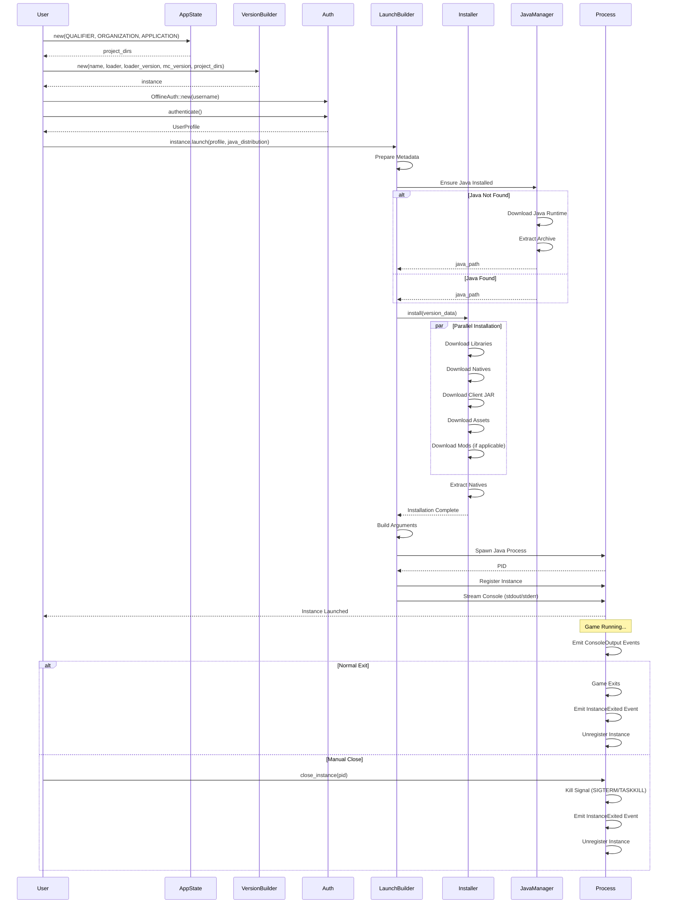
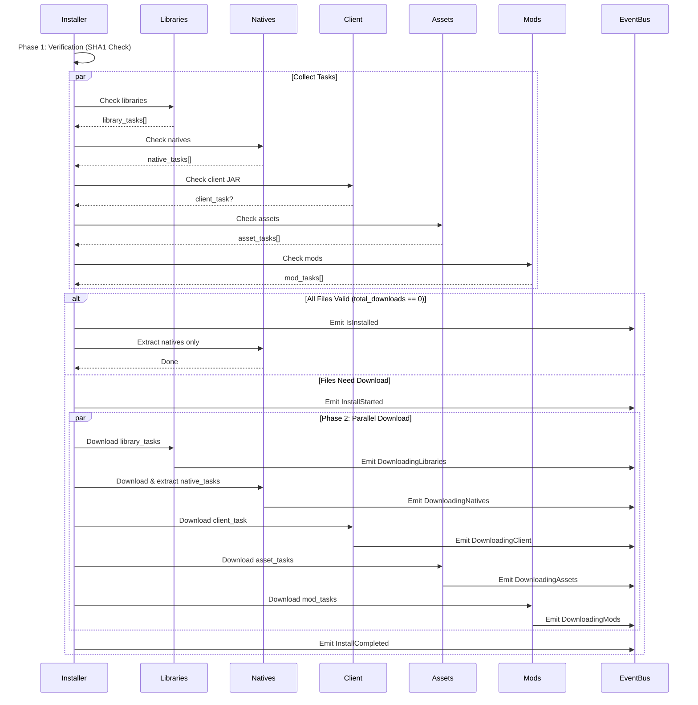
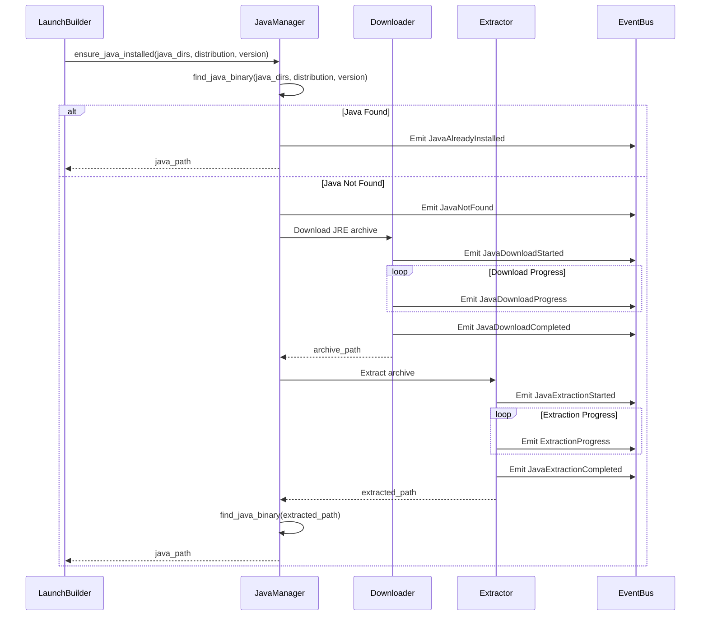
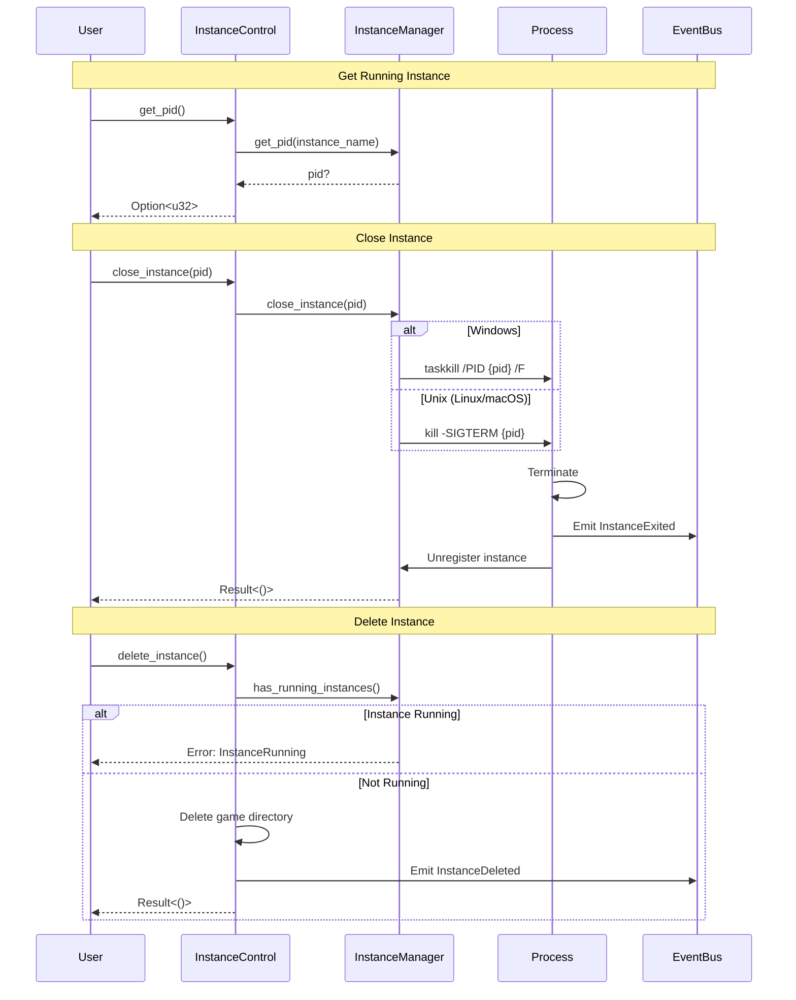
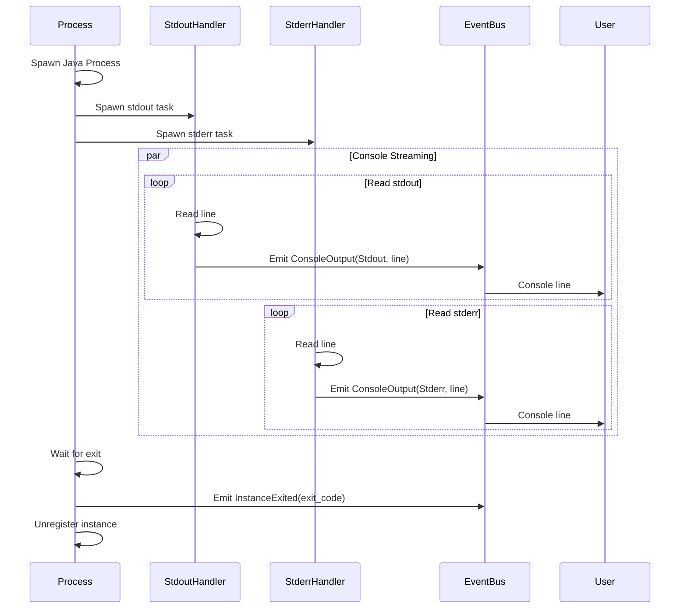
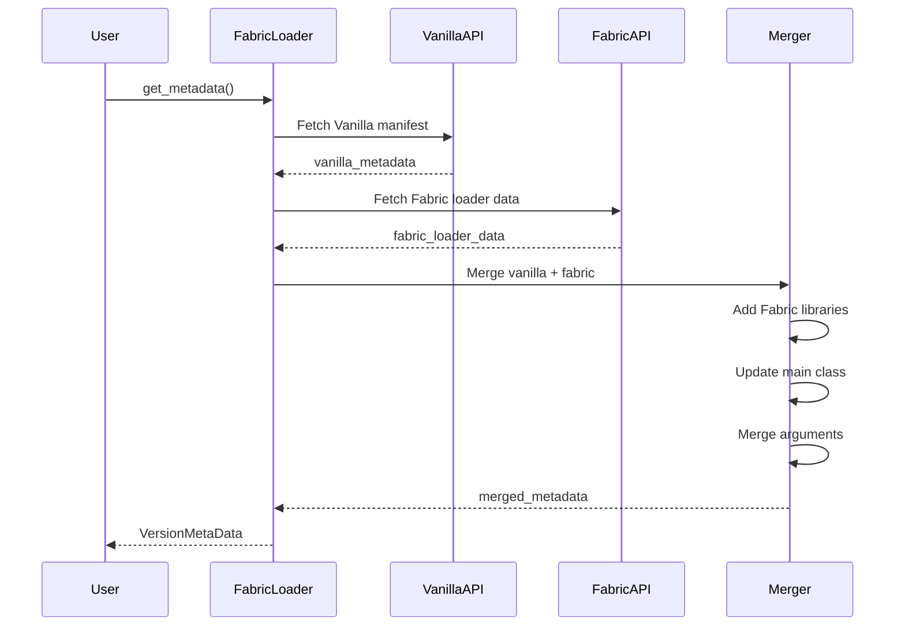

# Sequence Diagrams

## Complete Launch Sequence



## Authentication Sequence

### Offline Authentication

```mermaid
sequenceDiagram
    participant User
    participant OfflineAuth
    participant UUID

    User->>OfflineAuth: new(username)
    User->>OfflineAuth: authenticate()
    OfflineAuth->>UUID: generate_offline_uuid(username)
    UUID-->>OfflineAuth: deterministic UUID (v5)
    OfflineAuth-->>User: UserProfile {
        username,
        uuid,
        access_token: None,
        role: User
    }
```

### Microsoft Authentication

```mermaid
sequenceDiagram
    participant User
    participant MicrosoftAuth
    participant DeviceFlow
    participant Xbox
    participant Minecraft

    User->>MicrosoftAuth: new(client_id)
    User->>MicrosoftAuth: authenticate()

    MicrosoftAuth->>DeviceFlow: Request Device Code
    DeviceFlow-->>MicrosoftAuth: device_code, user_code, verification_url
    MicrosoftAuth->>User: Display: "Visit {url}, Enter {code}"

    loop Poll for completion
        MicrosoftAuth->>DeviceFlow: Poll for token
        alt User Authorized
            DeviceFlow-->>MicrosoftAuth: access_token
        else Still Pending
            DeviceFlow-->>MicrosoftAuth: authorization_pending
        end
    end

    MicrosoftAuth->>Xbox: Authenticate with Xbox Live
    Xbox-->>MicrosoftAuth: xbox_token, user_hash

    MicrosoftAuth->>Xbox: Get XSTS Token
    Xbox-->>MicrosoftAuth: xsts_token, xuid

    MicrosoftAuth->>Minecraft: Authenticate with Minecraft
    Minecraft-->>MicrosoftAuth: minecraft_access_token

    MicrosoftAuth->>Minecraft: Get Profile
    Minecraft-->>MicrosoftAuth: username, uuid

    MicrosoftAuth-->>User: UserProfile {
        username,
        uuid,
        access_token: Some(minecraft_access_token),
        role: User
    }
```

## Installation Sequence



## Java Management Sequence



## Instance Control Sequence



## Console Streaming Sequence



## Event Flow Diagram

```mermaid
flowchart TB
    Start([User Initiates Launch]) --> InitState[Initialize AppState]
    InitState --> CreateVersion[Create VersionBuilder]
    CreateVersion --> Auth[Authenticate User]

    Auth --> |OfflineAuth| OfflineEvent[Emit AuthenticationStarted/Success]
    Auth --> |MicrosoftAuth| MSEvents[Emit Device Code Events]

    OfflineEvent --> StartLaunch[Call launch()]
    MSEvents --> StartLaunch

    StartLaunch --> FetchMeta[Fetch Loader Metadata]
    FetchMeta --> |Emit LoaderEvent| CheckJava[Check Java Installation]

    CheckJava --> |Not Found| DownloadJava[Download Java]
    CheckJava --> |Found| InstallDeps[Install Dependencies]

    DownloadJava --> |Emit JavaEvents| InstallDeps

    InstallDeps --> Verify{All Files Valid?}

    Verify --> |Yes| EmitInstalled[Emit IsInstalled]
    Verify --> |No| EmitStart[Emit InstallStarted]

    EmitInstalled --> ExtractNatives[Extract Natives Only]
    EmitStart --> ParallelDownload[Parallel Download]

    ParallelDownload --> |Libraries| LibEvents[Emit DownloadingLibraries]
    ParallelDownload --> |Natives| NatEvents[Emit DownloadingNatives]
    ParallelDownload --> |Client| ClientEvents[Emit DownloadingClient]
    ParallelDownload --> |Assets| AssetEvents[Emit DownloadingAssets]
    ParallelDownload --> |Mods| ModEvents[Emit DownloadingMods]

    LibEvents --> EmitComplete[Emit InstallCompleted]
    NatEvents --> EmitComplete
    ClientEvents --> EmitComplete
    AssetEvents --> EmitComplete
    ModEvents --> EmitComplete
    ExtractNatives --> EmitComplete

    EmitComplete --> BuildArgs[Build Arguments]
    BuildArgs --> SpawnProcess[Spawn Java Process]
    SpawnProcess --> Register[Register Instance]
    Register --> EmitLaunched[Emit InstanceLaunched]

    EmitLaunched --> StreamConsole[Stream Console Output]
    StreamConsole --> |Each Line| EmitConsole[Emit ConsoleOutput]

    EmitConsole --> WaitExit{Process Running?}
    WaitExit --> |Yes| StreamConsole
    WaitExit --> |No| EmitExited[Emit InstanceExited]

    EmitExited --> Cleanup[Unregister Instance]
    Cleanup --> End([Launch Complete])
```

## Loader-Specific Sequences

### Fabric Loader



### LightyUpdater

```mermaid
sequenceDiagram
    participant User
    participant LightyBuilder
    participant ServerAPI
    participant Vanilla

    User->>LightyBuilder: new(name, server_url, project_dirs)
    User->>LightyBuilder: get_metadata()

    LightyBuilder->>ServerAPI: GET {server_url}/version
    ServerAPI-->>LightyBuilder: {
        minecraft_version,
        loader,
        loader_version,
        mods: [...]
    }

    LightyBuilder->>Vanilla: Fetch vanilla metadata
    Vanilla-->>LightyBuilder: vanilla_metadata

    LightyBuilder->>LightyBuilder: Add server mods to metadata
    LightyBuilder-->>User: VersionMetaData with custom mods
```

## Related Documentation

- [Launch Process](../crates/launch/docs/launch.md) - Detailed launch flow
- [Installation](../crates/launch/docs/installation.md) - Installation details
- [Instance Control](../crates/launch/docs/instance-control.md) - Process management
- [Events](../crates/launch/docs/events.md) - Event types reference
